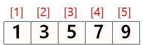

# 데이터 과학을 위한 R 알고리즘


## 1. 이진 검색

이진검색은 데이터가 벡터로 저장되어 있다고 가정할 때, 해당 값이 어느 위치에 있는지 찾아내는 알고리즘이다. 



- 이진검색은 단순 검색보다 훨씬 빠르다.
- $\mathcal{O}(log(n))$은 $\mathcal{O}(n)$ 보다 훨씬 빠른데, 특히 찾고자 하는 항목이 늘어날수록 확실한 속도차이를 체감한다.
- 알고리즘 시간은 빅오($\mathcal{O}$) 표기법으로 작성되고, 시분초가 아닌 알고리즘 성장으로 측정한다.

### 1.1. 반복을 활용한 이진 검색

[로제타코드 - Binary search](https://rosettacode.org/wiki/Binary_search)의 알고리즘을 기초로 이진검색을 `binary_search` 함수로 구현하면 다음과 같다. 찾고자 하는 항목(item)을 벡터로 넣어 두고, 
벡터의 중간값과 항목을 비교하여 최종적으로 벡터의 중간값과 항목이 같은 경우 몇번째 위치했는지 인덱스를 반환한다. R은 벡터 인덱스가 `0`이 아니라 `1`부터 시작된다.


```r
# 반복을 활용한 이진검색 함수

binary_search <- function(vec, item) {
  low <- 1L
  high <- length(vec)

  while(low <= high) {
    mid <- floor((low + high) /2L)

    if(vec[mid] == item) {
      return(mid)
    } else if(item < vec[mid]) {
      high <- mid -1
    } else {
      low  <- mid +1
    }
  }
  return(NULL)
}

# 이진 검색 실행
vec <- c(1,3,5,7,9)

binary_search(vec, 7) 
```

```
## [1] 4
```

```r
binary_search(vec, -1)
```

```
## NULL
```

### 1.2. 반복을 활용한 이진 검색 파이썬 코드

<iframe width="800" height="500" frameborder="0" src="http://pythontutor.com/iframe-embed.html#code=def%20binary_search%28list,%20item%29%3A%0A%20%20%23%20low%20and%20high%20keep%20track%20of%20which%20part%20of%20the%20list%20you'll%20search%20in.%0A%20%20low%20%3D%200%0A%20%20high%20%3D%20len%28list%29%20-%201%0A%0A%20%20%23%20While%20you%20haven't%20narrowed%20it%20down%20to%20one%20element%20...%0A%20%20while%20low%20%3C%3D%20high%3A%0A%20%20%20%20%23%20...%20check%20the%20middle%20element%0A%20%20%20%20mid%20%3D%20%28low%20%2B%20high%29%20//%202%0A%20%20%20%20guess%20%3D%20list%5Bmid%5D%0A%20%20%20%20%23%20Found%20the%20item.%0A%20%20%20%20if%20guess%20%3D%3D%20item%3A%0A%20%20%20%20%20%20return%20mid%0A%20%20%20%20%23%20The%20guess%20was%20too%20high.%0A%20%20%20%20if%20guess%20%3E%20item%3A%0A%20%20%20%20%20%20high%20%3D%20mid%20-%201%0A%20%20%20%20%23%20The%20guess%20was%20too%20low.%0A%20%20%20%20else%3A%0A%20%20%20%20%20%20low%20%3D%20mid%20%2B%201%0A%0A%20%20%23%20Item%20doesn't%20exist%0A%20%20return%20None%0A%0Amy_list%20%3D%20%5B1,%203,%205,%207,%209%5D%0Aprint%20binary_search%28my_list,%207%29%20%23%20%3D%3E%204&codeDivHeight=400&codeDivWidth=350&cumulative=false&curInstr=18&heapPrimitives=false&origin=opt-frontend.js&py=2&rawInputLstJSON=%5B%5D&textReferences=false"> </iframe>


## 2. 선형검색

선형검색은 순차적으로 벡터로 저장된 저장공간을 하나씩 비교하면서 찾아가는 방식이다. 따라서 찾고자 하는 항목(item)이 
가장 마지막에 위치한 경우 가장 많은 시간이 소요된다. 반면에 첫번째 위치한 경우 시간이 가장 적게 소요된다.


```r
linear_search <- function(vec, item) {
  high <- length(vec)
  for (i in 1:high) {
    if (vec[i] == item) {
      return(i)
    }
  }
  return(NULL)
}

vec <- c(1,3,5,7,9)
linear_search(vec, 9)
```

```
## [1] 5
```

```r
linear_search(vec, 6)
```

```
## NULL
```

### 2.1. 선형검색과 이진검색 비교

선형검색과 이진검색을 비교하여 소요된 시간을 비교하면 다음과 같다.

| 선형검색 | 이진검색 |
| --------------------|--------------------|
| 100개 항목 &rarr; 100번 검색 | 100개 항목 &rarr; 7번 검색 | 
| 4,000,000,000개 항목 &rarr; 4,000,000,000번 검색 | 4,000,000,000개 항목 &rarr; 32번 검색(log2(4,000,000,000) = 31.9) | 
| $\mathcal{O}(n)$                                    | $\mathcal{O}(log(n))$ || 
