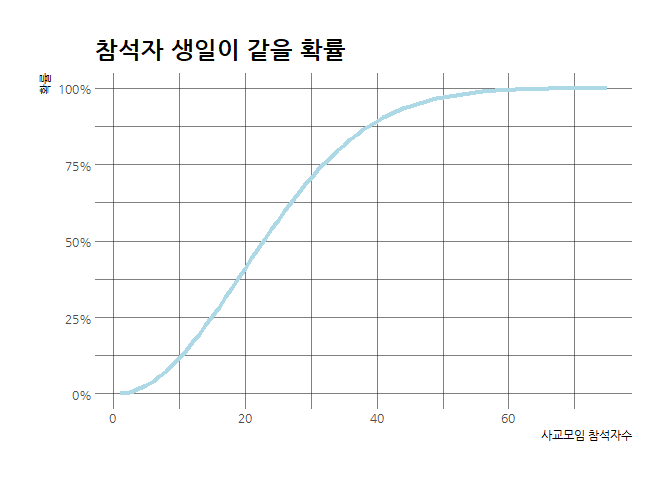

# 데이터 과학을 위한 R 알고리즘

## 1. 문제 정의 [^wiki-birthday-math] {#birthday-problem}

[^wiki-birthday-math]: [위키피디아 - Birthday problem](https://en.wikipedia.org/wiki/Birthday_problem)

사교모임 파티에 $n$명이 모였는데 동일한 생일을 갖을 확률은 얼마나 될까? 얼마의 사람이 모여야 50% 확률로 같은 생일날짜일까?
이런 질문에 답을 하기 위해서 일년을 365일로 고정하고 조합론(Combinatorics) 개념을 동원하여 확률을 계산해보자.

우선 놀랍게도 23명만 사교모임 파티에 모이면 생일이 같은 사람이 최소 2명이상 있을 확률이 50%나 된다.

<iframe width="560" height="315" src="https://www.youtube.com/embed/KtT_cgMzHx8" frameborder="0" allowfullscreen></iframe>

이를, 수학적으로 확인하기 위해서 확률을 계산하는데, 먼저 동일한 생일을 갖은 확률을 $P(A')$ 로 정의하고 여집합으로 
동일한 생일을 갖지 않을 확률을 $1-P(A) = P(A')$로 정의한다.

그러면, $P(A')$ 는 다음과 같이 정의할 수 있다.

$$P(A')=\frac{365}{365}\times\frac{364}{365}\times\frac{363}{365}\times\frac{362}{365}\times\cdots\times\frac{343}{365}$$

이를 정리하면 다음과 같이 된다.

$$P(A')=\left(\frac{1}{365}\right)^{23}\times(365\times364\times363\times\cdots\times343)$$

사교모임 파티 참석자 $n$을 23으로 둔 것을 계산하면 $P(A') \approx 0.492703$이 된다.
따라서, 23명이 사교모임에 참석하면 약 50% 확률로 적어도 동일한 생일을 갖는 사람이 있게 된다.

$$P(A) ≈ 1 - 0.492703  = 0.507297 (50.7297\%)$$

이를 조합을 계승(Factorial)과 이항계수(Binomial Coefficient), 순열(Permutation)을 활용하여 정리하면 다음과 같다.

$$\begin{align} \bar p(n) &= 1 \times \left(1-\frac{1}{365}\right) \times \left(1-\frac{2}{365}\right) \times \cdots \times \left(1-\frac{n-1}{365}\right) \\  
                          &= { 365 \times 364 \times \cdots \times (365-n+1) \over 365^n } \\ 
                          &= { 365! \over 365^n (365-n)!} = \frac{n!\cdot{365 \choose n}}{365^n} = \frac{_{365}P_n}{365^n}\end{align}$$

## 2. 생일문제 계산표 [^r-combinatrics] [^birthday-table] {#birthday-problem-table}

[^r-combinatrics]: [R Combinatorics](http://www.di.fc.ul.pt/~jpn/r/combinatorics/combinatorics.html)

[^birthday-table]: [The Birthday Problem by Jenn Murphy](https://rpubs.com/StatGirl302/TheBirthdayProblem)

1부터 10까지 더하는 연산을 1부터 10까지 순열(`seq(1, 10,1)`)을 생성하고 나서 `Reduce` 함수에 `+` 연산을 적용하여 계산하면,
`Reduce("+", seq(1, 10,1))` R코드를 작성하면 55이 된다.

동일한 로직으로 앞서 식으로 도출된 수식을 R로 구현하여 확률 값을 구하면 다음과 같다.

~~~{.r}
# 1. 수식으로 도출된 사항 계산 ----------------

(1/365^23) * Reduce("*", seq(343, 365,1))
~~~

~~~{.output}
[1] 0.4927028

~~~

~~~{.r}
1- (1/365^23) * Reduce("*", seq(343, 365,1))
~~~

~~~{.output}
[1] 0.5072972

~~~

사교모임 참석자별 확률을 계산하면 다음과 같다. 
놀라운 점은 매우 적은 사람이 참석해도 생일이 같은 사람이 있을 확률이 매우 높다는 점이다. 
예를 들어, 30명만 참석해도 70% 확률로 동일 생일을 갖는 사람이 있다는 점이다.

~~~{.r}
# 2. 생일문제 도표 생성 ----------------
## 2.1. 23명 사교모임 참석자 기준 확률 50% 계산
calculate_birthday_prob <- function(n) {
  prob <- (1/365^n) * Reduce("*", seq(365, 365-n+1, -1))
  return(prob)
}

1-calculate_birthday_prob(23)
~~~

~~~{.output}
[1] 0.5072972

~~~

~~~{.r}
## 2.2. 사교모임 참석자별 생일확률 계산

birthday_df <- data.frame()

for(i in 1:75) {
  person <- i
  prob <- 1-calculate_birthday_prob(i)
  birthday_df <- rbind(birthday_df, data.frame(person, prob))
}

birthday_df %>% 
  rename("참석자수"=person, "생일확률"=prob) %>% 
  DT::datatable() %>% 
    DT::formatPercentage(c(2), digits = 1)
~~~

<!--html_preserve-->

<!--/html_preserve-->

~~~{.r}
ggplot(birthday_df, aes(person, prob)) + 
  geom_line(size=1.5, color="lightblue") +
  theme_ipsum(base_family = "NanumGothic") +
  labs(x="사교모임 참석자수", title="참석자 생일이 같을 확률",
       y="확률") +
  scale_y_continuous(labels = scales::percent)
~~~

## 3. 몬테카를로 모의실험 [^birthdayMC] {#monte-carlo}

[^birthdayMC]: [Monte Carlo simulation for a non-standard birthday problem](https://gist.github.com/dododas/26901a0017a9c3aeebf8)

몬테카를로 모의실험을 통해서도 사교모임 참석자 생일문제를 해결할 수도 있다.

1. 사교모임 파티를 1회 열었을 때 동일생일이 있는 경우를 가정하는 모의실험 함수를 생성한다.
    - 참석자 생일을 365일 중에서 무작위로 중복을 허락하고 뽑아낸다: `sample.int(365, size=attendee, replace=TRUE)`
    - 생일별 빈도를 뽑아내서 정렬한다: `sort(birthday_counts$Freq, decreasing=TRUE)`
    - 만약 빈도수가 높은 순으로 정렬한 빈도에서 가장 처음 숫자가 1이 아니면 동일생일이 있는 것으로 간주한다: ifelse(sorted_counts[1]==1, FALSE, TRUE)
1. `n_trials` 횟수만큼 반복한다.
1. 시행횟수가 증가함에 따라 몬테카를로 모의실험을 통해 계산된 값이 이론치에 수렴함을 시각적으로 확인한다.    

~~~{.r}
## 단일 실험 정의
simulate_one_birthday <- function(attendee = 23){
  birthdays <- sample.int(365, size=attendee, replace=TRUE)
  birthday_counts <- table(birthdays) %>% as.data.frame
  sorted_counts <- sort(birthday_counts$Freq, decreasing=TRUE)
  success <- ifelse(sorted_counts[1]==1, FALSE, TRUE)
  return(success)
}

simulate_one_birthday(23)
~~~

~~~{.output}
[1] TRUE

~~~

300회 사교파티를 열고, 23명이 사교모임에 참석했을 때 동일생일 확률이 이론치에 수렴해감을 확인한다.

~~~{.r}
## 몬테카를로 모의실험

simulate_many_birthday <- function(n_trials){
  outcomes <- replicate(n_trials, simulate_one_birthday())
  return(sum(outcomes)/n_trials)
}

birthday_MC_df <- data.frame()

for(i in 1:300) {
  n_trials <- i
  prob <- simulate_many_birthday(i)
  birthday_MC_df <- rbind(birthday_MC_df, data.frame(n_trials, prob))
}

ggplot(birthday_MC_df, aes(n_trials, prob)) + 
  geom_line(size=1.0, color="lightblue", alpha=0.5) +
  theme_ipsum(base_family = "NanumGothic") +
  labs(x="모의시험횟수", title="사교모임 23명 참석시 동일생일 확률 모의실험", y="확률") +
  scale_y_continuous(labels = scales::percent) +
  geom_hline(yintercept=0.507297, color="red")
~~~

