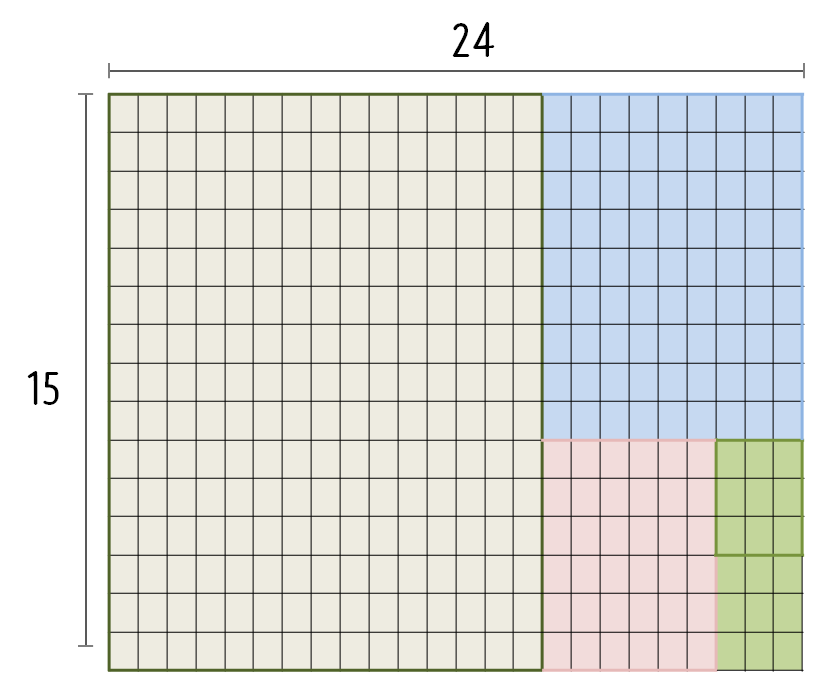

```{r, include=FALSE}
source("tools/chunk-options.R") 

knitr::opts_chunk$set(echo = TRUE, warning=FALSE, message=FALSE)

library(tidyverse)
library(ggthemes)
library(extrafont)
loadfonts()

options(scipen = 999)
options(family="NanumGothic")
```


## 1. 타일 문제 정의 [^wiki-euclid-algorith] {#tile-problem}

[^wiki-euclid-algorith]: [위키백과사전 - 유클리드 호제법](https://ko.wikipedia.org/wiki/%EC%9C%A0%ED%81%B4%EB%A6%AC%EB%93%9C_%ED%98%B8%EC%A0%9C%EB%B2%95)

직사각형 모향으로 된 바닥이 있는데, 바닥크기가 $15 \times 24$ 를 갖고 있다.
타일을 깔아야 하는데, 바닥을 빈공간 없이 모두 채울 수 있는 최대 크기 타일 크기를 계산해 보자.
최대공약수를 찾아가는 과정은 $15 \times 24$ &rarr; $15 \times 15$ &rarr; $9 \times 9$ &rarr;
$3 \times 3$ 으로 찾아가게 되어 결국, $3 \times 3$ 크기 타일을 $8 \times 5 = 40 $ 장 붙이면 바닥이 꽉 차게 된다.




## 2. 최대공약수 컴퓨터 {#great-common-divider}

[`gmp` 팩키지](https://cran.r-project.org/web/packages/gmp/index.html) `factorize()` 함수를 사용하면 자연수에 대한 인수분해를 수행할 수 있다.
이를 통해 두 자연수 사이 최대 공약수를 찾아낼 수 있다. 
즉, 24를 소인수 분해하면 $24 = 2 \times 2 \times 2 \times 3$가 되고, 
15는 $15 = 3 \times 5$가 되어 두 자연수 사이 최대 공약수는 **3** 이 된다.


``` {r gcd-example}
# 1. 최대공약수 ------------------
gmp::factorize(24)
gmp::factorize(15)
```

## 3. 최대공약수 손으로 계산하기 {#great-common-divider-by-hand}

두 자연수 사이 최대공약수를 유클리드 알고리즘으로 다음 과정을 거쳐 계산한다.

1. 두자연 24 와 15를 비교한다.
1. 24가 크기 때문에 24를 15로 나눈다.
    - 24를 15로 나누게 되면 항상 두가지가 성립한다.
    - 24는 15보다 항상 크고, 15는 나머지 9보다 항상 크다.
1. 다시 15를 9로 나눈다.
1. 이런 과정을 반복하여 나머지가 0이 될때까지 반복한다.

$$\begin{align}
    24 &= 15 \times 1 + 9 \\
    15 &= 9 \times 1 + 6 \\
    9  &= 6 \times 1 + 3 \\
    6  &= 3 \times 2 + 0 
  \end{align}$$

<iframe width="300" height="180" src="https://www.youtube.com/embed/NdqwT9kfquY" frameborder="0" allowfullscreen></iframe>

## 4. 유클리드 알고리즘  [^r-euclid-algorithm] {#euclid-algorithm-run}

[^r-euclid-algorithm]: [Euclid Algorithm for Set of Integers: ‘Reduce’ vs. trees in R](https://www.r-bloggers.com/euclid-algorithm-for-set-of-integers-reduce-vs-trees-in-r/)

유클리드 알고리즘을 프로그래밍 언어로 구현하는 방식은 
`while` 루프를 이용하는 방법과 재귀를 이용하는 방법으로 구현을 해보자. 

### 4.1. `while` 루프 활용 {#while-loop}

첫번째 자연수 숫자 ($D$)가 있고, 

$$D = \text{number_a} \times \text{number_b} + \text{나머지}$$

상기 재귀식을 활용하여 첫번째 숫자($\text{number_a}$)를 두번째 숫자($\text{number_b}$)로 
나누기를 반복하는데, $\text{number_a}==0$이 되면 `while` 루프를 빠져나온다.
그리고 나서 마지막 $\text{number_a}$을 반환한다.

``` {r gcd-while}
gcd_while <- function(number_a, number_b)
{

  while(number_b != 0) {
    remainder <- number_a %% number_b
    number_a  <- number_b
    number_b  <- remainder
  }
  return(number_a)
}

gcd_while(24, 15) # 3
gcd_while(54, 24) # 6
```

### 4.2. 재귀 활용 {#recursion-without-loop}

`while` 루프로 코딩된 것을 재귀 코드로 바꿔 구현할 수도 있다. [^euclid-without-loop]

[^euclid-without-loop]: [Finding the GCD without looping - R
](https://stackoverflow.com/questions/21502181/finding-the-gcd-without-looping-r)


``` {r gcd-recursion-code, eval=FALSE}
## 2.2. 재귀를 활용한 방법 --------------

gcd_recursion <- function(number_a, number_b) {
  
  remainder <- number_a %% number_b
  return(ifelse(remainder, gcd_recursion(number_b, remainder), number_b))
}

gcd_recursion(24, 15) # 3
gcd_recursion(54, 24) # 6
``
