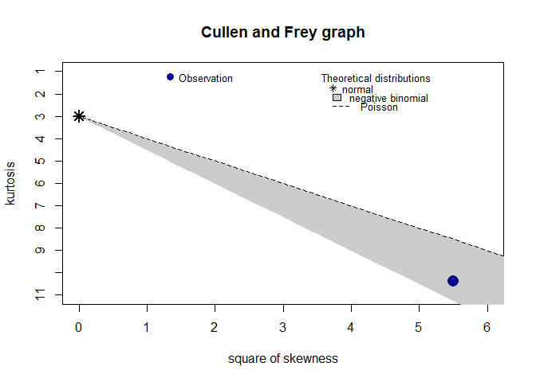

# 데이터 과학을 위한 R 알고리즘
`r Sys.Date()`  

## 1. 최초 성공의 의미 {#first-success-meaning}

최초 성공의 의미를 찾는 것은 [뮤오리진](http://muorigin.webzen.co.kr/main) 같은 MMORPG 게임에서 아이템 강화에 성공하는 작은 기쁨부터,
공무원시험에 합격하는 것까지 다양한 사례를 현실에서 찾아볼 수 있다.

## 2. 기하분포 수학적 표현 {#math-geometric-distribution} 

기하분포를 수학적으로 표현하는 방법은 두가지가 있다. [^wiki-geometric]

[^wiki-geometric]: [Geometric distribution](https://en.wikipedia.org/wiki/Geometric_distribution)

- $k$번 시도를 기준으로 성공을 수식으로 표현
    - $(1-p)^{k-1} \times p$
    - 평균: $\frac{1}{p}$
    - 분산: $\frac{1-p}{p^2}$
- $k$번 실패를 기준으로 성공을 수식으로 표현
    - $(1-p)^k \times p$
    - 평균: $\frac{1-p}{p}$
    - 분산: $\frac{1-p}{p^2}$

R에서는 `rgeom` 함수가 기하분포에서 난수를 발생시키는 함수인데 $k$번 실패를 기준으로 성공을 수식으로 표현한다.

### 2.1. `rgeom` 난수 발생 {#rgeom-random-number}

`rgeom` 함수를 통해 성공확률 0.7을 갖는 기하분포를 따르는 난수를 10,000개 생성한다.
`summary` 함수를 통해 평균값을 보면 평균적으로 0.4회 실패를 해야 성공할 수 있다고 결과가 나온다.
따라서, $\frac{1-p}{p} = \frac{1-0.7}{0.7} = 0.4285714$ 가 나온다.
다시 말해서 적어도 1회 성공하려면 시도 횟수에 방점을 둔 공식에 따라 $\frac{1}{p} = \frac{1}{0.7} = 1.4285714$ 이 된다.

~~~{.r}
rgeom_simdata <- rgeom(10000, prob=0.7)

summary(rgeom_simdata)
~~~

~~~{.output}
   Min. 1st Qu.  Median    Mean 3rd Qu.    Max. 
 0.0000  0.0000  0.0000  0.4256  1.0000  9.0000 

~~~

### 2.2. `rgeom` 난수의 적합도 검정 {#rgeom-random-number-gof}

`rgeom` 함수에서 나온 난수가 정말 기하분포를 따르는지, 만약 기하분포를 따른다면 모수는 얼마인지 추정해 보자.

~~~{.r}
descdist(rgeom_simdata, discrete = TRUE)
~~~

~~~{.output}
summary statistics
------
min:  0   max:  9 
median:  0 
mean:  0.4256 
estimated sd:  0.7830236 
estimated skewness:  2.435572 
estimated kurtosis:  11.29091 

~~~

~~~{.r}
fitdist(rgeom_simdata, "geom")
~~~

~~~{.output}
Fitting of the distribution ' geom ' by maximum likelihood 
Parameters:
     estimate  Std. Error
prob 0.701459 0.003832663

~~~

## 3. 아이템 강화 모사 {#item-reinforcement}

아이템 강화를 모사해 보자. 즉 아이템 성공확률이 $p=0.7$ 인 경우, 
1회 시도인 경우와 100회 시도인 경우를 모사해보자.

~~~{.r}
# 1. 아이템 강화 --------------
## 1.1. 1회 시도 모사
sample(c("성공", "실패"), size=1, prob=c(0.70, 1-0.70))
~~~

~~~{.output}
[1] "실패"

~~~

~~~{.r}
## 1.2. 100회 시도 모사
for(i in 1:100) cat(i, ":", sample(c("성공", "실패"), size=1, prob=c(0.70, 1-0.70)), "")
~~~

~~~{.output}
1 : 실패 2 : 성공 3 : 성공 4 : 실패 5 : 성공 6 : 실패 7 : 성공 8 : 실패 9 : 성공 10 : 실패 11 : 성공 12 : 성공 13 : 실패 14 : 성공 15 : 성공 16 : 성공 17 : 성공 18 : 성공 19 : 실패 20 : 성공 21 : 성공 22 : 성공 23 : 성공 24 : 성공 25 : 실패 26 : 성공 27 : 성공 28 : 성공 29 : 성공 30 : 성공 31 : 실패 32 : 성공 33 : 실패 34 : 성공 35 : 성공 36 : 실패 37 : 성공 38 : 실패 39 : 실패 40 : 성공 41 : 실패 42 : 성공 43 : 성공 44 : 성공 45 : 실패 46 : 실패 47 : 성공 48 : 실패 49 : 성공 50 : 성공 51 : 실패 52 : 성공 53 : 성공 54 : 실패 55 : 성공 56 : 성공 57 : 성공 58 : 성공 59 : 실패 60 : 성공 61 : 성공 62 : 성공 63 : 성공 64 : 성공 65 : 성공 66 : 성공 67 : 성공 68 : 성공 69 : 성공 70 : 성공 71 : 성공 72 : 성공 73 : 성공 74 : 성공 75 : 성공 76 : 성공 77 : 실패 78 : 실패 79 : 성공 80 : 성공 81 : 성공 82 : 실패 83 : 실패 84 : 실패 85 : 성공 86 : 실패 87 : 성공 88 : 성공 89 : 성공 90 : 성공 91 : 성공 92 : 성공 93 : 실패 94 : 성공 95 : 실패 96 : 실패 97 : 성공 98 : 실패 99 : 성공 100 : 성공 

~~~

### 3.1. 성공전 실패횟수 모사 {#item-reinforcement-before-success}

성공전 실패횟수를 모사하는 프로그램을 작성해보자.

1. 1회 모사 함수작성
1. 작성된 1회 모사 함수를 $n$ 회 반복
1. 성공전 실패횟수를 분석

#### 3.1.1. 성공전 실패횟수 1회 모사

성공전 실패횟수를 1회 모사하는 함수를 작성한다.
`sample(c("성공", "실패"), size=1, prob=c(0.70, 1-0.70)) == "성공"` 조건식을 통해 `성공`이 1회 관측되면
무한 루프를 종료하고 빠져나오고, 만약 조건식이 계속 `실패`로 나오면 반복적으로 실행한다.

~~~{.r}
## 1.3. 성공전 실패횟수를 모사 - 1회 모사 함수작성 후 n 회 반복

reinforce_item <- function(prob=0.7) {
    turn <- 0
    while(TRUE) {
        if(sample(c("성공", "실패"), size=1, prob=c(prob, 1-prob)) == "성공") {
            break
        } else {
            turn <- turn + 1
        }
        
    }
    return(turn)
}
~~~

#### 3.1.2. `n`번 반복

`reinforce_simulation` 함수를 작성해서 `n`번 반복을 수행해도 되지만,
`replicate` 내장함수를 사용하면 코드가 깔끔해진다.

~~~{.r}
# reinforce_simulation <- function(trial = 100) {
#     
#     reinforcment_result <- numeric(trial)
#     
#     for(i in 1:trial) {
#         reinforcment_result[i] <- reinforce_item()
#     }
#     
#     return(reinforcment_result)
# }

replicate(100, reinforce_item())
~~~

~~~{.output}
  [1] 0 0 0 0 0 0 2 0 0 1 0 0 0 0 1 0 0 0 0 0 2 0 1 0 0 0 0 0 1 1 2 0 0 2 1
 [36] 0 0 0 0 0 0 0 1 0 0 2 0 0 0 2 0 0 0 2 0 0 0 1 1 0 0 1 1 0 0 0 0 4 0 0
 [71] 0 2 2 1 0 0 1 0 0 0 0 0 3 0 1 0 1 0 0 0 0 0 2 0 0 0 1 1 1 1

~~~

#### 3.1.3. 모의실험 결과 검증

기 작성한 `n`번 반복 함수를 활용해도 돼고, 
`replicate` 함수를 활용해서 모의실험 결과를 검증해 본다.
당연하지만, 음이항분포의 특수한 사례가 기하분포가 되고, 기하분포의 모수는 `0.7`로 
제대로 생성된 것이 확인된다.

~~~{.r}
## 1.4. 모의실험 결과 검증

# reinforce_item_result <- reinforce_simulation(1000)
reinforce_item_result <- replicate(100000, reinforce_item(0.7))

fitdistrplus::descdist(reinforce_item_result, discrete = TRUE)
~~~

~~~{.output}
summary statistics
------
min:  0   max:  10 
median:  0 
mean:  0.42839 
estimated sd:  0.7789981 
estimated skewness:  2.345554 
estimated kurtosis:  10.38737 

~~~

~~~{.r}
fitdistrplus::fitdist(reinforce_item_result, "geom")
~~~

~~~{.output}
Fitting of the distribution ' geom ' by maximum likelihood 
Parameters:
      estimate Std. Error
prob 0.7000889  0.0012124

~~~

~~~{.r}
mean(reinforce_item_result)
~~~

~~~{.output}
[1] 0.42839

~~~

마지막으로 평균적으로 성공하기까지 0.42839회 실패를 해야되서, 
따라서 최초 성공횟수는 1.42839 이 되어서 이론치 $\frac{1}{0.7}= 1.4285714$에 근사한다.

## 4. 3할 타자가 삼진 아웃 전에 안타를 칠 확률 {#hit-geometric}

타율이 3할($p=0.3$)이 타자가 있다. 볼은 무시하고 스타라이크 아웃 전에 안타를 칠 확률은 얼마나 될까?
전형적인 기하분포 문제로 성공은 안타, 실패는 스크라이크로 정의한다.
그러면 스트라이크 아웃 전에 안타를 치려면 스타라이크 0 인 상태에서 안타, 스타라이크 1 인 상태에서 안타,
스타라이크 2 인 상황에서 안타를 쳐야한다. 따라서, 확률은 다음과 같다.

$$Pr(X=0) + Pr(X=1) + Pr(X=2) = (0.7)^0 \times 0.3 + (0.7)^1 \times 0.3 + (0.7)^2 \times 0.3  = 0.657$$

~~~{.r}
pgeom(2, prob=0.3)
~~~

~~~{.output}
[1] 0.657

~~~
