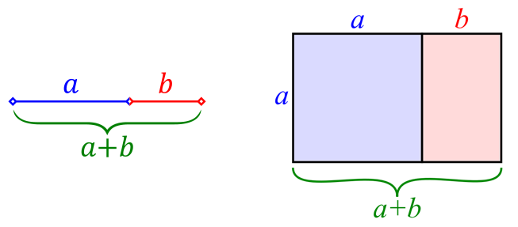
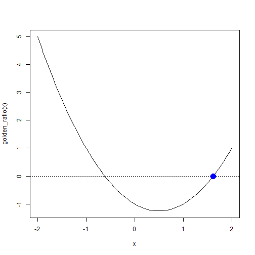

## 1. 황금비 (Golden Ratio) 정의 {#golden-ratio}

황금비(Golden ratio)는 어떤 두 수의 비율이 그 합과 두 수중 큰 수의 비율과 같도록 하는 비율로, 
근사값이 1.618... 같이 정의되는 무리수이다. 
기하학적으로 해석하면 더 큰 $a$와 $a+b$에 대한 비율이 $a$와 $b$에 대한 비율과 같다는 것으로 
하나의 선분에 대해서도 성립하고, 직사각형 면적에 대해서도 성립한다.

수학적으로 정의와 기하학적 의미는 다음과 같다.

이를 수학적으로 표현하면 다음과 같다. 그리고, 황금비를 $\varphi$로 표기한다.

$$ \frac{a + b}{a}  = \frac{a}{b} \overset{\underset{\mathrm{def}}{}}{=} \varphi$$

### 1.1 황금비는 얼마인가? {#golden-ratio-root}

황금비가 무리수라는 것이 알려져 있다. 이제 황금비가 얼마인지 수식을 풀어보자.

$$\varphi \overset{\underset{\mathrm{def}}{}}{=} \frac{a + b}{a}  = \frac{a}{b}$$

양변을 $ab$로 곱해주고 정리하면 다음과 같다.

$$\frac{a + b}{a} \times ab  = \frac{a}{b} \times ab$$

$$ab + b^2 = a^2$$

이제 앞서 정의한 황금비 $\frac{a}{b} \overset{\underset{\mathrm{def}}{}}{=} \varphi$에 맞춰 정리하기 위해서 양변을 $b^2$으로 나눠주고 $\varphi$ 값으로 정리한다.

$$ \frac {ab + b^2}{b^2} = \frac{a^2}{b^2}$$

$$\bigg(\frac {a}{b} \bigg)  + 1 = \bigg(\frac{a}{b} \bigg)^2$$

$$\varphi  + 1 = \varphi^2$$

이제 2차 방정식으로 정리하고 나서 풀어내면 방정식의 해를 구할 수 있고, 따라서 황금비를 구할 수 있다.

$$\varphi^2 - \varphi  - 1 = 0$$

$$\varphi = \frac{1+\sqrt{5}}{2} = 1.6180339887\ldots$$

### 1.2 컴퓨터를 활용한 황금비 계산 {#golden-ratio-root-with-computers}

R을 설치하면 `stats` 팩키지 내부에 `unitroot` 함수가 있어 방정식의 근을 찾을 수 있다.
황금비 함수를 `phi^2 - phi -1` 정의하고 나서 `unitroot` 함수에 근을 찾는 구간을 지정하면 근을 구할 수 있다.

이를 `curve` 함수로 황금비 함수를 시각화하고, 해가 존재하는 선을 `abline` 함수로 긋고 나서,
`unitroot`로 찾아진 근을 `points` 함수로 점모양(`pch=16`), 두배 크기(`cex = 2`), 색상은 푸른색(`col="blue"`)으로 지정하여 
시각화한다.

~~~{.r}
# 1. 황금비 
## 1.1. 황금비 함수 정의
golden_ratio <- function (phi) {
    phi^2 - phi -1    
}

## 1.2. 황금비 근찾기
gr_root <- uniroot(golden_ratio, c(0, 2))$root

## 1.3. 황금비 근 시각화
curve(golden_ratio(x), -2, 2)
abline(h = 0, lty = 3)
points(gr_root, 0, pch = 16, cex = 2, col="blue")
~~~

## 2. 근 찾기(Root Finding) [^newton-raphson-book] {#root-finding}

[^newton-raphson-book]: [Owen Jones, Robert Maillardet, Andrew Robinson(2014), "Introduction to Scientific Programming and Simulation Using R", CRC Press](https://www.crcpress.com/Introduction-to-Scientific-Programming-and-Simulation-Using-R-Second-Edition/Jones-Maillardet-Robinson/p/book/9781466569997)

근을 찾는 수치해석 알고리즘은 다수 존재한다. 그중 뉴튼-랩슨(Newton–Raphson) 알고리즘을 적용하여 근을 빠르게 구할 수 있다.

$$x_{n+1} = x_n - \frac{f(x_n)}{f^{\prime}(x_n)} $$

즉, 미분이 존재할 경우 초기값을 지정하고, 해당 지점에 미분값을 활용하여 추정값을 구하고 다음 추정값을 동일한 방식으로 
계산해 나가면 근사적으로 근과 매우 가까운 값을 구할 수 있다. 이를 시각적으로 구현한 애니메이션으로 표현하면 다음과 같다. [^animation-newton-raphson]

[^animation-newton-raphson]: [Demonstration of the Newton-Raphson method for root-finding](https://yihui.name/animation/example/newton-method/)

<video controls loop autoplay><source src="fig/newton-raphson-demo.mp4" />
뉴튼-랩슨 근 찾기
</video>

근을 구하려는 방정식 함수를 지정하고 나서, 해당 함수의 미분값을 구하여 해당 함수로 작성한다.

~~~{.r}
## 뉴튼-랩슨 알고리즘
newton_raphson_fn <- function(ftn, init_val = 2, tolerance = 1e-9, max_iter = 100) {
    
    # 초기값 설정
    x <- init_val
    fx <- ftn(x)
    iter <- 0

    # 뉴튼랩슨 알고리즘 실행
    while ((abs(fx[1]) > tolerance) && (iter < max_iter)) {
        x <- x - fx[1]/fx[2]
        fx <- ftn(x)
        iter <- iter + 1
        cat("반복횟수:", iter, "추정된 근의 값:", x, "\n")
    }

    # 뉴트랩슨 알고리즘 반환
    if (abs(fx[1]) > tolerance) {
        cat("뉴튼랩슨 알고리즘이 수렴하는데 실패했습니다.\n")
        break
    } else {
        cat("알고리즘이 수렴했습니다.\n")
        return(x)
    }
}
~~~

### 2.1. 황금비 뉴튼-랩슨 알고리즘 근찾기 {#golden-ratio-newton-raphson}

황금비 함수는 다음과 같이 표현된다.

$$f(\varphi) =\varphi^2 - \varphi  - 1$$

황금비 함수를 미분하면 다음과 같다.

$$f^{\prime}(\varphi) =2 \times \varphi - - 1$$

뉴튼-랩슨 알고리즘으로 근을 구하는데 황금비 함수와 일차 미분한 결과를 반영하여 `gold_ratio_fn`를 작성하여 `newton_raphson_fn` 함수에 넣어 근을 추정한다.

~~~{.r}
gold_ratio_fn <- function(x) {
    fx <- x^2 - x -1
    dfx <- 2*x -1
    return(c(fx, dfx))
}

newton_raphson_fn(gold_ratio_fn, init_val=3, max_iter = 1000)
~~~

~~~{.output}
반복횟수: 1 추정된 근의 값: 2 
반복횟수: 2 추정된 근의 값: 1.666667 
반복횟수: 3 추정된 근의 값: 1.619048 
반복횟수: 4 추정된 근의 값: 1.618034 
반복횟수: 5 추정된 근의 값: 1.618034 
알고리즘이 수렴했습니다.

~~~

~~~{.output}
[1] 1.618034

~~~

### 2.2. 애니메이션 뉴튼-랩슨 알고리즘 근찾기 {#animation-newton-raphson}

애니메이션에 나온 함수의 근을 찾는 방법도 동일한다.

$$f(x) = x^2 - 4$$

상기 함수를 미분하면 다음과 같다.

$$f^{\prime}(x) = 2x$$

뉴튼-랩슨 알고리즘으로 근을 구하는데 애니메이션 2차 함수($x^2 -4$)와 일차 미분($2x$)한 결과를 반영하여 `animation_fn`를 작성하여 `newton_raphson_fn` 함수에 넣어 근을 추정한다.

~~~{.r}
animation_fn <- function(x) {
    fx <- x^2 - 4
    dfx <- 2*x
    return(c(fx, dfx))
}

newton_raphson_fn(animation_fn, init_val=10, max_iter = 1000)
~~~

~~~{.output}
반복횟수: 1 추정된 근의 값: 5.2 
반복횟수: 2 추정된 근의 값: 2.984615 
반복횟수: 3 추정된 근의 값: 2.162411 
반복횟수: 4 추정된 근의 값: 2.006099 
반복횟수: 5 추정된 근의 값: 2.000009 
반복횟수: 6 추정된 근의 값: 2 
알고리즘이 수렴했습니다.

~~~

~~~{.output}
[1] 2

~~~
