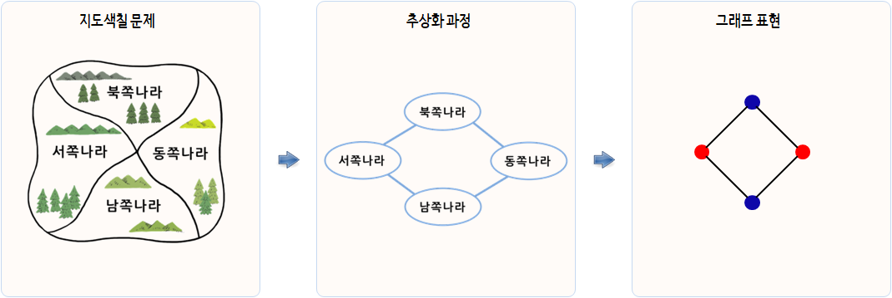

```{r, include=FALSE}
source("tools/chunk-options.R") 

knitr::opts_chunk$set(echo = TRUE, warning=FALSE, message=FALSE)


options(scipen = 999)
options(family="NanumGothic")

```


## 1. 가난한 지도 제작자 문제 [^unplugged-coloring] {#graph-coloring-problem}

[^unplugged-coloring]: [컴퓨터 과학 언플러그드 -  가난한 지도 제작자 - 그래프 색칠하기](https://statkclee.github.io/unplugged/intractability.html#graph-coloring)


많은 최적화 문제는 특정 사건이 동일 시간에 발생할 수 없거나, 
집합 객체에 소속된 구성원이 서로 인접할 수 없는 상황을 포함한다. 
예를 들어, 수업 시간표나 회의 일정표를 작성하는 사람은 관련된 모든 사람의 제약조건을 만족시키는 문제에 맞닥드리게 된다. 
이러한 어려움 중의 상당부분은 지도 색책 문제로 귀결된다. 
이 문제에서 지도에 있는 국가들, 국경을 맞대고 있는 나라를 다른 색깔을 정해서 칠해야 한다.

<iframe width="320" height="200" src="https://www.youtube.com/embed/NgbK43jB4rQ" frameborder="0" allowfullscreen></iframe>

지도 제작자가 가난해서, 크래용을 많이 사용할 수 없다. 그래서, 가능한 적은 수의 크래용을 사용하는 아이디어를 내보자.

예를 들어, 다음 지도에는 나라가 네개 있다. 
만약 Northland를 빨간색으로 칠한다면, Westland와 Eastland는 빨간색이 될 수 없다. 
왜냐하면, Northland와 국경을 맞대고 있어서 경계를 구별할 수 없기 때문이다. 
Westland를 녹색으로 칠할 수 있고 Eastland도 녹색으로 칠하는 것이 용인된다. 
왜냐하면 Westland와 국경을 맞대고 있지 않기 때문이다. 
(만약 두 나라가 한 점에서 만난다면, 국경을 공유하는 것으로 간주되지 않아서, 동일한 색깔을 칠할 수 있다.) 
Southland를 빨간색으로 색칠해서 지도상에 단지 두가지 색으로 색칠을 끝마칠 수 있다.




