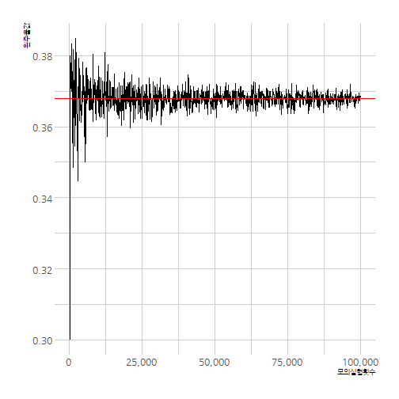

# 데이터 과학을 위한 R 알고리즘
`r Sys.Date()`  

## 1. 교란순열(Deragnement) {#derangement}

[교란순열(Derangement)](https://ko.wikipedia.org/wiki/%EC%99%84%EC%A0%84%EC%88%9C%EC%97%B4)은 모든 원소의 위치를 바꿔어 
원래 위치한 원소가 전혀 다른 위치한 순열이다. 

예를 들어, "1", "2", "3", "4" 숫자가 4개가 있는 경우 총, $4! =$ 24 나열하는 경우의 수가 있다.
하지만, "1"은 "1"의 위치에 있지 말아야 하고, 동일하게 "2,3,4"도 "2,3,4"의 위치에 있으면 되지 않는다.
그런 경우를 빼면 총 9 개의 경우의 수가 있는데 이러한 사례가 교란수열의 좋은 본보기다. [^wiki-derangments]

[^wiki-derangments]: [위키백과 - Derangement](https://en.wikipedia.org/wiki/Derangement)

즉, 숫자 4개를 배열하는 경우의 수는 24 경우가 있지만, 모든 원소의 원래 위치하지 않는 경우의 수는 9개가 있어 확률은 $\frac{9}{24}=$ 0.375가 된다.

<iframe width="560" height="315" src="https://www.youtube.com/embed/pbXg5EI5t4c" frameborder="0" allowfullscreen></iframe>

## 2. 교란순열 수식을 통한 증명 -  {#derangement-math}

교란순열이 전체 순열에서 차지하는 확률을 계산하려면, 분자와 분모로 나눠어서 증명한다.

### 2.1. 분모 {#derangement-math-denom}

분모는 첫번째 사람이 $n$ 개를 선택하고, 두번째 사람이 앞선 사람이 선택한 1개를 빼고 $n-1$, 세번째 사람은 앞선 사람이 선택한 2개를 빼고 $n-2$, 가 되고, $\cdots$ 마지막 사람은 당연히 1개만 남아 선택지가 없다. 이런 경우의 수는 $n \times (n-1) \times (n-2) \times \cdots 2 \times 1 = n!$

### 2.2. 분자 {#derangement-math-nom}

교란순열인 분자의 경우의 수는 조금 복잡해서, 문제를 간단히 하기 위해서 실패하는 사례를 먼저 생각해보자.

- 조합 경우의 수 일반식: $C(n,k) = \frac{n!}{k!(n-k)!}$
- 한사람이 숫자를 하나 잘못뽑는 경우: $C(n,1)$, $(n-1)!$ 경우의 수가 남음
- 두사람이 숫자를 두개 잘못뽑는 경우: $C(n,2)$, $(n-2)!$ 경우의 수가 남음
- ...
- $n-1$ 사람이 숫자를 $n-1$개 잘못뽑는 경우: $C(n,n-1)$, $1!$ 경우의 수가 남음
- $n$ 사람이 숫자를 $n$개 잘못뽑는 경우: $C(n,n)$, $0!$ 경우의 수가 남음

$k$ 사람이 숫자를 잘못 뽑는 경우, 실패사례를 일반화하여 수식으로 표현하면 다음과 같다.

$$C(n,k)(n-k)! =\frac{n!}{k!}$$

[포함-배제 원칙(inclusion-exclusion principle)](https://en.wikipedia.org/wiki/Inclusion%E2%80%93exclusion_principle#Examples)을
적용하여 교한순열을 표현하여 실패사례를 나타내보자.

$$\text{1명 잘못 뽑음} - \text{2명 잘못 뽑음} + \text{3명 잘못 뽑음} - \text{4명 잘못 뽑음} + \text{5명 잘못 뽑음} \pm \cdots$$
앞서, 정의한 수식을 대입해보자.

$${n \choose 1}(n-1)!+{n \choose 2}(n-2)!-\cdots \pm {n \choose n}0! =n!+\sum_{i=1}^n (-1)^i{n \choose i} (n-i)! = \frac{n!}{1!} - \frac{n!}{2!} + \frac{n!}{3!} - \frac{n!}{4!} + (-1)^{n+1} \frac{n!}{n!}$$

따라서, 실패한 경우의 수는 $n!$을 앞으로 빼서 정리하면 다음과 같다.

$$n! \Bigg( \frac{1}{1!} - \frac{1}{2!} + \frac{1}{3!} - \frac{1}{4!} + (-1)^{n+1} \frac{1}{n!}  \Bigg)$$

이제 확률을 계산하면 $n!$로 나눠주면 실패확률이 된다.

$$\text{실패확률} = \Bigg( \frac{1}{1!} - \frac{1}{2!} + \frac{1}{3!} - \frac{1}{4!} + (-1)^{n+1} \frac{1}{n!}  \Bigg)$$

성공 확률을 계산하려면 1 에서 빼면 된다.

$$\text{성공확률} = \frac{1}{2!} - \frac{1}{3!} + \frac{1}{4!} + (-1)^{n+1} \frac{1}{n!} \approx \lim_{n\to\infty} \frac{!n}{n!} = \frac{1}{e} \approx 0.3679 \dots$$

## 3. 교란순열 사례 - 산타선물 {#derangement-secret-santa}

산타선물 문제를 컴퓨터의 도움으로 풀어보자.

<iframe width="560" height="315" src="https://www.youtube.com/embed/7iNwyqeEH6Y" frameborder="0" allowfullscreen></iframe>

### 3.1. 산타선물 모의실험 함수 {#derangement-secret-santa-function}

사람이 10명 모여있고, 각자 선물을 줘야 하는데 본인에게 선물을 주는 것은 누구도 원치 않기 때문에 실패로 가정하고, 이를 함수로 작성하고 나서, 모의실험을 `10,000`회 실시하고 이론값(0.3678794)과 비교한다.

~~~{.r}
# library(tidyverse)
# library(hrbrthemes)
# library(extrafont)
# loadfonts()

# 1. 산타 선물 뽑기 모의실험 (1회)

secret_santa <- function(person=10) {
    # 참가자 설정
    person <- 10
    gift <- 1:person
    
    # 한번 뽑기 시도
    draw <- sample(gift, size=person, replace = FALSE)
    
    # 뽑기 결과: 합이 0 이면 성공
    
    result <- ifelse( sum(gift == draw) == 0, TRUE, FALSE)
    return(result)
}

# 2. 산타 선물 뽑기 모의실험 반복실험
## 2.1. 이론값
1/exp(1)
~~~

~~~{.output}
[1] 0.3678794

~~~

~~~{.r}
## 2.2. 모의실험 값
mean(replicate(10000, secret_santa()))
~~~

~~~{.output}
[1] 0.3609

~~~

### 3.2. 산타선물 모의실험 수렴확인 {#derangement-secret-simulation}

회차별 모의실험을 수행하기 위채서 별도로 `simulate_santa`라는 모의실험 반복함수를 생성시키고 나서, 모의실험 횟수가 증가함에 따라 이론값에 수렴해 나가는 것을 표와 그래프로 확인한다.

~~~{.r}
# 3. 모의실험값이 이론값에 수렴함을 시각화 -----------------
## 3.1. 모의실험 횟수 함수
simulate_santa <- function(iter=1000) {
    santa_mean_v <- mean(replicate(iter, secret_santa()))
    return(santa_mean_v)
}

## 3.2. 모의실험 횟수
santa_lst <- list()

for(i in 1:10^5) {
    if(i %% 100 == 0) {
        santa_lst[[length(santa_lst)+1]] <- i
    }
}

## 3.3. 모의실험 횟수 증가 모의실험

iter_v <- santa_lst %>% unlist
santa_v <- map(santa_lst, simulate_santa) %>% unlist

santa_df <- data.frame("반복횟수"=iter_v, "교란확률"=santa_v)

## 3.4. 표로 정리

santa_df %>% 
    mutate(오차율 = scales::percent(abs(교란확률 - 1/exp(1)) / (1/exp(1)))) %>% 
    DT::datatable() %>% 
       DT::formatCurrency("교란확률", currency ="", interval = 3, mark = ",", digits = 5)
~~~

<!--html_preserve-->

<!--/html_preserve-->

~~~{.r}
## 3.5. 수렴 시각화

ggplot(santa_df, aes(x=반복횟수, y=교란확률)) +
    geom_line() +
    theme_ipsum(base_family="NanumGothic") +
    labs(x="모의실험횟수", y="원주율값") +
    scale_x_continuous(labels = scales::comma) +
    geom_hline(yintercept = 1/exp(1), color="red")
~~~

