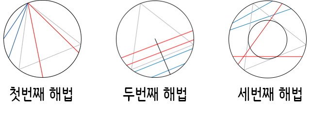

```{r, include=FALSE}
source("tools/chunk-options.R") 

knitr::opts_chunk$set(echo = TRUE, warning=FALSE, message=FALSE, fig.width = 12, fig.height = 10)

library(tidyverse)
library(ggthemes)
library(extrafont)
library(hrbrthemes)
loadfonts()

library(timelineS) # devtools::install_github("daheelee/timelineS")
library(tidyverse)
library(lubridate)
library(dice)
library(Rdice)

options(scipen = 999)
options(family="NanumGothic")
```

## 1. 역사적인 확률문제 [^classic-problems-of-probability] {#histical-probability-problems}

[^classic-problems-of-probability]: [Prakash Gorroochurn (2016), "Classic Problems of Probability", Wiley](https://www.amazon.com/Classic-Problems-Probability-Prakash-Gorroochurn/dp/1118063252)


``` {r history-of-probability}
# 0. 환경설정 --------------
# library(timelineS) # devtools::install_github("daheelee/timelineS")
# library(tidyverse)
# library(lubridate)

# 1. 확률의 역사 데이터 --------------
history_df <- tribble(
    ~event, ~event_date, ~event_eng,
    "카다노 - 확률게임", "1564-07-01", "Cardano - Games of Chance",
    "갈릴레오 - 주사위에 대한 발견", "1620-07-01", "Galileo - a Discovery Concerning Dice",
    "슈발리에 드 메레 - 주사위 문제", "1654-07-01", "Chevalier de Mere - The Problem of Dice",
    "슈발리에 드 메레 - 지분분할 문제", "1654-07-01", "Chevalier de Mere - The Problem of Points",
    "호이겐스 - 도박꾼의 파산", "1657-07-01", "Huygens and the Gambler’s Ruin",
    "피에르 레몽 드 몽모르 조우", "1708-07-01", "Rencontres with Montmort",
    "야코프 베르누이 - 황금정리", "1713-07-01", "Jacob Bernoulli and his Golden Theorem",
    "다니엘 베르누이 - 세인트 피터스버그 문제", "1738-07-01", "Daniel Bernoulli and the St. Petersburg Problem",
    "달랑베르 - 동전던지기", "1754-07-01", "d’Alembert and the Croix ou Pile Article",
    "달랑베르 - 도박사의 오류", "1761-07-01", "d’Alembert and the Gambler’s Fallacy",
    "뷔퐁의 바늘 문제", "1777-07-01", "The Buffon Needle Problem",
    "베르트랑 투표 문제", "1887-07-01", "Bertrand’s Ballot Problem",
    "베르트랑의 수상한 세 상자", "1889-07-01", "Bertrand’s Strange Three Boxes",
    "베르트랑의 현", "1889-07-01", "Bertrand’s Chords",
    "프랜시스 골톤의 동전 던지기", "1894-07-01", "Three Coins and a Puzzle from Galton",
    "생일문제", "1939-07-01", "Coinciding Birthdays"
)

history_df <- history_df %>% 
    mutate(event_date = ymd(event_date))

# 2. 확률의 역사 연대기 --------------

timelineS(history_df, main = "확률 연대기", buffer.days = 3600,
          label.direction = "up", label.length = c(0.2,0.8,0.4,1.2), label.position = 3,
          labels = paste0(history_df[[1]], "(", as.character(year(history_df[[2]])), ")", "\n", history_df[[3]]) )
```

## 2. 연대별 중요 확률 문제 {#classic-probability-problems}

### 2.1. 카다노 - 확률게임 {#cardano-1564}

**문제:** 적어도 한번 눈이 6개인 주사위면이 나오려면 공정한 주사위를 최소 몇번 던져야할까? - 
"How many throws of a fair die do we need in order to have an even chance of at least one six?"

- 주사위를 한번 던져 주사위 눈이 6개인 면이 나올 사건을 $A$로 정의
- 사건 $A$에 따라 확률은 $p_A = \frac{1}{6}$
- 사건 $A$가 발생하지 않을 확률은 $1 - p_A = 1 - \frac{1}{6} = \frac{5}{6}$
- 주사위를 던지는 사건의 독립성을 가정하면,

$$\begin{align}
Pr(\text{n번 주사위를 던져 적어도 6면이 한번 이상 나올 확률}) & = 1 - Pr(\text{n번 주사위를 던져 한번도 6면이 나오지 않을 확률}) \nonumber \\
  & 1 - (1 - \frac{1}{6}) \times (1 - \frac{1}{6}) \times \cdots \times (1 - \frac{1}{6}) \\
  & 1 - \bigg(\frac{5}{6} \bigg)^n
\end{align}$$

이제 최소 횟수를 구하기 위해서 $1 - \bigg(\frac{5}{6} \bigg)^n \ge \frac{1}{2}$ 수식을 정리하면 다음과 같다.

$$n \ge \frac{ln(\frac{1}{2})}{ln(\frac{5}{6})} = 3.801784 \approx 4$$

즉, 4회 이상이 된다.

이를 R 코드로 작성해서 카다노 문제를 모의실험할 수 있다.

``` {r cardano-simulation, cache=TRUE}
# 2. 모의실험 ---------------

draw_dice <- function(nthrow=1) {
    draw_die <- rmultinom(n=1, size=nthrow, prob=rep(1/6,6))
    num_six <- ifelse(draw_die[6,1] == 0, 0, 1)
    return(num_six)
}

for(i in 1:50) {
    
    theory_val <- 1 - (5/6)^i 
    
    sim_val <- mean(replicate(10000, draw_dice(i)))
    
    cat("주사위던지기 횟수(n):", i, "이론값:", round(theory_val, 5), "확률값:", round(sim_val, 5), "\n")
}
```


### 2.2. 갈릴레오 - 주사위에 대한 발견 {#galileo-1620}

**문제:** 세개 주사위를 던져 합을 구한다. 서로 다른 6개 조합을 통해 주사위 던진 합 9, 10, 11, 12을 구할 수 있다.
그런데, 주사위 던진 합계 10 혹은 11이 9, 12 보다 더 왜 많이 나오는가?

"Suppose three dice are thrown and the three numbers obtained added. 
The total scores of 9, 10, 11, and 12 can all be obtained in six different combinations.
Why then is a total score of 10 or 11 more likely than a total score of 9 or 12?"

- 주사위 세개를 던진 합계가 9, 10, 11, 12인 경우를 표로 정리하면 결과를 쉽게 확인할 수 있다.

| 조합수| 9 | 조합수| 10 | 조합수| 11 | 조합수| 12 |
|:-----:|---|:-----:|----|:-----:|----|:-----:|----|
| 6-2-1 | 6 | 6-3-1 | 6  | 6-4-1 | 6  | 6-5-1 | 6  |
| 5-3-1 | 6 | 6-2-2 | 3  | 6-3-2 | 6  | 6-4-2 | 6  |
| 5-2-2 | 3 | 5-4-1 | 6  | 5-5-1 | 3  | 6-3-3 | 3  |
| 4-4-1 | 3 | 5-3-2 | 6  | 5-4-2 | 6  | 5-5-2 | 3  |
| 4-3-2 | 6 | 4-4-2 | 3  | 5-3-3 | 3  | 5-4-3 | 6  |
| 3-3-3 | 1 | 4-3-3 | 3  | 4-4-3 | 3  | 4-4-4 | 1  |
| 9 경우수 | 25 | 10 경우수 | 27 | 11 경우수 | 27 | 12 경우수 | 25 |

``` {r galileo-1620-rcode}
## 2. 이론값 ------------
library(dice) # install.packages("dice")

three_dice <- getSumProbs(ndicePerRoll = 3,
            nsidesPerDie = 6,
            nkept = 3)

three_dice$probabilities %>% 
    DT::datatable() %>% 
      DT::formatPercentage("Probability", digits=1)

## 3. 모의실험결과 ------------
library(Rdice)

dice_sim <- dice.roll(faces = 6, dice = 3, rolls = 100000)

dice_sim$sums_freq %>% as_tibble() %>% 
    rename("주사위합" = sum, "확률" = freq, "누적확률" = cum_sum) %>% 
      DT::datatable() %>% 
        DT::formatCurrency(c("N"), currency="", interval=3, digits=0) %>% 
        DT::formatPercentage(c("확률", "누적확률"), digits=1)
```


### 2.3. 슈발리에 드 메레 - 주사위 문제 {#mere-1654}

**문제:** 주사위를 4번 던졌을 때, 적어도 주사위 눈 6 이 나올 확률은 $\frac{1}{2}$ 보다 약간 크다.
하지만, 주사위 두개를 24번 던졌을 때, 적어도 한번 주사위 눈 6이 두번 나올 확률은 $\frac{1}{2}$ 보다 다소 작다.
$Pr(\text{주사위 두개를 더졌을 때 6 눈이 두개}) = \frac{1}{36} = \frac{1}{6} \times Pr(\text{주사위 한개 던졌을 때 6개 눈이 한개})$인 사실에 비추어 봤을 때와 주사위 두개를 사용할 때 $6 \times 4 = 24$ 던져 $\frac{1}{6}$ 부분을 벌충할 수 있다고 봤을 때, 왜 두 확률이 같지 않는가?

"When a die is thrown four times, the probability of obtaining at least
one six is a little more than 1/2. However, when two dice are thrown 24 times, the
probability of getting at least one double-six is a little less than 1/2. Why are the
two probabilities not the same, given the fact that Pr{double-six for a pair of
dice} $= \frac{1}{36} = \frac{1}{6} \times$ Pr{a six for a single die}, and you compensate for the factor of
$\frac{1}{6}$ by throwing $6 \times 4 = 24$ times when using two dice?"

<iframe width="300" height="180" src="https://www.youtube.com/embed/MrVD4q1m1Vo" frameborder="0" allowfullscreen></iframe>

슈발리에 드 메레가 생각한 것을 정리하면 다음과 같다. 즉, 두가지 경우 승률이 0.5보다 높게 나와서 할만한 게임이다.

- $\frac{1}{6} + \frac{1}{6} + \frac{1}{6} + \frac{1}{6}= \frac{4}{6}$
- $\frac{1}{36} + \frac{1}{36} + \cdots + \frac{1}{36} = \frac{24}{36} = \frac{2}{3}$

하지만, 확률 곱셈법칙을 통해서 두가지 경우에 대한 확률을 계산하면 얘기가 달라진다.

$$\begin{align}
Pr(\text{4번 주사위를 던져 적어도 6면이 한번 나올 확률}) 
  & = 1 - Pr(\text{4번 주사위를 던져 한번도 6면이 나오지 않을 확률})  \\
  & = 1 - (1 - \frac{1}{6}) \times (1 - \frac{1}{6}) \times (1 - \frac{1}{6}) \times (1 - \frac{1}{6}) \\
  & = 1 - \bigg(\frac{5}{6} \bigg)^4 \\
  & = 0.5177469
\end{align}$$

$$\begin{align}
Pr(\text{24번 주사위를 던져 적어도 6면이 두번 나올 확률}) 
  & = 1 - Pr(\text{24번 주사위를 던져 한번도 6면이 두번 나오지 않을 확률})  \\
  & = 1 - (1 - \frac{1}{36}) \times (1 - \frac{1}{36}) \times \cdots \times (1 - \frac{1}{36}) \\
  & = 1 - \bigg(\frac{35}{36} \bigg)^24 \\
  & = 0.4914039
\end{align}$$


``` {r chevalier-problem-I, cache=TRUE}
# 2. 모의실험 ---------------
## 2.1. 주사위를 4번 던져 적어도 1회 눈이 6이 나올 확률
draw_dice <- function(nthrow=1) {
    draw_die <- rmultinom(n=1, size=nthrow, prob=rep(1/6,6))
    num_six <- ifelse(draw_die[6,1] >= 1, 1, 0)
    return(num_six)
}

mean(replicate(100000, draw_dice(nthrow=4)))

## 2.2. 주사위 두개를 24번 던졌을 때, 적어도 한번 주사위 눈 6이 두번 나올 확률
draw_two_dice <- function(draws = 24, dice=2) {
    dice_mat <- rmultinom(n=draws, size=dice, prob=rep(1/6,6))
    is_double_six <- ifelse(dice_mat[6,] == 2, 1, 0) # 24번 던져서 6이 두번 나온 경우
    double_six_game <- ifelse(sum(is_double_six) >= 1, 1, 0) # 1보다 크다면 24번 던진 전체 경기를 1승으로 간주
    return(double_six_game)
}

mean(replicate(100000, draw_two_dice(draws = 24, dice=2)))
```

### 2.4. 슈발리에 드 메레 - 지분분할 문제 {#mere-1654-2}

**문제:** 두 선수(A,B)가 공정한 게임을 통해서, 전체적으로 6경기를 먼저 이기는 사람이 
사람이 상금을 모두 가져가기로 했다. A 선수가 5경기를, B선수가 3경기를 이겼을 때, 뜻밖의
사건이 발생해서 경기를 더이상 속계할 수 없게 되었다.
이런 경우 선수 A, B 사이에 상금을 어떻게 나눠가져야 할까?

| 선수 | 1 | . | . | . | . | . | . | . | . |   현재   |
|:----:|---|---|---|---|---|---|---|---|---|----------|
|  A   | . | W | W | . | W | W | . | . | W | 1승 남음 |
|  B   | W | . | . | W | . | . | . | W | . | 3승 남음 | 

"Two players A and B play a fair game such that the player who wins a
total of 6 rounds first wins a prize. Suppose the game unexpectedly stops when A has
won a total of 5 rounds and B has won a total of 3 rounds. How should the prize be
divided between A and B?"


<iframe width="300" height="180" src="https://www.youtube.com/embed/C_nV3cVNjog" frameborder="0" allowfullscreen></iframe>

만약 게임을 계속진행한다면 6번째 경기까지 이겨서 상금을 받을 상대적인 확률로 결정한다.
A 선수는 1경기, B선수는 3 경기를 이겨야 하지만, A 선수 B선수 동시에 이기는 경우는 제외해야 해서
$(1+3)-1 =4$ 총 4 경기가 남았다.
따라서, $A_{\text{승}}, B_{\text{승}} A_{\text{승}}, B_{\text{승}} B_{\text{승}} A_{\text{승}},B_{\text{승}} B_{\text{승}} B_{\text{승}}$ 네가지 조합의 경우가 발생한다. 하지만, 네가지 최종승리 조합은 서로 일어날 가능성이 다르다. 예를 들어, $A_{\text{승}}$인 경우는  $A_{\text{승}}A_{\text{승}}A_{\text{승}}, A_{\text{승}}A_{\text{승}}B_{\text{승}}, A_{\text{승}}B_{\text{승}}A_{\text{승}}, A_{\text{승}}B_{\text{승}}B_{\text{승}}$ 이 포함된다. 따라서, 

$\bigg\{ A_{\text{승}}A_{\text{승}}A_{\text{승}}, A_{\text{승}}A_{\text{승}}B_{\text{승}}, A_{\text{승}}B_{\text{승}}A_{\text{승}}, A_{\text{승}}B_{\text{승}}B_{\text{승}},B_{\text{승}}A_{\text{승}}A_{\text{승}},B_{\text{승}}A_{\text{승}}B_{\text{승}}, B_{\text{승}}B_{\text{승}}A_{\text{승}}, B_{\text{승}}B_{\text{승}}B_{\text{승}} \bigg \}$

총 8가지 경우의 수가 앞으로 발생할 수 있고, $B$는 1번만 이기는 경우가 존재하기 때문에 7:1로 상금을 나누면 공평하게 상금이 나눠진다.

매번 경기를 할 때마다 경기는 "A승", "B승"으로 나눠지게 된다. 그리고 이런 경기를 3번 수행하는 경우 총 8가지 경우의 수가 나오고 B가 경기를 이기는 경우는 단 한가지만 존재한다.

```{r problems-of-points-expand-grid}
# 1. 경우의 수 ---------------

play_game   <- c("A승", "B승")

expand.grid(first=play_game, second=play_game, third=play_game)
```

`rmultinom`에서 난수를 뽑아내서 B선수가 이긴 경우는 단 하나로 연속해서 3번 이긴 경우가 된다. 
이를 모의실험하면 `r 1/8` B가 이긴 확률에 근사적으로 가깝게 도출된다.

```{r problems-of-points-simulation}
# 2. 모의실험 ---------------

play_mat <- rmultinom(n=100000, size=3, prob=rep(1/2,2))
is_B_win <- ifelse(play_mat[2,] == 3, 1, 0 ) # 잔여 경기 3게임을 실행해서 B가 이긴 경우

mean(is_B_win)
```

### 2.5. 호이겐스 - 도박꾼의 파산 [^gambler-ruin] {#huygens-1657}

[^gambler-ruin]: [도박꾼의 파산](https://ko.wikipedia.org/wiki/%EB%8F%84%EB%B0%95%EA%BE%BC%EC%9D%98_%ED%8C%8C%EC%82%B0)

**문제:** 두 선수 A,B가 초기 도박자금으로 각각 $a$, $t-a$ 가지고 있다.
선수 $A$가 첫번째 경기에서 이길 확률은 $p$, 선수 $B$가 이길 확률은 $q=1-p$로 가정하자.
선수 $A$가 매번 승리할 때마다, $B$로부터 1 달러를 받고, 그렇지 않은 경우는 $B$에게 1 달러를 준다.
궁극적으로 $A$가 $B$의 모든 돈을 가져올 확률은 얼마나 될까?

"Two players A and B, having initial amounts of money $a$ and $t-a$
dollars, respectively, play a game in which the probability that A wins a round is p and
the probability that B wins is $q=1-p$. Each time A wins, he gets one dollar from B,
otherwise he gives B one dollar. What is the probability that A will eventually get all
of B’s money?"

전체 확률의 법칙(Law of Total Probability)을 활용하여 파산할 확률을 다음과 같이 정리할 수 있다. 
여기서, $P(R_n)$은 초기 도박자금 $n$을 가지고 시작할 확률이다. 

$$P(R_n) = P(R_n|W)P(W) + P(R_n|\bar{W})P(\bar{W})$$

- $P(W)$: 승리할 확률($p$)
- $P(\bar{W})$: 패배할 확률($1-p$)

이제, $q_n = P(R_n)$으로 놓고, 경계조건 $q_0 = 1$, $q_{n_1 + n_2} = 0$ 갖고, 
도박게임을 계차방정식(differnce equation)으로 정리하면 다음과 같다. 

$$q_n = q_{n+1} p + q_{n-1} q$$

방정식을 풀면 $p_1=p_2=1/2$ 공평한 도박의 경우 다음과 같다.

- $P_1= \frac{n_2}{n_1+n_2}$
- $P_2= \frac{n_1}{n_1+n_2}$

불공평한 도박 ($p_1\ne p_2$)에서의 파산 확률은 다음과 같다.

- $P_1= \frac{1-(p_2/p_1)^{n_1}}{1-(p_2/p_1)^{n_1+n_2}}$
- $P_2= \frac{1-(p_1/p_2)^{n_2}}{1-(p_1/p_2)^{n_1+n_2}}$

즉, 둘 중 하나는 거의 확실하게 파산하게 된다.
다만, $n_1 \ll n_2$인 경우, 예를 들어, 카지노는 개인 도박꾼보다 훨씬 부유하다. 따라서, $n_2 \to \infty$ 인 경우 다음과 같이 수식이 정리된다.

$$P_1=
  \begin{cases}
     1-(p_2/p_1)^{n_1}&p_1>p_2\\
     0&p_2\le p_1
   \end{cases}
$$
$$P_2=1-P_1$$

즉, 도박꾼은 $p_1>1/2$인 경우에는 파산할 확률이 유한하고, $p_1\le1/2$인 경우에는 거의 확실하게 파산하게 된다.

#### 2.5.1. 모의실험 카지노 1차 방문

``` {r gambler-ruin-single}
## 2.1. 한번 모의실험 -----------
# 초기조건
player <- 20; casino <- 100; prob <- 0.47

# 도박꾼의 통장상황 기록
record_player <- c(player)

probval <-  runif(1)
if (probval < prob){
    player <- player + 1
    casion <- casino -1
} else{
    player <- player - 1
    casion <- casino + 1
}

# 결과를 기록
(record_player <- c(record_player, player))
```

#### 2.5.2. 파산할때까지 게임 실험

``` {r gambler-ruin-bankrupt}

## 2.2. 파산할 때까지 모의실험 -----------
# 초기조건
player <- 20; casino <- 100; prob <- 0.47
total <- player + casino
# 도박꾼의 통장상황 기록
record_player <- c(player)

while(player > 0) {

    if (runif(1) < prob){
        player <- player + 1
        casion <- casino -1
    } else {
        player <- player - 1
        casion <- casino + 1
    }
    record_player <- c(record_player, player)
    if(player == total) break
}

# 시각화
plot(record_player,type="l",col="red", ylim=c(0,120))
abline(h=0)
abline(v=0)
abline(h=player,col="red")
abline(h=total,col="green")
```

#### 2.5.3. 파산할때까지 게임 모의실험

``` {r gambler-ruin-many-simulation}
## 2.3. 파산할 때까지 n번 모의실험 -----------
# 초기조건

gambler_ruin <- function(player = 20, casino = 100, prob = 0.47) {
    total <- player + casino
    # 도박꾼의 통장상황 기록
    record_player <- c(player)
    
    while(player > 0) {
        
        if (runif(1) < prob){
            player <- player + 1
            casion <- casino -1
        } else {
            player <- player - 1
            casion <- casino + 1
        }
        record_player <- c(record_player, player)
        if(player == total) break
    }
    return(record_player)
}

for(i in 1:20) {
    par(new=TRUE)
    ruins <- gambler_ruin(player = 100, casino = 100, prob = 0.47)
    plot(ruins,type="l",col=i, ylim=c(0,150), xaxt='n', xlab = "", ylab="")
    abline(h=player,col="red")
}
```

### 2.6. 피프스-뉴톤 연결 [^newton-pepys-problem] {#pepys-newton-1693}

[^newton-pepys-problem]: [위키백과, Newton–Pepys problem](https://en.wikipedia.org/wiki/Newton%E2%80%93Pepys_problem)


**문제:** 선수 A는 주사위를 6번 던져서 적어도 한번 눈이 6인 주사위가 한번 나온다고 주장한다.
선수 B는 주사위를 12번 던져서 적어도 한번 눈이 6인 주사위가 두번 나온다고 주장한다.
선수 C는 주사위를 18번 던져서 적어도 한번 눈이 6인 주사위가 세번 나온다고 주장한다.
선수 세명중 어떤 선수가 자신의 주장에 대해서 약속을 잘 지켜낼 수 있을까?

"A asserts that he will throw at least one six with six dice. B asserts that he
will throw at least two sixes by throwing 12 dice. C asserts that he will throw at least
three sixes by throwing 18 dice. Which of the three stands the best chance of carrying
out his promise?"

문제에 대한 해답은 이항분포와 깊은 연관이 있다.

$$\Pr(X = x) = f(x;n,p)={n\choose x}p^x(1-p)^{n-x}$$

선수 A 주장에 대해서 $B(1, \frac{1}{6}$,

$$Pr(A)=Pr(X \ge 1)=1-Pr(X=0)=1-\left(\frac{5}{6}\right)^{6} = \frac{31031}{46656} \approx 0.6651\, $$

선수 B 주장에 대해서 $B(12, \frac{1}{6}$,

$$Pr(B)=Pr(X \ge 2)=1-Pr(X=0)-Pr(X=1)=1-\sum_{x=0}^1\binom{12}{x}\left(\frac{1}{6}\right)^x\left(\frac{5}{6}\right)^{12-x}
= \frac{1346704211}{2176782336} \approx 0.6187\, $$

선수 C 주장에 대해서 $B(18, \frac{1}{6}$,

$$Pr(C)=Pr(X \ge 3)=1-Pr(X=0)-Pr(X=1)-Pr(X=2)=1-\sum_{x=0}^2\binom{18}{x}\left(\frac{1}{6}\right)^x\left(\frac{5}{6}\right)^{18-x}
= \frac{15166600495229}{25389989167104} \approx 0.5973\, $$

#### 2.6.1. 이항분포 이론값

이항누적분포를 활용하여 선수 세명의 주장에 대한 확률을 순차적으로 계산한다.

``` {r pepys-newton-rcode}
# 1. 이론계산값 ---------------

for(s in 1:3) {              # 눈이 6인 주사위수
    n <- 6*s                 # 6, 12, 18번 수행횟수
    q <- pbinom(s-1, n, 1/6) # 누적확률
    cat( "공정한 주사위", n, "번 던져 적어도", s, "번 눈이 6인 주사위가 나올 확률:", 1-q, "\n")
}
```

#### 2.6.2. 모의실험

주사위 눈이 6개 나오는 경우가, 6번, 12번, 18번 던질때 각각 최소 1회, 2회, 3회가 되기 때문에 이를 인자로 
반영해서 모의실험해서 확률값을 계산한다.

``` {r pepys-newton-simulation}

# 2. 모의실험 ---------------

draw_dice <- function(nthrow=6, min_six=1) {
    draw_die <- rmultinom(n=1, size=nthrow, prob=rep(1/6,6))
    is_six <- ifelse(draw_die[6,1] >= min_six, TRUE, FALSE)
    return(is_six)
}

mean(replicate(10000, draw_dice(nthrow=6, min_six = 1)))
mean(replicate(10000, draw_dice(nthrow=12, min_six = 2)))
mean(replicate(10000, draw_dice(nthrow=18, min_six = 3)))
```

### 2.7. 피에르 레몽 드 몽모르 조우 [^derangement-santa]  {#montmort-1708}

[^derangement-santa]: [산타 선물 문제 (교란순열, Derangement)](https://statkclee.github.io/r-algorithm/r-hat-derangement.html)


**문제:** $1,2,3, \cdots, n$ 숫자가 세겨진 공을 $n$개 담겨있는 항아리가 있다.
항아리 안에서 공은 잘 섞어서 한번에 하나씩 뽑아낸다.
적어도 공하나 뽑히는 순서가 공에 표식된 순서대로 뽑힐 확률은 얼마인가? 
(예를 들어, 숫자 2가 찍힌 공이 두번째로 뽑힌다.)

"Suppose you have a jar containing n balls numbered 1, 2, 3, . . ., n,
respectively. They are well mixed and then drawn one at a time. What is the
probability that at least one ball is drawn in the order indicated by its label (e.g., the
ball labeled 2 could be the second ball drawn from the jar)?"

$n$개 공을 순서있게 뽑는 경우의 수는 $n!$이 존재한다. 따라서,

$$L_n = |A_1 \cup A_2 \cup \cdots \cup A_n | = \sum_i |A_i| - \sum_{i<j} |A_i \cup A_j| + \sum_{i<j<k} |A_i \cup A_j \cup A_k| - \cdots + (-1)^{n+1} |A_1 \cup A_2 \cup \cdots \cup A_n |$$

상기 수식은 포함-배제 원칙을 적용해서 도출되었다. 
그리고, $|A_i \cup A_j| = (n-2)!$이고 $n \choose 2$ 경우의 수가 있고, 마찬가지 방식으로 나머지 항들도 정리하면 
다음과 같다.

$${n \choose 1}(n-1)!+{n \choose 2}(n-2)!-\cdots \pm {n \choose n}0! =n!+\sum_{i=1}^n (-1)^i{n \choose i} (n-i)! = \frac{n!}{1!} - \frac{n!}{2!} + \frac{n!}{3!} - \frac{n!}{4!} + (-1)^{n+1} \frac{n!}{n!}$$

따라서, 적어도 공하나가 공에 적힌 숫자에 맞춰 추출되는 확률은 전체 $n!$로 나눠주면,

$$\frac{\frac{n!}{1!} - \frac{n!}{2!} + \frac{n!}{3!} - \frac{n!}{4!} + (-1)^{n+1} \frac{n!}{n!}}{n!} =  \frac{1}{1!} - \frac{1}{2!} + \frac{1}{3!} - \frac{1}{4!} + (-1)^{n+1} \frac{1}{n!}$$

마지막으로, $e^x = 1 + x + \frac{x^2}{2!} + \frac{x^3}{3!} + \frac{x^4}{4!} + \cdots$를 활용하여 정리하면 다음과 같다.

$$lim_{n \to \infty} p_n = 1 - \frac{1}{e} \approx 0.6321206$$

공이 10개 들어있는 경우를 가정하고, 이를 바탕으로 모의실험을 준비한다.

1. `jar <- 1:ball`: 항아리에 정성스럽게 넣어 준비한다.
1. `sample(jar, size=ball, replace = FALSE)`: 한번 전체 공을 뽑는 경우는, 무작위로 공을 뽑는데 비복원으로 공을 추출한다.
1. `ifelse( sum(jar == draw) >= 1, TRUE, FALSE)`: 만약 공의 번호와 뽑는 순서가 같다면 성공으로 가정하는데, 1개 이상인 경우도 모두 성공으로 처리한다.
1. `mean(replicate(10000, montmort(10)))`: 공을 10개 항아리에 담아 10,000번 반복해서 성공, 실패에 대한 평균을 계산한다.
1. `mean(replicate(10000, montmort(100)))`: 공을 100개 항아리에 담아 10,000번 반복해서 성공, 실패에 대한 평균을 계산한다.
1. `cat("이론값:", theory_val, "모의실험:", sim_val, "차이:", abs(theory_val - sim_val))`: 이론값과 모의실험 값을 차이를 비교한다.

``` {r montmort-jar-ball}
montmort <- function(ball=10) {
    # 참가자 설정
    ball <- 10
    jar <- 1:ball
    
    # 한번 전체 공을 뽑는 시도
    draw <- sample(jar, size=ball, replace = FALSE)
    
    # 뽑기 결과: 합이 1 이상 이면 성공
    result <- ifelse( sum(jar == draw) >= 1, TRUE, FALSE)
    return(result)
}

## 1.1. 공이 10개 들어있을 경우
theory_val <- 1 - 1/exp(1)
sim_val <- mean(replicate(10000, montmort(10)))

cat("이론값:", theory_val, "모의실험:", sim_val, "차이:", abs(theory_val - sim_val))

## 1.2. 공이 100개 들어있을 경우
theory_val <- 1 - 1/exp(1)
sim_val <- mean(replicate(10000, montmort(100)))

cat("이론값:", theory_val, "모의실험:", sim_val, "차이:", abs(theory_val - sim_val))
```

### 2.8. 야코프 베르누이 - 황금정리 [^wiki-law-of-large-number] {#bernoulli-1713}

[^wiki-law-of-large-number]: [위키사전 - 대수의 법칙](https://ko.wikipedia.org/wiki/%ED%81%B0_%EC%88%98%EC%9D%98_%EB%B2%95%EC%B9%99)

**문제:** 공정한 동전을 $2m$번 던졌을 때 동전 앞면과 뒷면이 같을 확률은 큰 $m$에 대해서 근사적으로 $\frac{1}{sqrt{\pi m}}$임을 보여라.

"Show that the probability of an equal number of heads and tails when a
fair coin is tossed 2m times is approximately $\frac{1}{sqrt{\pi m}}$
for large m.?"

사건 $X$를 $2m$ 독립적으로 동전을 던졌을 때 앞면이 나오는 사건으로 정의하자. 
그러면, $X \thicksim B(2m, \frac{1}{2})$.

$$Pr(X=x) = {2m \choose x} \bigg(\frac{1}{2} \bigg)^x \bigg(\frac{1}{2} \bigg)^{2m-x} = \frac{1}{2^{2m}}{2m \choose x}$$

이제 동전의 앞면과 동전 뒷면이 나올 확률이 같은 확률은 다음과 같다.

$$Pr(X=m) = \frac{1}{2^{2m}}{2m \choose m} = \frac{1}{2^{2m}} \frac{(2m)!}{(m!)^2}$$

스터링 근사, $n!\sim\sqrt{2\pi n}(n/e)^n$을 사용해서 정리하면 증명을 할 수 있다.

$$Pr(X=m) \approx \frac{1}{2^{2m}} \frac{\sqrt{2\pi 2m}(n/e)^{2m}}{(\sqrt{2\pi m}(n/e)^m)^2} = \frac{1}{\sqrt{\pi m}}$$

`dbinom` 함수로 계산된 값을 수학이론값으로 놓고, 스털링근사를 통한 값을 상호 비교해보자.

``` {r golden-theorem-math}
# 1. 이론값 ---------------

golden <- function(m) {
    coin_prob <- dbinom(m, size= 2*m, prob=0.5)
    return(coin_prob)
}

idx <- numeric()
math_v <- numeric()
approx_val <- numeric()

for(i in c(10,100,1000,10000,100000)) {
        idx <- c(idx, i)
        math_v <- c(math_v, golden(i))
        approx_val <- c(approx_val, 1/sqrt(pi * i))
}

golden_df <- data.frame(idx, math_v, approx_val) %>% 
    mutate(차이 = abs(math_v - approx_val),
          차이율 = scales::percent(차이/math_v))

DT::datatable(golden_df)
```

1. `rbinom(2*m, size= 1, prob=0.5)`: $2m$ 동전던지기 실험을 모사한다.
1. `sum(rbinom(2*m, size= 1, prob=0.5)) == m`: 앞변과 뒷면의 수가 동일한지 검사한다.
1. `replicate(10000, golden_sim(i))`: 1000회 반복한다.

``` {r golden-theorem-sim}
# 2. 모의실험 ---------------

golden_sim <- function(m) {
    
    is_head_equal_tail <- ifelse(sum(rbinom(2*m, size= 1, prob=0.5)) == m, TRUE, FALSE)
                                 
    return(is_head_equal_tail)
}

for(i in c(10,100,1000,10000,100000)) {
    cat("주사위던지기 횟수(n):", i, "근사값:", 1/sqrt(pi * i), "모의실험값:", mean(replicate(1000, golden_sim(i))), "\n")
}
```


### 2.11. 다니엘 베르누이 - 세인트 피터스버그 문제 [^st-petersburg-problem] {#bernoulli-1738}

[^st-petersburg-problem]: [상트페테르부르크의 역설 (St. Petersburg paradox)](https://statkclee.github.io/r-algorithm/r-petersburg-paradox.html)

**문제:** 카지노에서 공정한 동전 던지기 게임을 한 선수가 하고 있다.
카지노가 약속한 경기 규칙은 첫번째 동전 던지기에서 앞면이 나오면 1달러, 
첫번째 동전 앞면이 두번째 던지기에서 나오면 2 달러, 일반화해서 앞면이 $n$번째 동전던지기에서 
나오면 $2^{n-1}$ 달러를 주기로 했다. 공정한 게임 되려면 게임 참가자는 **이론적으로** 카지노에 
얼마의 돈을 초기 예치금으로 두어야 할까? (즉, 카지노 혹은 게임 참가자의 기대 수익은 0)

"A player plays a coin-tossing game with a fair coin in a casino. The casino
agrees to pay the player 1 dollar if heads appears on the initial throw, 2 dollars if head
first appears on the second throw, and in general $2^{n-1}$ dollars if heads first appears on
the nth throw. How much should the player theoretically give the casino as an initial
down-payment if the game is to be fair (i.e., the expected profit of the casino or player
is zero)?"


$n$번 동전을 던져 뒷면이 $n-1$회 나오고, $n$번째 동전 앞면이 나와야 경기 참가자가 승리하게 된다.
이에 대한 확률을 계산하면 $\bigg( \frac{1}{2} \bigg)^{n-1} \bigg( \frac{1}{2} \bigg) = \bigg( \frac{1}{2} \bigg)^n$이 되고,
카지노가 지급하는 돈은 $2^{n-1}$달러가 된다. 따라서, 카지노가 경기참가자에 지급하는 돈은 다음과 같다.

$$\sum_{n=1}^{\infty} \frac{1}{2^n}\times 2^{n-1} = \sum_{n=1}^{\infty} \frac{1}{2}=\infty$$

따라서, 경기참가자가 초기 참가비로 카지노에 얼마를 담보로 걸고 경기를 하더라도 항상 돈을 벌게 된다.
이론적으로, 경기참가자가 무한대의 돈을 걸게 되면, 공정한 경기가 된다.

#### 2.11.1. R코드 모의실험

동전이 앞면이 나올 확률을 계산하기 위해서 앞면이 나오는 경우 승리하는 시나리로을 가정하고 모의시험 코드를 작성한다. `0` 이면 뒷면 `1`이면 앞면으로 동전던지기를 중단한다. 결국 동전 던지기 횟수가 증가하면 할수록 확률이 1에 수렴되어 가는 것이 확인된다.

``` {r bernoulli-st-petersburg-1738}
# 1. 모의실험 ---------------
## 1.1. 앞면이 나오는 순서
toss_head <- function() {
    rec_toss <- numeric() # 동전 앞면
    while(TRUE) {
        coin_toss <- rbinom(1, size=1, prob=0.5)
        if( coin_toss == 1) {
            rec_toss <- c(rec_toss, coin_toss)
            break # 동전 앞면이 나온 경우
        } else {
            rec_toss <- c(rec_toss, coin_toss)
        }
    }
    return(rec_toss)
}

for(i in 1:10) print(toss_head())

toss_lst <- replicate(10000, toss_head())

toss_df <- map(toss_lst, length) %>% unlist %>% table %>% as.data.frame

names(toss_df) <- c("앞면출현순서", "모의실험횟수")

toss_df %>% mutate(빈도확률 = scales::percent(모의실험횟수/sum(모의실험횟수)),
                   누적확률 = scales::percent(cumsum(모의실험횟수/sum(모의실험횟수))))
```

### 2.12. 달랑베르 - 동전던지기 {#dalembert-1754}

**문제:** 공정한 동전 두개를 순서대로 던졌을 경우, 앞면이 적어도 한번 나올 확률은 얼마인가?

"In two tosses of a fair coin, what is the probability that heads will appear
at least once?"

$\text{앞}$를 동전의 앞면, $\text{뒤}$를 동전의 뒷면이라고 정의하고 나서, 동전을 던졌을 때 표본공간은 다음과 같이 정의된다. $\Omega = \{ \text{앞앞}, \text{앞뒤}, \text{뒤앞}, \text{뒤뒤} \}$
그리고, 두번 동전을 던지는 사건이 일어날 확률은 동일하기 때문에 전통적인 확률 정의를 적용해서 확률을 계산하면 정답이 도출된다.

$$Pr\{ \text{적어도 앞면이 하나} \} = \frac{\text{동전 던져 앞면이 나온 횟수}}{\text{전체 동전 던진 경우의 수}} =\frac{3}{4}$$

### 2.13. 달랑베르 - 도박사의 오류 {#dalembert-1761}

**문제:** 공정한 동전 던졌을 때, 연속해서 앞면이 세번 나왔다고 가정하면, 
다음번 동전던지기에서 뒷면이 나올 확률은 얼마인가?

"When a fair coin is tossed, given that heads have occurred three times in a
row, what is the probability that the next toss is a tail?"

동전이 공정하기 때문에, 동전을 던졌을 때 앞면 (혹은 뒷면)이 나올 확률은 $\frac{1}{2}$가 된다.
독립을 가정하면, 앞선 동전던지기 결과에 관계없이 확률은 여전히 $\frac{1}{2}$이 된다.

| 대출결정의 오류 | 의사의 오류   |
|---------------------------------------------|---------------------------------------------|
|<iframe width="300" height="180" src="https://www.youtube.com/embed/4eVluL-idkM" frameborder="0" allowfullscreen></iframe> | <iframe width="300" height="180" src="https://www.youtube.com/embed/SEedAhz9Ok0" frameborder="0" allowfullscreen></iframe> |


#### 2.12.1. R코드 모의실험

`rle` 함수를 사용해서 연속해서 앞면 혹은 뒷면이 나온 횟수를 셀수 있다.
이를 함수로 만들어서 동전 던지기 1번부터 1,000회 던졌을 때 연속해서 나온 앞면 혹은 뒷면 횟수를 기록해서 
시각화 해보자.

``` {r coin-toss-run-length}
(toss_outcome <- rbinom(10, size=1, prob=0.5))
rle(toss_outcome)$length

toss_coin <- function(trial=10) {
    toss_outcome <- rbinom(trial, size=1, prob=0.5)
    max_run <- max(rle(toss_outcome)$length)
    return(max_run)
}

max_run_v <- numeric(1000)

for(i in 1:1000) {
    max_run_v[i] <- mean(replicate(10, toss_coin(i)))
}

plot(1:1000, max_run_v)
```

### 2.15. 라이브니쯔 실수 {#dalembert-1761}

**문제:** 이상적인 주사위 두개를 던졌을 때, 두 주사위의 합이 12가 나올 확률은 11이 나올 확률과 같은가?

With two balanced dice, is a throw of 12 as likely as a throw of 11?

주사위 두개를 던졌을 때, 표본공간은 $\Omega = \{ (1,1), (1,2), \cdots, (6,6) \}$ 36가지 경우가 존재한다.
합이 12가 나오는 경우는 $(6,6)$인 경우 하나고, 합이 11이 나오는 경우는 $(5,6), (6,5)$ 두가지 경우가 있다.
따라서, $Pr(\text{주사위 합이 12}) = \frac{1}{36}$, $Pr(\text{주사위 합이 11}) = \frac{2}{36}= \frac{1}{18}$ 이 되어서
두배 차이가 난다.

### 2.16. 뷔폰의 바늘 {#buffon-1777}

**문제:** 길이 $l$인 바늘을 평행선이 다수 그어져 있는 평면에 무작위로 던졌을 때, 바늘이 평행선과 걸칠 확률은 얼마나 되는가?
단, 평행선의 길이는 $d>l$을 만족한다.

A needle of length l is thrown at random on a plane on which a set of
parallel lines separated by a distance  $d>l$ have been drawn. What is the probability
that the needle will intersect one of the lines?

자세한 사항은 [5. 뷔퐁 바늘(Buffon Needle)](https://statkclee.github.io/r-algorithm/r-monte-carlo-pi.html)을 참조한다.


### 2.17. 베르트랑 투표문제 [^donga-ballot-problem] [^bertrand-park] {#bertrand-ballot-1887}

[^donga-ballot-problem]: [동아사이언스(2016), 누가 이길까? 선거 개표의 수학](http://dongascience.donga.com/news.php?idx=11183)

[^bertrand-park]: [박부성 (경남대학교 수학교육과), 베르트랑의 투표 문제](http://210.101.116.28/W_files/kiss6/10308786_pv.pdf)

**문제:** 선거에서 피선거권자 $M$ 후보가 $m$표를 얻고 있는 반면에, $N$ 후보는 
$n$ 표를 얻고 있다. 여기서 $m>n$ 관계가 성립한다. 개표를 쭉 진행하게 될 때,
$M$ 후보가 한번도 선두를 빼끼지 않고 $N$ 후보를 앞설 확률이 $\frac{m-n}{m+n}$이 됨을 증명하시오.

다양한 증명법이 존재한다. 이 문제에 대한 일반해는 1878년에 영국의 수학자 위트워스(W. A. Whitworth)가 처음 발표하였으나, 
베르트랑이 복잡한 점화식을 이용하여 이 문제를 풀었으나, 
답 자체가 매우 간단한 꼴이어서 아마도 간명하고 직접적인 풀이가 존재할 것으로 추측하였고,
앙드레(D. André)가 “반전법(reflection method)”이라는 이름으로 증명하였다. 

$$\begin{align}
    P(\text{M 후보가 항상 득표수 많음}) 
    & = \frac{\text{M 후보가 항상 득표수가 많은 경우의 수}}{\text{전체 가능한 개표 경우의 수}} \\
    & = \frac{\text{M 후보가 항상 득표수가 많은 경우의 수 - N 후보가 득표수가 많은 경우의 수}}{\text{전체 가능한 개표 경우의 수}} \\
    & = \frac{ {{m+n-1}\choose{m-1}} - {{m+n-1}\choose{q-1}} }{{{m+n}\choose{m}}} \\
    & = \frac{m-n}{m+n}
\end{align}
$$

#### 2.17.1. R 모의실험 코드 [^wiki-bertrand-ballot] [^betrand-ballot-soccer]

[^wiki-bertrand-ballot]: [Wikipedia - Bertrand ballot theorem](https://en.wikipedia.org/wiki/Bertrand%27s_ballot_theorem)

[^betrand-ballot-soccer]: [Data Genetrics - Bertrand Ballot and Soccer Games](http://datagenetics.com/blog/october22014/index.html)

먼저 지지 않는 상황을 상정하면 이론 확률은 $\frac{m+1-n}{m+1}$이 되고, 모의실험을 설정하면 다음과 같다.

1. 두 후보자의 투표를 설정: `rep("M", m)`, `rep("N", n)`
1. 투표 결과를 예상으로 뽑아낸다: `sample(candid, replace=FALSE)`
1. 동투표수를 가정하고 승리하는 경우를 상정한다: `cumsum(ballot=="M") < cumsum(ballot=="N")`
1. 안정된 횟수만큼 모의실험하여 평균을 도출한다: `mean(replicate(1000, ballot_fn(m, n)))`

``` {r ballot-problem-equal}
# 2. 이론 값: 동등 투표 허용 ------------
m <- 3
n <- 2

(m+1-n)/(m+1)

# 3. 모의실험 ------------

ballot_fn <- function(m, n){

    candid_M <- rep("M", m)
    candid_N <- rep("N", n)
    
    candid <- c(candid_M, candid_N)
    
    ballot <- sample(candid, replace=FALSE)
    
    is_win_path <- cumsum(ballot=="M") < cumsum(ballot=="N")
    
    ballot_win <- sum(is_win_path) == 0
    
    return(ballot_win)
}

mean(replicate(1000, ballot_fn(m, n)))
```

항상 투표에서 이기는 상황을 상정하면 이론 확률은 $\frac{m-n}{m+n}$이 되고, 모의실험을 설정하면 다음과 같다.

1. 두 후보자의 투표를 설정: `rep("M", m)`, `rep("N", n)`
1. 투표 결과를 예상으로 뽑아낸다: `sample(candid, replace=FALSE)`
1. 동투표수를 가정하고 승리하는 경우를 상정한다: `cumsum(ballot=="M") <= cumsum(ballot=="N")`, 
1. 안정된 횟수만큼 모의실험하여 평균을 도출한다: `1-mean(replicate(1000, ballot_fn(m, n)))`


``` {r ballot-problem-not-allowed}
# 2. 이론 값: 동등 투표 허용 X ------------
m <- 3
n <- 2

(m-n)/(m+n)

# 3. 모의실험 ------------

ballot_fn <- function(m, n){
    
    candid_M <- rep("M", m)
    candid_N <- rep("N", n)
    
    candid <- c(candid_M, candid_N)
    
    ballot <- sample(candid, replace=FALSE)
    
    is_win_path <- cumsum(ballot=="M") <= cumsum(ballot=="N")
    
    ballot_win <- sum(is_win_path) != 0
    
    return(ballot_win)
}

1- mean(replicate(1000, ballot_fn(m, n)))
```


### 2.18. 베르트랑의 수상한 세 상자  {#bertrand-1889}

**문제:** 서랍을 각각 두개 갖고 있는 상자가 3개 있다. 상자 A는 서랍 두개에 금화가 담겨있고,
상자 B는 서랍 두개에 모두 은화가 답겨있고, 
상자 C에는 은화가 다른 서랍하나에는 금화가 담겨있다.

1. 상자를 하나 임의로 뽑았을 때, 상자 C가 선택될 확률은 얼마인가?
1. 상자를 하나 임의로 뽑고, 서랍도 하나 무작위로 뽑아 열어봤다. 열어봤더니 금화였다.
임의로 뽑은 상자가 상자 C인 확률은 얼마인가?

<iframe width="300" height="180" src="https://www.youtube.com/embed/FNl7xv5ms90" frameborder="0" allowfullscreen></iframe>

1.번 문제에 대해서 모든 상자가 동일하게 뽑힐 가능성이 있기 때문에, 상자 C가 뽑힐 확률은 
$\frac{1}{3}$이 된다.

2.번 문제 대해서, 베이즈 정리를 활용하여 확률을 계산할 수 있다.

- $Pr(A)=Pr(B)=Pr(C)=\frac{1}{3}$
- $Pr(\text{금화}|A) = 1, Pr(\text{금화}|B) = 0, Pr(\text{금화}|C) = \frac{1}{2}$

따라서,

$$Pr(C|\text{금화}) = \frac{Pr(\text{금화}|C)}{Pr(C)} {Pr(\text{금화}|C)}{Pr(C) +Pr(\text{금화}|B)}{Pr(B) +Pr(\text{금화}|A)}{Pr(A)} = \frac{\frac{1}{2}\times \frac{1}{3}}{\frac{1}{2} \times \frac{1}{3}+0 \times \frac{1}{3} + 1 \times \frac{1}{3}} = \frac{1}{3}$$


### 2.19. 베르트랑의 현 [^wiki-bertrand-chord]  {#bertrand-chord-1889}

[^wiki-bertrand-chord]: [위키 - 베르트랑의 역설 (확률)](https://ko.wikipedia.org/wiki/%EB%B2%A0%EB%A5%B4%ED%8A%B8%EB%9E%91%EC%9D%98_%EC%97%AD%EC%84%A4_(%ED%99%95%EB%A5%A0))

**문제:** 원내부에 현을 임의로 잡는다. 현의 길이가 원에 내접하는 정삼각형 길이 보다 길 확률을 구하시오.

"A chord is randomly chosen on a circle. Calculate the probability that the
chord is longer than the side of an equilateral triangle inscribed inside the circle."

*첫번째 해법:* 현의 종점을 무작위로 놓는 (random endpoint) 해법으로 $\frac{1}{3}$. 
현의 시작점을 삼각형의 한 꼭짓점으로 하고, 현이 삼각형의 한 변보다 길어지기 위해서는 시작점의 반대쪽에 있는 변을 지나야 한다. 
이 조건을 만족하기 위해서는 현과 시작점에서의 원의 접선이 이루는 각도가 60~120도가 되어야 한다. 
현을 정의할 수 있는 각도는 0~180도 이므로 그래서 $\frac{60}{180} = \frac{1}{3}$.

*두번째 해법:* 
현과 원의 중심 사이의 거리를 무작위로 놓는 해법으로 $\frac{1}{2}$. 
삼각형의 한 변과 평행한 현을 가정하면, 현이 변보다 안쪽에 있어야 변보다 길어질 수 있다. 
원의 내접 정삼각형의 변은 반지름을 이등분하므로 $\frac{1}{2}$.

*두번째 해법:* 
현의 중점을 무작위로 놓는 해법으로 $\frac{1}{4}$. 
삼각형에 내접하는 원을 그리고, 바깥쪽 원에 임의의 현을 하나 놓는다. 
현의 중점이 안쪽 원에 놓일 확률을 구하면 되는데, 안쪽 원의 반지름은 바깥쪽 원의 반이므로 
넓이가 4배 차이나기 때문에 $\frac{1}{4}$.



### 2.20. 프랜시스 골톤의 동전 던지기  {#galton-1894}

**문제:** 공정한 동전을 세개 던진다. 모든 동전 세개가 동일한 면이 나올 확률은?

"Three fair coins are tossed. What is the probability of all three coins
turning up alike?"

표본공간은 $\Omega = \{\text{앞앞앞}, \text{앞앞뒤}, \codts, \text{뒤뒤뒤} \}$ 8개로 구성되고 모두 동일한 확률로 발생하는 사건이다.
모든 동전 세개가 동일한 면이 나오는 경우는 $\text{앞앞앞}, \text{뒤뒤뒤}$ 2가지 경우가 된다. 
따라서, $\frac{2}{8} = \frac{1}{4}$.

### 2.28. 생일 문제 {#Coinciding-Birthdays-1939}

**문제:** 사교모임에 사람들이 모였는데, 동일한 생일을 갖는 사람이 적어도 50% 이상 되려면 몇명이나 모여야 할까?
일년을 365일로 가정하고, 생일은 1년 365일 동일하다고 가정한다.

자세한 내용은 [생일문제(Birthday Problem)](https://statkclee.github.io/r-algorithm/r-birthday-problem.html)를 참조한다.

먼저 사교모임 참석자 $n$명의 생일이 전혀 일치하지 않는 경우의 수를 계산하자. 

$$n_A = 365 \times 364 \times \cdots \times (365-n+1)$$

$$\begin{align}
   p_A &= n_A \\
       &= \frac{365 \times 364 \times \cdots \times (365-n+1)}{365^5} \\
       &= \bigg( \frac{365}{365} \bigg) \bigg( \frac{365-1}{365} \bigg) \bigg( \frac{365-2}{365} \bigg) \cdots \bigg( \frac{365-(n-1)}{365} \bigg) \\
       &= \bigg( 1- \frac{1}{365} \bigg) \bigg(1- \frac{2}{365} \bigg) \bigg(1- \frac{3}{365} \bigg) \cdots \bigg( 1- \frac{n-1}{365} \bigg)
\end{align}$$

이제 양변에 로그를 취해서 정리하면 다음과 같다.

$$\begin{align}
   log(p_A) &= log\bigg( 1- \frac{1}{365} \bigg) + log \bigg(1- \frac{2}{365} \bigg) + log \bigg(1- \frac{3}{365} \bigg) \cdots +log \bigg( 1- \frac{n-1}{365} \bigg) \\
           &\approx - \frac{1}{365}  - \frac{2}{365} - \cdots - - \frac{n-1}{365} \\
           &= - \frac{1+2+\cdots + (n-1)}{365} \\
           &= - \frac{\frac{n(n-1)}{2}}{365} = - \frac{n(n-1)}{2\times365}
\end{align}$$

$p_A$에 대해서 정리하고 적어도 두명이 동일한 생일을 갖는 경우는 $q_A = 1 - p_A$가 된다.

$$\begin{align}
   q_A &= 1 - p_A \\
       &= 1 - exp \bigg\{-\frac{n(n-1)}{2\times365} \bigg\} \ge 0.5
\end{align}$$

$n$에 대해서 정리하면 $n \ge 23$.

### 2.30. 심슨 패러독스 {#simpson-paradox-1951}

### 2.31. 엘리베이터 문제  {#gamow-1958}

**문제:** 한사람이 빌딩 $a$층에서 내려가는 엘리베이터를 기다리고 있다.
빌딩은 $b(>a)$층으로 되어 있고, 하루 종일 오르내린다.
엘리베이터가 도착했을 때, 엘리베이터가 내려가는 방향일 확률을 구하시오.

"A person is waiting for the elevator on the ath floor in a building and
wishes to go down. The building has $b(>a)$ floors. Assume the elevator is continually
going up and down all day long. Calculate the probability that when the elevator
arrives, it will be going down."

엘리베이터는 $(b-a)$ 에서 내려갈 수도 있고 $(a-1)$ 로 올라갈 수도 있다.
따라서, 엘리베이터가 내겨갈 확률은 다음과 같다.

$$\frac{(b-a)}{(b-a) +(a-1)} = \frac{b-a}{b-1}$$


### 2.32. 몬티홀 {#monty-hall-1975}

**문제:** 상금이 걸린 몬티홀 TV 프로그램에는 문($X, Y, Z$)이 세개 있다. 세문 중 하나를 열면 고급 자동차가 있는 반면에
나머지 두 문을 열면 염소가 있다. 참가자 중 하 명이 문 세개중 하나를 선택했다고 가정하자, $X$.
몬티홀 TV 프로그램 진행자는 세 문 중 어떤 문을 열면 자동차가 있는지 알고 있어서 염소가 들어 있는 문, $Y$를 연다고 가정하자.
이제 프로그램 진행자가 참가자에게 처음 선택을 계속 유지할지 (즉, $X), 혹은 아직 열리지 않은 다른 문(즉, $Y$)을 바꿀지 결정하게 한다.
어떤 선택이 더 나은 선택인가?

"In a TV prize-game, there are three doors (X, Y, and Z). One of
them conceals a car while the other two doors hide a goat each. A contestant chooses
one of the doors, say X. The game host knows which door hides the car and opens a
door, say Y, which has a goat behind it. The host then gives the contestant the options
of either sticking to her original choice (i.e., X) or of switching to the other unopened
door (i.e., Z). Which is the better option?"

- $C_X$: 참가자가 선택한 문
- $C_Y$: 프로그램 진행자가 연 문
- $C_Z$: 자동차가 숨겨진 문

이제 참가자가 $C_X$ 문을 선택하고, 진행자가 $C_Y$를 열어 염소를 보여준 상태에서, 참가자에게 처음 선택한 문을 유지할지, 선택한 문을 버리고 다른 문을 선택할지 질문을 한다. 처음 선택을 유지하는 것이 좋은 전략일까? 아니면 문을 바꾸는 것이 좋은 전략일까? 베이즈 정리를 활용하여 확률을 계산해보자.

$$\begin{align}
  Pr(C_z | H_Y) &= \frac{Pr(H_Y | C_Z)Pr(C_Z)}{Pr(H_Y | C_X)Pr(C_X) + Pr(H_Y | C_Y)Pr(C_Y) + Pr(H_Y | C_Z)Pr(C_Z)} \\
                &= \frac{1 \times \frac{1}{3}}{\frac{1}{2} \times \frac{1}{3} + 0 \times \frac{1}{3} + 1 \times \frac{1}{3}} \\
                &= \frac{2}{3}
\end{align}$$

자세한 사항은 [몬티홀 문제(Monty Hall Problem)](https://statkclee.github.io/r-algorithm/r-monty-hall-problem.html)을 참조한다.

1. 문뒤에 상황을 실제와 같이 모사한다: `doors <- sample(c("염소","염소","자동차"), replace=FALSE)`
1. 참가자가 1차 선택을 한다: `init_choice <- sample(1:3,1)`
1. 자동차가 아니고, 참가자가 선택한 것을 빼고 프로그램 진행자가 선택을 한다: `monty_choice <- i`
1. 참가자가 1차 선택을 고수하는 경우: `keep_win <- ifelse(doors[init_choice] =="자동차", 1, 0)`
1. 프로그램 진행자가 선택한 것과 참가자가 1차 선택한 것을 바꿔 선택 - 참가자가 1차 선택을 번복하는 경우: `switch_choice <- i`
1. 선택을 번복하는 것을 10,000번 반복 모의실험: `mean(replicate(10000, monty_show()))`

``` {r monty-hall-recode}
monty_show <- function() {
    
    doors <- sample(c("염소","염소","자동차"), replace=FALSE)
    
    ## 참가자 1차 선택
    
    init_choice <- sample(1:3,1)
    
    ## 몬티 선택
    for(i in 1:3) {
        if(doors[i] == "자동차") {
            next
        } else if(i == init_choice) {
            next
        } else {
            monty_choice <- i
        }
    }
    
    ## 참가자 1차 선택 고수
    keep_win <- ifelse(doors[init_choice] =="자동차", 1, 0)
    
    ## 참가자 1차 선택 번복
    for(i in 1:3) {
        if(i == monty_choice) {
            next
        } else if(i == init_choice) {
            next
        } else {
            switch_choice <- i
        }
    }
    
    switch_win <- ifelse(doors[switch_choice] =="자동차", 1, 0)
    
    return(switch_win)
}

mean(replicate(10000, monty_show()))
```

### 2.33. 파론도 패러독스 {#parrondo-paradox-1996}

**문제:** 동전의 앞면이 나오면 $1, 뒷면이 나오는 게임 $G_1 , G_2 , G_3$을 생각해보자.
단, 초기 게임 시작 비용은 $0 로 가정한다.

- $G_1$: 첫번째 게임은 동전에 편의가 있어 동전을 던져 앞면이 나올 확률은 **0.495**가 나온다.
- $G_2$: 두번째 게임은 게임을 진행할 때마다 순잔고가 3의 배수면 동전 A를 던지는데 앞면이 나올 확률은 **0.095**다. 
순잔고가 3의 배수가 아니면 동전 B를 던지는데 앞면이 나올 확률은 **0.745**가 된다.
- $G_3$: 세번째 게임은 앞선 $G_1$, $G_2$ 두 경기를 무작위로 즉, **0.5** 확률로 진행한다.

설사 $G_1$, $G_2$ 게임이 돈을 잃는 게임이지만, $G_3$ 게임은 돈을 버는 게임이라는 것을 증명하시오.

첫번째 $G_1$ 게임에 대한 기대값을 구하면, $\$ \times 0.495 - \$ 0.505 = -\$ 0.01$. 따라서, 돈을 잃는 게임이다.

두번째 $G_2$ 게임에 대한 기대값은 $X_n$이 $X_{n-1}$에 의존하는 마코프 사슬을 이용해서 $\tilde{X_n} = X_n \text{mod 3}$와 같이 표현할 수 있다. 따라서, 전이확률행렬(transition probability matrix)은 다음과 같이 정의된다.

$$P_2 =
  \begin{bmatrix}
      0   & 0.095 & 0.905 \\
    0.255 &   0   & 0.745 \\
    0.745 & 0.255 &   0
  \end{bmatrix}$$

동전 던지기를 충분히 반복한 후에 $\tilde{X_n}$에 대한 정상분포(stationary distribution)는 다음과 같다.

$$\pi P_2 = \pi$$
$$
  \begin{align}
                     &+ 0.255 \pi_1  &+ 0.745 \pi_2 &= \pi_0 , \\
     0.095 \pi_0     &+              &+ 0.255 \pi_2 &= \pi_1 , \\
     0.095 \pi_0     &+ 0.745 \pi_1  &+             &= \pi_2 
  \end{align}$$

$\pi_0 + \pi_1 + \pi_2 = 1$이라는 조건을 갖고 연립방정식을 풀면, $\pi = [0.384, 0.154, 0.462]$가 된다.
따라서, 동전을 한번 던졌을 때 승리 기대값은 $0.384 \times (0.095) + 0.154 \times (.745) + 0.462 \times (.745) = \$ 0.495$, 평균 패배 기대값은 $\$ 0.505$, 승리와 패배에 대한 기대값을 더한 순손실 금액은 $\$ 0.01$이 된다.

세번째 $G_2$ 게임에 대해서 $Y_n$도 마코프 사슬을 이용해서 $\tilde{Y_n} = Y_n \text{mod 3}$와 같이 표현할 수 있다.

$$P_3 = \frac{1}{2} \times \bigg( P_1 + P_2 \bigg)$$

동일한 방식으로 풀게 되면 $G_3$에 대한 순기대수익은 $\$0.016$이 된다.

#### 2.33.1 모의실험 코드

서로 다른 세가지 게임을 모사하는 모의실험 코드를 작성해서 게임결과를 통장잔고로 놓고 모의실험한다.

``` {r parrondo-simulation}
# 1. 문제: 파론도 패러독스 ---------------

iter <- 1000L
wallet <- 0L
record_wallet <- 0

## 1.1. 게임 1 

game_one <- function(wallet=0L, iter=1000) {
    
    for(i in 1:iter) {
        game_1 <- sample(c("앞면", "뒷면"), prob=c(0.495, 1-0.495), 1)
        wallet_one <- ifelse(game_1 == "앞면", 1, -1)
        wallet <- c(wallet, wallet_one)
    }
    return(wallet)
}

game_one_v <- cumsum(game_one(0, iter))

## 1.2. 게임 2 

game_two <- function(wallet=0L, iter = 1000) {
    
    for(i in 1:iter) {
        if(sum(wallet) %% 3 == 0) {
            coin_A <- sample(c("앞면", "뒷면"), prob=c(0.095, 1-0.095), 1)
            wallet_two <- ifelse(coin_A == "앞면", 1, -1)
        } else {
            coin_B <- sample(c("앞면", "뒷면"), prob=c(0.745, 1-0.745), 1)
            wallet_two <- ifelse(coin_B == "앞면", 1, -1)
        }
        wallet <- c(wallet, wallet_two)
        # cat(i, ":", wallet, ":", wallet[length(wallet)],  "\n")
    }
    return(wallet)
}

game_two_v <- cumsum(game_two(0, iter))


## 1.3. 게임 3 


game_three <- function(iter=1000) {
    
    for(i in 1:iter) {
        
        play_game <- sample(c("앞면", "뒷면"), prob=c(1/2, 1/2), 1)
        
        if(play_game == "앞면") {
            game_1 <- sample(c("앞면", "뒷면"), prob=c(0.495, 1-0.495), 1)
            wallet <- ifelse(game_1 == "앞면", 1, -1)
        } else {
            if(wallet %% 3 == 0) {
                coin_A <- sample(c("앞면", "뒷면"), prob=c(0.095, 1-0.095), 1)
                wallet <- wallet + ifelse(coin_A == "앞면", 1, -1)
            } else {
                coin_B <- sample(c("앞면", "뒷면"), prob=c(0.745, 1-0.745), 1)
                wallet <- wallet + ifelse(coin_B == "앞면", 1, -1)
            }
        }
        
        record_wallet <- c(record_wallet, wallet)
    }
    return(record_wallet)
}

game_three_v <- cumsum(game_three(iter))

## 1.4. 데이터 정리 ------------ 

parrondo_df <- data.frame(iteration=1:(iter+1), game_one = game_one_v, game_two = game_two_v, game_three =game_three_v)

parrondo_df %>% 
    gather(game, wallet, -iteration) %>% 
      mutate(game = factor(game, levels = c("game_one", "game_two", "game_three"), labels=c("게임A", "게임B", "게임C"))) %>% 
       ggplot(aes(iteration, wallet, color=game)) +
         geom_line() +
         theme_bw(base_family="NanumGothic") +
         labs(title="파론도 패러독스", x="게임진행횟수", y="통장잔고($)", color="게임") +
         scale_x_continuous(labels = scales::comma) +
         theme(legend.position = "top") 
         
parrondo_df %>% 
    gather(game, wallet, -iteration) %>% 
    mutate(game = factor(game, levels = c("game_one", "game_two", "game_three"), labels=c("게임A", "게임B", "게임C"))) %>% 
    ggplot(aes(iteration, wallet, color=game)) +
    geom_line() +
    theme_bw(base_family="NanumGothic") +
    labs(title="파론도 패러독스", x="게임진행횟수", y="통장잔고($)", color="게임") +
    scale_x_continuous(labels = scales::comma) +
    theme(legend.position = "top")  +
    facet_wrap(~game)
```


