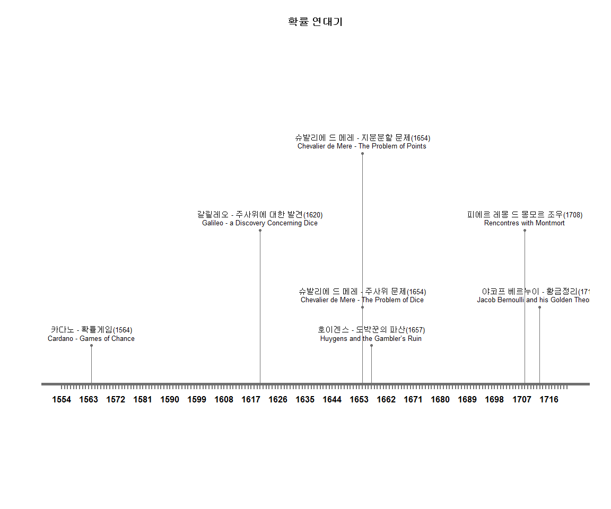
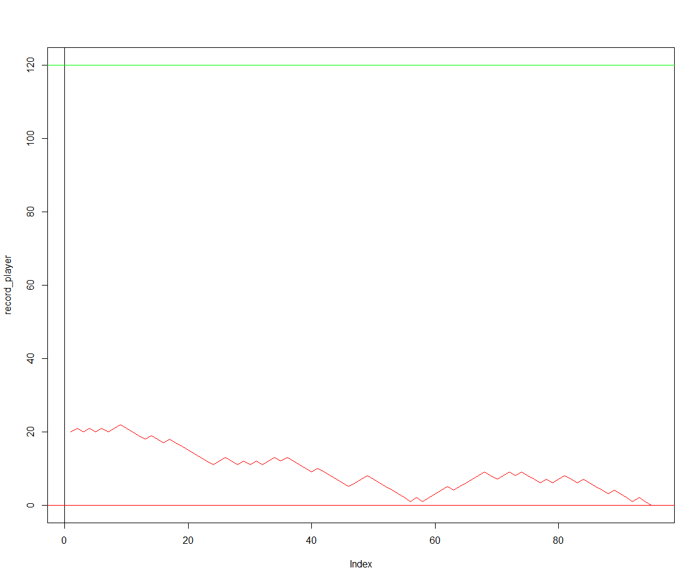
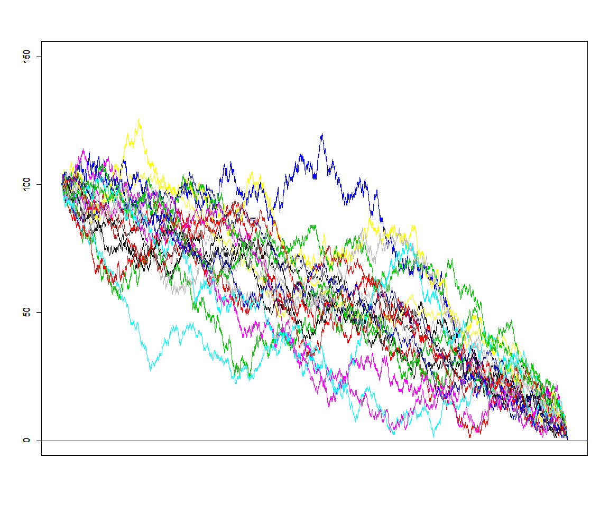

# 데이터 과학을 위한 R 알고리즘
`r Sys.Date()`  

## 1. 역사적인 확률문제 [^classic-problems-of-probability] {#histical-probability-problems}

[^classic-problems-of-probability]: [Prakash Gorroochurn (2016), "Classic Problems of Probability", Wiley](https://www.amazon.com/Classic-Problems-Probability-Prakash-Gorroochurn/dp/1118063252)

~~~{.r}
# 0. 환경설정 --------------
# library(timelineS) # devtools::install_github("daheelee/timelineS")
# library(tidyverse)
# library(lubridate)

# 1. 확률의 역사 데이터 --------------
history_df <- tribble(
    ~event, ~event_date, ~event_eng,
    "카다노 - 확률게임", "1564-07-01", "Cardano - Games of Chance",
    "갈릴레오 - 주사위에 대한 발견", "1620-07-01", "Galileo - a Discovery Concerning Dice",
    "슈발리에 드 메레 - 주사위 문제", "1654-07-01", "Chevalier de Mere - The Problem of Dice",
    "슈발리에 드 메레 - 지분분할 문제", "1654-07-01", "Chevalier de Mere - The Problem of Points",
    "호이겐스 - 도박꾼의 파산", "1657-07-01", "Huygens and the Gambler’s Ruin"
)

history_df <- history_df %>% 
    mutate(event_date = ymd(event_date))

# 2. 확률의 역사 연대기 --------------

timelineS(history_df, main = "확률 연대기", buffer.days = 3600,
          label.direction = "up", label.length = c(0.2,0.8,0.4,1.2), label.position = 3,
          labels = paste0(history_df[[1]], "(", as.character(year(history_df[[2]])), ")", "\n", history_df[[3]]) )
~~~

## 2. 연대별 중요 확률 문제 {#classic-probability-problems}

### 2.1. 카다노 - 확률게임 {#cardano-1564}

**문제:** 적어도 한번 눈이 6개인 주사위면이 나오려면 공정한 주사위를 최소 몇번 던져야할까? - 
"How many throws of a fair die do we need in order to have an even chance of at least one six?"

- 주사위를 한번 던져 주사위 눈이 6개인 면이 나올 사건을 $A$로 정의
- 사건 $A$에 따라 확률은 $p_A = \frac{1}{6}$
- 사건 $A$가 발생하지 않을 확률은 $1 - p_A = 1 - \frac{1}{6} = \frac{5}{6}$
- 주사위를 던지는 사건의 독립성을 가정하면,

$$\begin{align}
Pr(\text{n번 주사위를 던져 적어도 6면이 한번 이상 나올 확률}) & = 1 - Pr(\text{n번 주사위를 던져 한번도 6면이 나오지 않을 확률}) \nonumber \\
  & 1 - (1 - \frac{1}{6}) \times (1 - \frac{1}{6}) \times \cdots \times (1 - \frac{1}{6}) \\
  & 1 - \bigg(\frac{5}{6} \bigg)^n
\end{align}$$

이제 최소 횟수를 구하기 위해서 $1 - \bigg(\frac{5}{6} \bigg)^n \ge \frac{1}{2}$ 수식을 정리하면 다음과 같다.

$$n \ge \frac{ln(\frac{1}{2})}{ln(\frac{5}{6})} = 3.801784 \approx 4$$

즉, 4회 이상이 된다.

이를 R 코드로 작성해서 카다노 문제를 모의실험할 수 있다.

~~~{.r}
# 2. 모의실험 ---------------

draw_dice <- function(nthrow=1) {
    draw_die <- rmultinom(n=1, size=nthrow, prob=rep(1/6,6))
    num_six <- ifelse(draw_die[6,1] == 0, 0, 1)
    return(num_six)
}

for(i in 1:50) {
    
    theory_val <- 1 - (5/6)^i 
    
    sim_val <- mean(replicate(10000, draw_dice(i)))
    
    cat("주사위던지기 횟수(n):", i, "이론값:", round(theory_val, 5), "확률값:", round(sim_val, 5), "\n")
}
~~~

~~~{.output}
주사위던지기 횟수(n): 1 이론값: 0.16667 확률값: 0.1666 
주사위던지기 횟수(n): 2 이론값: 0.30556 확률값: 0.3052 
주사위던지기 횟수(n): 3 이론값: 0.4213 확률값: 0.4202 
주사위던지기 횟수(n): 4 이론값: 0.51775 확률값: 0.5258 
주사위던지기 횟수(n): 5 이론값: 0.59812 확률값: 0.5961 
주사위던지기 횟수(n): 6 이론값: 0.6651 확률값: 0.6689 
주사위던지기 횟수(n): 7 이론값: 0.72092 확률값: 0.7195 
주사위던지기 횟수(n): 8 이론값: 0.76743 확률값: 0.7644 
주사위던지기 횟수(n): 9 이론값: 0.80619 확률값: 0.8076 
주사위던지기 횟수(n): 10 이론값: 0.83849 확률값: 0.8375 
주사위던지기 횟수(n): 11 이론값: 0.86541 확률값: 0.8668 
주사위던지기 횟수(n): 12 이론값: 0.88784 확률값: 0.888 
주사위던지기 횟수(n): 13 이론값: 0.90654 확률값: 0.9074 
주사위던지기 횟수(n): 14 이론값: 0.92211 확률값: 0.9231 
주사위던지기 횟수(n): 15 이론값: 0.93509 확률값: 0.9366 
주사위던지기 횟수(n): 16 이론값: 0.94591 확률값: 0.9476 
주사위던지기 횟수(n): 17 이론값: 0.95493 확률값: 0.9515 
주사위던지기 횟수(n): 18 이론값: 0.96244 확률값: 0.9615 
주사위던지기 횟수(n): 19 이론값: 0.9687 확률값: 0.9694 
주사위던지기 횟수(n): 20 이론값: 0.97392 확률값: 0.975 
주사위던지기 횟수(n): 21 이론값: 0.97826 확률값: 0.9826 
주사위던지기 횟수(n): 22 이론값: 0.98189 확률값: 0.9824 
주사위던지기 횟수(n): 23 이론값: 0.98491 확률값: 0.9862 
주사위던지기 횟수(n): 24 이론값: 0.98742 확률값: 0.9868 
주사위던지기 횟수(n): 25 이론값: 0.98952 확률값: 0.99 
주사위던지기 횟수(n): 26 이론값: 0.99126 확률값: 0.9911 
주사위던지기 횟수(n): 27 이론값: 0.99272 확률값: 0.9932 
주사위던지기 횟수(n): 28 이론값: 0.99393 확률값: 0.9937 
주사위던지기 횟수(n): 29 이론값: 0.99494 확률값: 0.9949 
주사위던지기 횟수(n): 30 이론값: 0.99579 확률값: 0.9963 
주사위던지기 횟수(n): 31 이론값: 0.99649 확률값: 0.9961 
주사위던지기 횟수(n): 32 이론값: 0.99707 확률값: 0.9968 
주사위던지기 횟수(n): 33 이론값: 0.99756 확률값: 0.9981 
주사위던지기 횟수(n): 34 이론값: 0.99797 확률값: 0.9981 
주사위던지기 횟수(n): 35 이론값: 0.99831 확률값: 0.9986 
주사위던지기 횟수(n): 36 이론값: 0.99859 확률값: 0.9987 
주사위던지기 횟수(n): 37 이론값: 0.99882 확률값: 0.9986 
주사위던지기 횟수(n): 38 이론값: 0.99902 확률값: 0.9991 
주사위던지기 횟수(n): 39 이론값: 0.99918 확률값: 0.9994 
주사위던지기 횟수(n): 40 이론값: 0.99932 확률값: 0.9992 
주사위던지기 횟수(n): 41 이론값: 0.99943 확률값: 0.9996 
주사위던지기 횟수(n): 42 이론값: 0.99953 확률값: 0.9995 
주사위던지기 횟수(n): 43 이론값: 0.99961 확률값: 0.9995 
주사위던지기 횟수(n): 44 이론값: 0.99967 확률값: 0.9997 
주사위던지기 횟수(n): 45 이론값: 0.99973 확률값: 0.9999 
주사위던지기 횟수(n): 46 이론값: 0.99977 확률값: 0.9995 
주사위던지기 횟수(n): 47 이론값: 0.99981 확률값: 0.9996 
주사위던지기 횟수(n): 48 이론값: 0.99984 확률값: 0.9999 
주사위던지기 횟수(n): 49 이론값: 0.99987 확률값: 0.9998 
주사위던지기 횟수(n): 50 이론값: 0.99989 확률값: 0.9999 

~~~

### 2.2. 갈릴레오 - 주사위에 대한 발견 {#galileo-1620}

**문제:** 세개 주사위를 던져 합을 구한다. 서로 다른 6개 조합을 통해 주사위 던진 합 9, 10, 11, 12을 구할 수 있다.
그런데, 주사위 던진 합계 10 혹은 11이 9, 12 보다 더 왜 많이 나오는가?

"Suppose three dice are thrown and the three numbers obtained added. 
The total scores of 9, 10, 11, and 12 can all be obtained in six different combinations.
Why then is a total score of 10 or 11 more likely than a total score of 9 or 12?"

- 주사위 세개를 던진 합계가 9, 10, 11, 12인 경우를 표로 정리하면 결과를 쉽게 확인할 수 있다.

| 조합수| 9 | 조합수| 10 | 조합수| 11 | 조합수| 12 |
|:-----:|---|:-----:|----|:-----:|----|:-----:|----|
| 6-2-1 | 6 | 6-3-1 | 6  | 6-4-1 | 6  | 6-5-1 | 6  |
| 5-3-1 | 6 | 6-2-2 | 3  | 6-3-2 | 6  | 6-4-2 | 6  |
| 5-2-2 | 3 | 5-4-1 | 6  | 5-5-1 | 3  | 6-3-3 | 3  |
| 4-4-1 | 3 | 5-3-2 | 6  | 5-4-2 | 6  | 5-5-2 | 3  |
| 4-3-2 | 6 | 4-4-2 | 3  | 5-3-3 | 3  | 5-4-3 | 6  |
| 3-3-3 | 1 | 4-3-3 | 3  | 4-4-3 | 3  | 4-4-4 | 1  |
| 9 경우수 | 25 | 10 경우수 | 27 | 11 경우수 | 27 | 12 경우수 | 25 |

~~~{.r}
## 2. 이론값 ------------
library(dice) # install.packages("dice")

three_dice <- getSumProbs(ndicePerRoll = 3,
            nsidesPerDie = 6,
            nkept = 3)

three_dice$probabilities %>% 
    DT::datatable() %>% 
      DT::formatPercentage("Probability", digits=1)
~~~

<!--html_preserve-->

<!--/html_preserve-->

~~~{.r}
## 3. 모의실험결과 ------------
library(Rdice)

dice_sim <- dice.roll(faces = 6, dice = 3, rolls = 100000)

dice_sim$sums_freq %>% as_tibble() %>% 
    rename("주사위합" = sum, "확률" = freq, "누적확률" = cum_sum) %>% 
      DT::datatable() %>% 
        DT::formatCurrency(c("N"), currency="", interval=3, digits=0) %>% 
        DT::formatPercentage(c("확률", "누적확률"), digits=1)
~~~

<!--html_preserve-->

<!--/html_preserve-->

### 2.3. 슈발리에 드 메레 - 주사위 문제 {#mere-1654}

**문제:** 주사위를 4번 던졌을 때, 적어도 주사위 눈 6 이 나올 확률은 $\frac{1}{2}$ 보다 약간 크다.
하지만, 주사위 두개를 24번 던졌을 때, 적어도 한번 주사위 눈 6이 두번 나올 확률은 $\frac{1}{2}$ 보다 다소 작다.
$Pr(\text{주사위 두개를 더졌을 때 6 눈이 두개}) = \frac{1}{36} = \frac{1}{6} \times Pr(\text{주사위 한개 던졌을 때 6개 눈이 한개})$인 사실에 비추어 봤을 때와 주사위 두개를 사용할 때 $6 \times 4 = 24$ 던져 $\frac{1}{6}$ 부분을 벌충할 수 있다고 봤을 때, 왜 두 확률이 같지 않는가?

"When a die is thrown four times, the probability of obtaining at least
one six is a little more than 1/2. However, when two dice are thrown 24 times, the
probability of getting at least one double-six is a little less than 1/2. Why are the
two probabilities not the same, given the fact that Pr{double-six for a pair of
dice} $= \frac{1}{36} = \frac{1}{6} \times$ Pr{a six for a single die}, and you compensate for the factor of
$\frac{1}{6}$ by throwing $6 \times 4 = 24$ times when using two dice?"

<iframe width="300" height="180" src="https://www.youtube.com/embed/MrVD4q1m1Vo" frameborder="0" allowfullscreen></iframe>

슈발리에 드 메레가 생각한 것을 정리하면 다음과 같다. 즉, 두가지 경우 승률이 0.5보다 높게 나와서 할만한 게임이다.

- $\frac{1}{6} + \frac{1}{6} + \frac{1}{6} + \frac{1}{6}= \frac{4}{6}$
- $\frac{1}{36} + \frac{1}{36} + \cdots + \frac{1}{36} = \frac{24}{36} = \frac{2}{3}$

하지만, 확률 곱셈법칙을 통해서 두가지 경우에 대한 확률을 계산하면 얘기가 달라진다.

$$\begin{align}
Pr(\text{4번 주사위를 던져 적어도 6면이 한번 나올 확률}) 
  & = 1 - Pr(\text{4번 주사위를 던져 한번도 6면이 나오지 않을 확률})  \\
  & = 1 - (1 - \frac{1}{6}) \times (1 - \frac{1}{6}) \times (1 - \frac{1}{6}) \times (1 - \frac{1}{6}) \\
  & = 1 - \bigg(\frac{5}{6} \bigg)^4 \\
  & = 0.5177469
\end{align}$$

$$\begin{align}
Pr(\text{24번 주사위를 던져 적어도 6면이 두번 나올 확률}) 
  & = 1 - Pr(\text{24번 주사위를 던져 한번도 6면이 두번 나오지 않을 확률})  \\
  & = 1 - (1 - \frac{1}{36}) \times (1 - \frac{1}{36}) \times \cdots \times (1 - \frac{1}{36}) \\
  & = 1 - \bigg(\frac{35}{36} \bigg)^24 \\
  & = 0.4914039
\end{align}$$

~~~{.r}
# 2. 모의실험 ---------------
## 2.1. 주사위를 4번 던져 적어도 1회 눈이 6이 나올 확률
draw_dice <- function(nthrow=1) {
    draw_die <- rmultinom(n=1, size=nthrow, prob=rep(1/6,6))
    num_six <- ifelse(draw_die[6,1] >= 1, 1, 0)
    return(num_six)
}

mean(replicate(100000, draw_dice(nthrow=4)))
~~~

~~~{.output}
[1] 0.51825

~~~

~~~{.r}
## 2.2. 주사위 두개를 24번 던졌을 때, 적어도 한번 주사위 눈 6이 두번 나올 확률
draw_two_dice <- function(draws = 24, dice=2) {
    dice_mat <- rmultinom(n=draws, size=dice, prob=rep(1/6,6))
    is_double_six <- ifelse(dice_mat[6,] == 2, 1, 0) # 24번 던져서 6이 두번 나온 경우
    double_six_game <- ifelse(sum(is_double_six) >= 1, 1, 0) # 1보다 크다면 24번 던진 전체 경기를 1승으로 간주
    return(double_six_game)
}

mean(replicate(100000, draw_two_dice(draws = 24, dice=2)))
~~~

~~~{.output}
[1] 0.49174

~~~

### 2.4. 슈발리에 드 메레 - 지분분할 문제 {#mere-1654-2}

**문제:** 두 선수(A,B)가 공정한 게임을 통해서, 전체적으로 6경기를 먼저 이기는 사람이 
사람이 상금을 모두 가져가기로 했다. A 선수가 5경기를, B선수가 3경기를 이겼을 때, 뜻밖의
사건이 발생해서 경기를 더이상 속계할 수 없게 되었다.
이런 경우 선수 A, B 사이에 상금을 어떻게 나눠가져야 할까?

| 선수 | 1 | . | . | . | . | . | . | . | . |   현재   |
|:----:|---|---|---|---|---|---|---|---|---|----------|
|  A   | . | W | W | . | W | W | . | . | W | 1승 남음 |
|  B   | W | . | . | W | . | . | . | W | . | 3승 남음 | 

"Two players A and B play a fair game such that the player who wins a
total of 6 rounds first wins a prize. Suppose the game unexpectedly stops when A has
won a total of 5 rounds and B has won a total of 3 rounds. How should the prize be
divided between A and B?"

<iframe width="300" height="180" src="https://www.youtube.com/embed/C_nV3cVNjog" frameborder="0" allowfullscreen></iframe>

만약 게임을 계속진행한다면 6번째 경기까지 이겨서 상금을 받을 상대적인 확률로 결정한다.
A 선수는 1경기, B선수는 3 경기를 이겨야 하지만, A 선수 B선수 동시에 이기는 경우는 제외해야 해서
$(1+3)-1 =4$ 총 4 경기가 남았다.
따라서, $A_{\text{승}}, B_{\text{승}} A_{\text{승}}, B_{\text{승}} B_{\text{승}} A_{\text{승}},B_{\text{승}} B_{\text{승}} B_{\text{승}}$ 네가지 조합의 경우가 발생한다. 하지만, 네가지 최종승리 조합은 서로 일어날 가능성이 다르다. 예를 들어, $A_{\text{승}}$인 경우는  $A_{\text{승}}A_{\text{승}}A_{\text{승}}, A_{\text{승}}A_{\text{승}}B_{\text{승}}, A_{\text{승}}B_{\text{승}}A_{\text{승}}, A_{\text{승}}B_{\text{승}}B_{\text{승}}$ 이 포함된다. 따라서, 

$\bigg\{ A_{\text{승}}A_{\text{승}}A_{\text{승}}, A_{\text{승}}A_{\text{승}}B_{\text{승}}, A_{\text{승}}B_{\text{승}}A_{\text{승}}, A_{\text{승}}B_{\text{승}}B_{\text{승}},B_{\text{승}}A_{\text{승}}A_{\text{승}},B_{\text{승}}A_{\text{승}}B_{\text{승}}, B_{\text{승}}B_{\text{승}}A_{\text{승}}, B_{\text{승}}B_{\text{승}}B_{\text{승}} \bigg \}$

총 8가지 경우의 수가 앞으로 발생할 수 있고, $B$는 1번만 이기는 경우가 존재하기 때문에 7:1로 상금을 나누면 공평하게 상금이 나눠진다.

매번 경기를 할 때마다 경기는 "A승", "B승"으로 나눠지게 된다. 그리고 이런 경기를 3번 수행하는 경우 총 8가지 경우의 수가 나오고 B가 경기를 이기는 경우는 단 한가지만 존재한다.

~~~{.r}
# 1. 경우의 수 ---------------

play_game   <- c("A승", "B승")

expand.grid(first=play_game, second=play_game, third=play_game)
~~~

~~~{.output}
  first second third
1   A승    A승   A승
2   B승    A승   A승
3   A승    B승   A승
4   B승    B승   A승
5   A승    A승   B승
6   B승    A승   B승
7   A승    B승   B승
8   B승    B승   B승

~~~

`rmultinom`에서 난수를 뽑아내서 B선수가 이긴 경우는 단 하나로 연속해서 3번 이긴 경우가 된다. 
이를 모의실험하면 0.125 B가 이긴 확률에 근사적으로 가깝게 도출된다.

~~~{.r}
# 2. 모의실험 ---------------

play_mat <- rmultinom(n=100000, size=3, prob=rep(1/2,2))
is_B_win <- ifelse(play_mat[2,] == 3, 1, 0 ) # 잔여 경기 3게임을 실행해서 B가 이긴 경우

mean(is_B_win)
~~~

~~~{.output}
[1] 0.12434

~~~

### 2.5. 호이겐스 - 도박꾼의 파산 [^gambler-ruin] {#huygens-1657}

[^gambler-ruin]: [도박꾼의 파산](https://ko.wikipedia.org/wiki/%EB%8F%84%EB%B0%95%EA%BE%BC%EC%9D%98_%ED%8C%8C%EC%82%B0)

**문제:** 두 선수 A,B가 초기 도박자금으로 각각 $a$, $t-a$ 가지고 있다.
선수 $A$가 첫번째 경기에서 이길 확률은 $p$, 선수 $B$가 이길 확률은 $q=1-p$로 가정하자.
선수 $A$가 매번 승리할 때마다, $B$로부터 1 달러를 받고, 그렇지 않은 경우는 $B$에게 1 달러를 준다.
궁극적으로 $A$가 $B$의 모든 돈을 가져올 확률은 얼마나 될까?

"Two players A and B, having initial amounts of money $a$ and $t-a$
dollars, respectively, play a game in which the probability that A wins a round is p and
the probability that B wins is $q=1-p$. Each time A wins, he gets one dollar from B,
otherwise he gives B one dollar. What is the probability that A will eventually get all
of B’s money?"

전체 확률의 법칙(Law of Total Probability)을 활용하여 파산할 확률을 다음과 같이 정리할 수 있다. 
여기서, $P(R_n)$은 초기 도박자금 $n$을 가지고 시작할 확률이다. 

$$P(R_n) = P(R_n|W)P(W) + P(R_n|\bar{W})P(\bar{W})$$

- $P(W)$: 승리할 확률($p$)
- $P(\bar{W})$: 패배할 확률($1-p$)

이제, $q_n = P(R_n)$으로 놓고, 경계조건 $q_0 = 1$, $q_{n_1 + n_2} = 0$ 갖고, 
도박게임을 계차방정식(differnce equation)으로 정리하면 다음과 같다. 

$$q_n = q_{n+1} p + q_{n-1} q$$

방정식을 풀면 $p_1=p_2=1/2$ 공평한 도박의 경우 다음과 같다.

- $P_1= \frac{n_2}{n_1+n_2}$
- $P_2= \frac{n_1}{n_1+n_2}$

불공평한 도박 ($p_1\ne p_2$)에서의 파산 확률은 다음과 같다.

- $P_1= \frac{1-(p_2/p_1)^{n_1}}{1-(p_2/p_1)^{n_1+n_2}}$
- $P_2= \frac{1-(p_1/p_2)^{n_2}}{1-(p_1/p_2)^{n_1+n_2}}$

즉, 둘 중 하나는 거의 확실하게 파산하게 된다.
다만, $n_1 \ll n_2$인 경우, 예를 들어, 카지노는 개인 도박꾼보다 훨씬 부유하다. 따라서, $n_2 \to \infty$ 인 경우 다음과 같이 수식이 정리된다.

$$P_1=
  \begin{cases}
     1-(p_2/p_1)^{n_1}&p_1>p_2\\
     0&p_2\le p_1
   \end{cases}
$$
$$P_2=1-P_1$$

즉, 도박꾼은 $p_1>1/2$인 경우에는 파산할 확률이 유한하고, $p_1\le1/2$인 경우에는 거의 확실하게 파산하게 된다.

#### 2.5.1. 모의실험 카지노 1차 방문

~~~{.r}
## 2.1. 한번 모의실험 -----------
# 초기조건
player <- 20; casino <- 100; prob <- 0.47

# 도박꾼의 통장상황 기록
record_player <- c(player)

probval <-  runif(1)
if (probval < prob){
    player <- player + 1
    casion <- casino -1
} else{
    player <- player - 1
    casion <- casino + 1
}

# 결과를 기록
(record_player <- c(record_player, player))
~~~

~~~{.output}
[1] 20 19

~~~

#### 2.5.2. 파산할때까지 게임 실험

~~~{.r}
## 2.2. 파산할 때까지 모의실험 -----------
# 초기조건
player <- 20; casino <- 100; prob <- 0.47
total <- player + casino
# 도박꾼의 통장상황 기록
record_player <- c(player)

while(player > 0) {

    if (runif(1) < prob){
        player <- player + 1
        casion <- casino -1
    } else {
        player <- player - 1
        casion <- casino + 1
    }
    record_player <- c(record_player, player)
    if(player == total) break
}

# 시각화
plot(record_player,type="l",col="red", ylim=c(0,120))
abline(h=0)
abline(v=0)
abline(h=player,col="red")
abline(h=total,col="green")
~~~

#### 2.5.3. 파산할때까지 게임 모의실험

~~~{.r}
## 2.3. 파산할 때까지 n번 모의실험 -----------
# 초기조건

gambler_ruin <- function(player = 20, casino = 100, prob = 0.47) {
    total <- player + casino
    # 도박꾼의 통장상황 기록
    record_player <- c(player)
    
    while(player > 0) {
        
        if (runif(1) < prob){
            player <- player + 1
            casion <- casino -1
        } else {
            player <- player - 1
            casion <- casino + 1
        }
        record_player <- c(record_player, player)
        if(player == total) break
    }
    return(record_player)
}

for(i in 1:20) {
    par(new=TRUE)
    ruins <- gambler_ruin(player = 100, casino = 100, prob = 0.47)
    plot(ruins,type="l",col=i, ylim=c(0,150), xaxt='n', xlab = "", ylab="")
    abline(h=player,col="red")
}
~~~

### 2.6. 피프스-뉴톤 연결 [^newton-pepys-problem] {#pepys-newton-1693}

[^newton-pepys-problem]: [위키백과, Newton–Pepys problem](https://en.wikipedia.org/wiki/Newton%E2%80%93Pepys_problem)

**문제:** 선수 A는 주사위를 6번 던져서 적어도 한번 눈이 6인 주사위가 한번 나온다고 주장한다.
선수 B는 주사위를 12번 던져서 적어도 한번 눈이 6인 주사위가 두번 나온다고 주장한다.
선수 C는 주사위를 18번 던져서 적어도 한번 눈이 6인 주사위가 세번 나온다고 주장한다.
선수 세명중 어떤 선수가 자신의 주장에 대해서 약속을 잘 지켜낼 수 있을까?

"A asserts that he will throw at least one six with six dice. B asserts that he
will throw at least two sixes by throwing 12 dice. C asserts that he will throw at least
three sixes by throwing 18 dice. Which of the three stands the best chance of carrying
out his promise?"

문제에 대한 해답은 이항분포와 깊은 연관이 있다.

$$\Pr(X = x) = f(x;n,p)={n\choose x}p^x(1-p)^{n-x}$$

선수 A 주장에 대해서 $B(1, \frac{1}{6}$,

$$Pr(A)=Pr(X \ge 1)=1-Pr(X=0)=1-\left(\frac{5}{6}\right)^{6} = \frac{31031}{46656} \approx 0.6651\, $$

선수 B 주장에 대해서 $B(12, \frac{1}{6}$,

$$Pr(B)=Pr(X \ge 2)=1-Pr(X=0)-Pr(X=1)=1-\sum_{x=0}^1\binom{12}{x}\left(\frac{1}{6}\right)^x\left(\frac{5}{6}\right)^{12-x}
= \frac{1346704211}{2176782336} \approx 0.6187\, $$

선수 C 주장에 대해서 $B(18, \frac{1}{6}$,

$$Pr(C)=Pr(X \ge 3)=1-Pr(X=0)-Pr(X=1)-Pr(X=2)=1-\sum_{x=0}^2\binom{18}{x}\left(\frac{1}{6}\right)^x\left(\frac{5}{6}\right)^{18-x}
= \frac{15166600495229}{25389989167104} \approx 0.5973\, $$

#### 2.6.1. 이항분포 이론값

이항누적분포를 활용하여 선수 세명의 주장에 대한 확률을 순차적으로 계산한다.

~~~{.r}
# 1. 이론계산값 ---------------

for(s in 1:3) {              # 눈이 6인 주사위수
    n <- 6*s                 # 6, 12, 18번 수행횟수
    q <- pbinom(s-1, n, 1/6) # 누적확률
    cat( "공정한 주사위", n, "번 던져 적어도", s, "번 눈이 6인 주사위가 나올 확률:", 1-q, "\n")
}
~~~

~~~{.output}
공정한 주사위 6 번 던져 적어도 1 번 눈이 6인 주사위가 나올 확률: 0.665102 
공정한 주사위 12 번 던져 적어도 2 번 눈이 6인 주사위가 나올 확률: 0.6186674 
공정한 주사위 18 번 던져 적어도 3 번 눈이 6인 주사위가 나올 확률: 0.5973457 

~~~

#### 2.6.2. 모의실험

주사위 눈이 6개 나오는 경우가, 6번, 12번, 18번 던질때 각각 최소 1회, 2회, 3회가 되기 때문에 이를 인자로 
반영해서 모의실험해서 확률값을 계산한다.

~~~{.r}
# 2. 모의실험 ---------------

draw_dice <- function(nthrow=6, min_six=1) {
    draw_die <- rmultinom(n=1, size=nthrow, prob=rep(1/6,6))
    is_six <- ifelse(draw_die[6,1] >= min_six, TRUE, FALSE)
    return(is_six)
}

mean(replicate(10000, draw_dice(nthrow=6, min_six = 1)))
~~~

~~~{.output}
[1] 0.6672

~~~

~~~{.r}
mean(replicate(10000, draw_dice(nthrow=12, min_six = 2)))
~~~

~~~{.output}
[1] 0.62

~~~

~~~{.r}
mean(replicate(10000, draw_dice(nthrow=18, min_six = 3)))
~~~

~~~{.output}
[1] 0.5976

~~~
