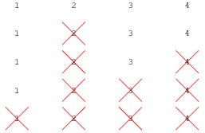

# 데이터 과학을 위한 R 알고리즘
`r Sys.Date()`  

## 1. 요세푸스가 겪은 일화 {#josephus-episode}

요세푸스 문제(Josephus problem, 혹은 Josephus permutation)은 실제 요세푸스가 겪은 일화에서 시작되었다.
로마시대 유대인들은 로마 지배에 봉기하여 맞서 싸웠지만 위기에 처하게 되자 명예로운 자결을 선택하였다.

요세푸스를 포함한 병사 총 41명이 원으로 둘러서서 3번째 사람을 죽여서 아무도 남지 않을 때까지 반복하고 나면,
마지막 사람은 스스로 자결하는 선택을 하는 결정을 하였다.
요세푸스를 포함한 병사 총 41명이 이런 결정에 동의를 했지만, 요세푸스 자신을 꼭 살고자 했다.
그럼 요세푸스는 몇번째 자리에 위치해야 모든 사람이 다 죽은 후에 홀로 살아남을 수 있을까?

예를 들어, 4명이 원을 둘러 처형하는 순서는 2 &rarr; 4 &rarr; 3 &rarr; 1 으로 도식으로 표현하면 다음과 같다. [^wolfram-josephus]

[^wolfram-josephus]: [Wolfram MathWorld - Josephus Problem](http://mathworld.wolfram.com/JosephusProblem.html)

총 41명이 원으로 둘러서서 매 3번째 병사를 처형하는 순서는 다음과 같다. 

3&rarr; 6&rarr; 9&rarr; 12&rarr; 15&rarr; 18&rarr; 21&rarr; 24&rarr; 27&rarr; 30&rarr; 33&rarr; 36&rarr; 39&rarr; 1&rarr; 5&rarr; 10&rarr; 14&rarr; 19&rarr; 23&rarr; 28&rarr; 32&rarr; 37&rarr; 41&rarr; 7&rarr; 13&rarr; 20&rarr; 26&rarr; 34&rarr; 40&rarr; 8&rarr; 17&rarr; 29&rarr; 38&rarr; 11&rarr; 25&rarr; 2&rarr; 22&rarr; 4&rarr; 35&rarr; 16&rarr; 31

<iframe width="300" height="180" src="https://www.youtube.com/embed/uCsD3ZGzMgE" frameborder="0" allowfullscreen></iframe>

## 2. 요세푸스 문제 점화식 [^josephus-solution] {#josephus-recurrence}

[^josephus-solution]: [Wikipedia - Josephus problem](https://en.wikipedia.org/wiki/Josephus_problem)

요세푸스 문제를 푸는 방법은 동적 프로그래밍(Dynamic Programming)을 활용하는 것이다.
인덱스가 1에서 시작한다고 가정하면, $f(1,k)=1$ 초기항을 두고, 다음과 같은 점화식으로 표현할 수 있다.

$$f(n,k)=((f(n-1,k)+k-1) \bmod n)+1$$

## 3. R 코드 {#josephus-recurrence-rcode}

요세푸스 문제 점화식을 R코드로 재귀(Recursion)으로 표현하면 총 1 - 41 명까지 원으로 둘러선 경우를 가정하고,
매번 3번째 사람을 처형하는 경우 생존자를 모사하면 다음과 같다. 즉, 41명이 있는 경우 3번째 사람을 처형하는 경우 최종 생존자는 31번째 위치가 된다.

~~~{.r}
jesephus_rec <- function(people, passes) {
    if (people == 1) {
        return(1)
    }
    return((jesephus_rec(people-1, passes) + passes-1) %% people + 1 )
}

for(i in 1:41) {
    survivor <- jesephus_rec(i, 3)
    cat("병사수:", i, "생존자:", survivor, "\n")
}
~~~

~~~{.output}
병사수: 1 생존자: 1 
병사수: 2 생존자: 2 
병사수: 3 생존자: 2 
병사수: 4 생존자: 1 
병사수: 5 생존자: 4 
병사수: 6 생존자: 1 
병사수: 7 생존자: 4 
병사수: 8 생존자: 7 
병사수: 9 생존자: 1 
병사수: 10 생존자: 4 
병사수: 11 생존자: 7 
병사수: 12 생존자: 10 
병사수: 13 생존자: 13 
병사수: 14 생존자: 2 
병사수: 15 생존자: 5 
병사수: 16 생존자: 8 
병사수: 17 생존자: 11 
병사수: 18 생존자: 14 
병사수: 19 생존자: 17 
병사수: 20 생존자: 20 
병사수: 21 생존자: 2 
병사수: 22 생존자: 5 
병사수: 23 생존자: 8 
병사수: 24 생존자: 11 
병사수: 25 생존자: 14 
병사수: 26 생존자: 17 
병사수: 27 생존자: 20 
병사수: 28 생존자: 23 
병사수: 29 생존자: 26 
병사수: 30 생존자: 29 
병사수: 31 생존자: 1 
병사수: 32 생존자: 4 
병사수: 33 생존자: 7 
병사수: 34 생존자: 10 
병사수: 35 생존자: 13 
병사수: 36 생존자: 16 
병사수: 37 생존자: 19 
병사수: 38 생존자: 22 
병사수: 39 생존자: 25 
병사수: 40 생존자: 28 
병사수: 41 생존자: 31 

~~~
