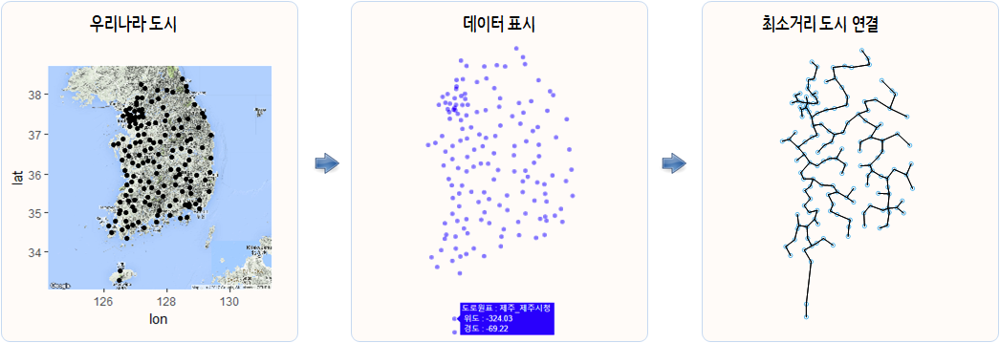

```{r, include=FALSE}
source("tools/chunk-options.R") 

knitr::opts_chunk$set(echo = TRUE, warning=FALSE, message=FALSE)

library(tidyverse)
library(stringr)
library(rvest)
library(leaflet)
library(ggmap)
library(Imap)
library(ape)
library(plotly)
library(extrafont)
library(ggthemes)
library(igraph)
loadfonts()

options(scipen = 999)
options(family="NanumGothic")

map_origin_df <- read_csv("data/map_origin_df.csv")
map_dist_mat <- readRDS("data/map_dist_mat.rds")
map_dist_g <- readRDS("data/map_dist_g")
```


## 1. 최소비용 신장 나무 [^unplugged-mst] {#minimal-spanning-tree}

[^unplugged-mst]: [컴퓨터 과학 언플러그드 - 진흙도시 프로젝트 - 최소생성나무(Minimal Spanning Trees)](https://statkclee.github.io/unplugged/algorithm.html#minimal-spanning-tree)

우리 사회는 전화, 에너지 공급, 컴퓨터, 도로 등 다양한 네트워크로 연결되어 있습니다. 
각각의 네트워크에는 도로, 케이블, 혹은 무선 네트워크를 어떻게 배치하는지에 대한 설계 결정이 녹여져 있습니다.
따라서, 효율적으로 네트워크에서 객체를 연결하는 방법을 파악할 필요가 있습니다.

“최소생성나무”는 가스나 전력 네트워크에만 유용한 것이 아닙니다. 
컴퓨터 네트워크, 전화 네트워크, 송유관, 항공운항 경로 문제를 해결하는데 도움이 됩니다. 
하지만, 여행의 최적 경로를 결정할 때는 비용이 얼마나 드는지, 여행이 얼마나 편안할지도 함께 고려해야 합니다. 
단지 비용이 저렴하다는 이유로, 처음으로 여행가는 나라에 비행기를 장시간 타면서 시간을 낭비하려는 사람은 많지 않을 것입니다. 
비행경로나 화물 운송경로를 최소화하는데 사용되는 진흙도시 알고리즘은 여행경로와 같은 네트워크 최적화하는 데에는 그다지 도움이 되지 않습니다.

이러한 문제를 해결할 때 많이 사용되는 최소비용 신장 나무 알고리즘으로 Prim과 Kruskal 알고리즘이 유명하다.

- [Prim 알고리즘](https://en.wikipedia.org/wiki/Prim%27s_algorithm)
- [Kruskal 알고리즘](https://en.wikipedia.org/wiki/Kruskal%27s_algorithm)

<iframe width="320" height="190" src="https://www.youtube.com/embed/i4ZDgJS0_yM" frameborder="0" allowfullscreen></iframe>

## 2. 대한민국 주요 도시 {#main-city}

우리나라 주요 모든 도시를 최소거리로 연결해보자. 이를 위해 서 위키백과사전에 등록된 대한민국 도로원점 데이터를 바탕으로 데이터를 준비한다.
각 도시에 설치된 [위키백과사전 - 도로원표](https://ko.wikipedia.org/wiki/%EB%8F%84%EB%A1%9C%EC%9B%90%ED%91%9C) 데이터를 가져와서 
이를 기반으로 우리나라 주요도시를 노드로 삼고자 데이터를 정리한다.



- 우리나라 주요도시에 대한 실제 정보
- 실제 지도정보를 데이터 자료구조로 표현
- 알고리즘을 적용하여 문제해결

### 2.1. 위키백과 데이터 긁어오기 {#wiki-data-crawling}

`rvest` 팩키지로 위키백과 도로원표 정보가 포함된 표를 대상으로 데이터를 가져온다.
위도와 경도가 포함된 데이터를 정규표현식과 리스트 데이터를 전처리하여 위도와 경도를 뽑아내어 정리한다.

``` {r korea-city-raw-data, eval=FALSE}
# 0. 환경설정 ------
# library(tidyverse);library(stringr);library(rvest);library(leaflet);library(ggmap);library(Imap);library(ape);library(plotly);library(extrafont);library(ggthemes);loadfonts();

# 1. 데이터 가져오기 ------
# https://ko.wikipedia.org/wiki/도로원표
url <- "https://ko.wikipedia.org/wiki/%EB%8F%84%EB%A1%9C%EC%9B%90%ED%91%9C"

Sys.setlocale("LC_ALL", "C")

origin_df <- url %>%
    read_html() %>%
    html_nodes(xpath='//*[@id="mw-content-text"]/div/table[4]') %>%
    html_table(fill = TRUE) %>% 
    .[[1]]

Sys.setlocale("LC_ALL", "Korean")

names(origin_df) <- c("지역", "도시", "지점", "진표", "이표")

# 2. 데이터 정제 ------

map_origin_df <- origin_df %>% 
    dplyr::filter(!is.na(`지점`),
                  !is.na(`지역`)) %>% 
    mutate(위경도 = str_extract_all(진표, "\\(?[0-9,.]+\\)?"))


lonlat_lst <- map_origin_df$위경도

lonlat_lst <- map(lonlat_lst, str_extract, pattern ="[0-9]+(\\.\\d{5,7}?)")

lonlat_valid_lst <- lapply(lonlat_lst, function(x) x[!is.na(x)])

lonlat_df <- lonlat_valid_lst %>% {
    tibble(
        lat = map(lonlat_valid_lst, `[`, 1) %>% unlist %>% as.numeric,
        lon = map(lonlat_valid_lst, `[`, 2) %>% unlist %>% as.numeric
    )
}

map_origin_df <- bind_cols(map_origin_df, lonlat_df)
```

### 2.2. 긁어온 데이터 시각화 {#wiki-data-leaflet}

긁어온 데이터를 지도상에 뿌려서 데이터의 정합성도 시각적으로 확인한다.

``` {r korea-city-raw-leaflet}

# 3. 지리정보 시각화 ------

leaflet(data = map_origin_df) %>% 
    addProviderTiles(providers$OpenStreetMap) %>% 
    addMarkers(lng=~lon, lat=~lat, clusterOptions = markerClusterOptions(),
               popup = ~ as.character(paste0("<strong>", paste0("도로원표: ", `지점`), "</strong><br><br>",
                                             "-----------------------------------------------------------<br>",
                                             "&middot; 시도명: ", `지역`, "<br>",
                                             "&middot; 도시명: ", `도시`, "<br>"
               )))

```

## 3. 대한민국 주요 도시간 거리 [^from-lonlat-to-distance] {#distance-between-cities}

대한민국 주요도시를 정리했다면, 다음으로 도시간 거리가 얼마나 되는지 유추해야만 한다.
이를 위해서 대한민국 주요도시에 대한 위도와 경도 정보를 바탕으로 거리를 계산해보자.

[^from-lonlat-to-distance]: [Calculating Geographic Distance With R](http://nagraj.net/notes/calculating-geographic-distance-with-r/)

이를 위해서 [구글 지도 API(Google Maps API)](https://developers.google.com/maps/documentation/geocoding/intro?csw=1)에 기반한
`ggmap` 팩키지에 포함된 `mapdist()` 함수도 가능하다. 하지만 2,500개 일별 한도가 있어 이를 우회하는 방법이 있는데,
Imap 팩키지에 포함된 `gdist()` 함수를 활용하여 두도시간 위경도 정보를 기반으로 거리를 계산해낸다.


``` {r korea-city-distance, eval=FALSE}

# 4. 위경도에서 거리정보 ------

map_dist_df <- map_origin_df %>% 
    mutate(출발시군 = str_c(도시, "_", 지점)) %>% 
    dplyr::select(출발시군, lat, lon)

## 4.1. 위경도 - 거리 ------
map_dist_list <- list()

for (i in 1:nrow(map_dist_df)) {
    
    map_dist_list[[i]] <- gdist(lon.1 = map_dist_df$lon[i], 
                            lat.1 = map_dist_df$lat[i], 
                            lon.2 = map_dist_df$lon, 
                            lat.2 = map_dist_df$lat, 
                            units="km")
}

## 4.2. 리스트를 행렬로 변환 ------

map_dist_mat <- sapply(map_dist_list, unlist)

colnames(map_dist_mat) <- map_dist_df$출발시군
rownames(map_dist_mat) <- map_dist_df$출발시군
```

## 4. 도시거리정보로 지도 복원하기 {#recover-map}

도시간 거리정보를 바탕으로 우리나라 지도를 복원할 수 있을까? 이런 질문에 
거리정보를 다차원척도법(MDS, multidimensional scaling)을 적용해보자.

``` {r korea-city-mds}
map_dist_df <- map_origin_df %>% 
    mutate(출발시군 = str_c(도시, "_", 지점)) %>% 
    dplyr::select(출발시군, lat, lon)

# 2. MDS ------
map_mds <- cmdscale(map_dist_mat, k = 10, eig = TRUE)

map_mds_df <- map_mds$points %>% as_tibble() %>% 
    rename("lat" = V1, "lon" = V2) %>% 
    bind_cols(data.frame(시군 =map_dist_df$출발시군)) %>% 
    mutate(lat = lat * -1)

## 2.1 MDS 시각화 ------

korea_map_gg <- ggplot(map_mds_df, aes(x=lon, y=lat,
                                       text = paste('도로원표 :', 시군, "\n",
                                                    '위도 :', round(lat,2), "\n",
                                                    '경도 :', round(lon,2), "\n"
                                       ))) +
    geom_point(color="blue", alpha=0.5) +
    #  geom_text(aes(label=map_mds_df$시군,size=0.5), hjust=0, vjust=0, size=1) +
    labs(x="", y="") +
    theme_bw(base_family = "NanumGothic") +
    theme(line = element_blank(),
          text = element_blank(),
          title = element_blank()) +
    coord_fixed(ratio=1)

ggplotly(korea_map_gg, height = 582, width = 282, tooltip = "text")
```

## 5. 최소거리 도시 연결 {#mst-korean-cities}

최소비용 신장 나무 알고리즘을 바탕으로 모든 도시를 열결하는 최소거리를 계산하고 도시를 연결해본다.

``` {r korea-city-mst}
# 3. 최소신장나무 알고리즘 ------

map_mst <- ape::mst(map_dist_mat)

plot(map_mds_df$lon, map_mds_df$lat, xlab = "", ylab = "", asp=1,
     yaxt='n', xaxt='n', ann=FALSE, col=2)

for (i in 1:nrow(map_dist_mat)) {
    w1 <- which(map_mst[i, ] == 1)
    segments(map_mds_df$lon[i], map_mds_df$lat[i], map_mds_df$lon[w1], map_mds_df$lat[w1])
}
```

## 6. 네트워크 분석 {#mst-through-network}

### 6.1. 네트워크 데이터  {#mst-through-network-dataset}

고급 네트워크 데이터 분석을 위해서 도시간 거리를 계산한 행렬 자료구조를 
가져와서 네트워크 데이터로 변환한다.

``` {r korea-city-network-data}
# 1. 데이터 가져오기 ------

map_dist_mat[lower.tri(map_dist_mat)] <- 0

# 2. 데이터 전처리 ------

map_dist_g <- graph.adjacency(map_dist_mat, weighted=TRUE)
map_dist_df <- get.data.frame(map_dist_g)
DT::datatable(map_dist_df)

# 3. 시각화 -------------

plot(map_dist_g, edge.arrow.size=.1, edge.curved=.1,
     vertex.size=5, vertex.color="orange")
```

### 6.2. 네트워크 최소비용 신장 나무 알고리즘  {#mst-through-network-mst}

네트워크 데이터로 변환이 되었다면 원데이터가 모든 도시간 연결에 대한 거리정보를 갖고 있는데 최소비용 신장 알고리즘을 바탕으로 
모든 도시를 연결해 본다.

#### 6.2.1. 네트워크 최소비용 신장 나무 알고리즘 정적 그래프  {#mst-through-network-mst-static}

최소비용 신장 나무 알고리즘을 `igraph` 팩키지 `mst` 함수를 활용하는데, 가중치가 있는 경우 `prim` 알고리즘을 이용한다.
먼저, 최소비용 신장 나무 알고리즘으로 우리나라 도시를 모두 연결하여 보자.

``` {r korea-city-network-mst, fig.width=8, fig.height=12}
# 2. 최소신장 알고리즘 ------
map_dist_mst_g <- mst(map_dist_g)

# 3. 정적 시각화 -------------

V(map_dist_mst_g)$label.cex <- 0.6

plot(map_dist_mst_g, edge.arrow.size=.1, edge.curved=.1,
     edge.label.font=0.6,
     vertex.size=3, vertex.color="orange", asp=0)
```

#### 6.2.1. 네트워크 최소비용 신장 나무 알고리즘 정적 그래프  {#mst-through-network-mst-static}

동일한 데이터를 바탕으로 `networkD3` 팩키지 `forceNetwork`를 이용하여 동일하게 시각화해 본다.

``` {r korea-city-network-mst-dynamic, eval=FALSE, fig.width=8, fig.height=12}

# 4. 동적 네트워크 시각화 -------------
## 4.1. 엣지리스트 데이터프레임 변환
map_dist_mst_df <- get.data.frame(map_dist_mst_g)

## 4.2. 노드 마스터
map_dist_node <- unique(c(map_dist_mst_df$from, map_dist_mst_df$to))
map_dist_node <- data.frame(node_nm = map_dist_node, node_val=as.numeric(factor(map_dist_node))-1)

## 4.3. 엣지 데이터프레임
map_dist_mst_df <- left_join(map_dist_mst_df, map_dist_node, by=c("from" = "node_nm")) 
map_dist_mst_df <- left_join(map_dist_mst_df, map_dist_node, by=c("to" = "node_nm"))

el <- data.frame(from=map_dist_mst_df$node_val.x, 
                 to  =map_dist_mst_df$node_val.y)

## 4.4. 시각화
forceNetwork(Links = el, Nodes = map_dist_node, Source="from", Target="to",
             NodeID = "node_val", Group = "node_nm", linkWidth = 2,
             fontSize=12, zoom=TRUE, legend=FALSE,
             charge=-300, opacityNoHover = TRUE)
```
