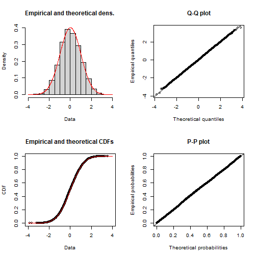

# 데이터 과학을 위한 R 알고리즘
`r Sys.Date()`  

## 1. 우도와 확률밀도함수 {#mle}

확률밀도함수(PDF)는 그 자체로 미래지향적이지만, 상대적으로 우도함수는 과거지향적이다. 
왜냐하면, 데이터가 주어진 상태에서 데이터가 나온 분포를 가정하고 모수를 추정해야 되기 때문이다.

## 2. 정규분포 [^normal-distribution] {#normal-distribution}

[^normal-distribution]: [위키백과, 정규분포(Normal distribution)](https://en.wikipedia.org/wiki/Normal_distribution)

정규분포(正規分布, normal distribution)는 연속 확률 분포의 하나로, 
중심극한정리에 의하여 독립적인 확률변수들의 평균은 정규분포에 가까워지는 성질이 있기 때문에 
수집된 자료의 분포를 근사하는 데에 빈번하게 활용된다.

$$f(x \; | \; \mu, \sigma^2) = \frac{1}{\sqrt{2\pi\sigma^2} } \; e^{ -\frac{(x-\mu)^2}{2\sigma^2} }$$
</math>

- $\mu$는 정규분포의 중심을 나타내는 척도로 자주 사용되는 평균. 
- $\sigma$는 분포의 퍼짐을 나타내는 척도로 자주 사용되는 표준편차
- $\sigma^2$는 표준편차를 제곱한 분산

### 2.1. 정규분포 우도함수 {#mle-normal-distribution}

정규분포에서 나온 데이터 각각의 독립성을 가정하면, 결합밀도함수를 모두 곱해서 표현할 수 있다.

$$\mathcal{L}(\theta) = \prod_i f_{\mu, \sigma}(x_i) = \prod_i \frac{1}{\sqrt{2 \pi} \sigma} \exp(\frac{-(x_i - \mu)^2}{2 \sigma^2})$$

그리고, 양변에 로그를 취하여 수식을 다음과 같이 정리할 수 있다.

$$\mathcal{L}^*(\theta) = -\frac{n}{2} \log{2\pi} - n \log \sigma - \frac{1}{2 \sigma^2} \sum_i {(x_i - \mu)^2}$$

이제 우도를 최대화하는 모수를 찾기 위해서 양변을 $\mu$로 편미분해서 정리하면 $\mu$를 구할 수 있다. 
$$\frac{\partial}{\partial \mu} \mathcal{L}^*(\theta) = \frac{1}{\sigma^2} \sum_i (x_i - \mu)= \frac{1}{\sigma^2} (\sum_i x_i  - n \mu) = 0$$

$\mu$에 대해서 정리하면 $\widehat \mu = (\sum_i x_i) / n$ 이 된다.

마찬가지 방법으로 $\sigma$에 대해서 편미분하여 정리하면 $\sigma$도 구할 수 있다.

$$\frac{\partial}{\partial \sigma} \mathcal{L}^*(\theta) = -\frac{n}{\sigma} + \frac{1}{\sigma^3} \sum_i (x_i - \mu)^2 =0$$

$\sigma$에 대해서 정리하면 $\sigma^2 = \sum_i (x_i - \mu)^2 / n$을 얻게 된다.

### 2.2. 정규분포 시각화 {#viz-normal-distribution}

정규분포의 특성을 살펴보고자 난수를 추출하여 정규분포 확률밀도함수, 누적분포함수를 정규분포에서 추출할 난수와 함께 시각화를 한다.

~~~{.r}
# 1. 정규분포 ----------------------------------------
# https://www.r-bloggers.com/normal-distribution-functions/
xseq <- seq(-4, 4, .001)
normal_densities <- dnorm(xseq, 0,1)
normal_cumulative <- pnorm(xseq, 0, 1)
normal_smpl <- rnorm(length(xseq), 0, 1)

normal_df <- data.frame(xseq, normal_densities, normal_cumulative, normal_smpl)

normal_density_p <- normal_df %>% 
    ggplot(aes(x=xseq, y=normal_densities)) +
    geom_line(color="darkgreen") +
    theme_bw(base_family="NanumGothic") +  
    labs(x = '데이터 (x)', y ='밀도', title="정규분포 확률밀도함수")

normal_cummulative_p <- normal_df %>% 
    ggplot(aes(x=xseq, y=normal_cumulative)) +
    geom_line(color="darkorange") +
    theme_bw(base_family="NanumGothic") +  
    labs(x = '데이터 (x)', y ='누적확률', title="정규분포 누적밀도함수")

normal_sample_p <- normal_df %>% 
    ggplot(aes(x=normal_smpl)) +
    geom_histogram(aes(y = ..count..), bins = 30, fill = 'darkblue', alpha=0.5) +
    theme_bw(base_family="NanumGothic") +  
    labs(x = '데이터 (x)', y ='표본수', title="표준정규분포에서 추출한 난수")

normal_data_fit_p <- ggplot(normal_df, aes(normal_smpl)) +
    geom_histogram(aes(y = ..count..), bins = 30, fill = 'darkblue', alpha=0.5) +
    theme_bw(base_family="NanumGothic") +
    scale_y_continuous(labels = scales::comma) +
    labs(x = '데이터', y ='빈도', title="정규분포 - 데이터 + 정규분포곡선") +
    stat_function(
        fun = function(x, mean, sd, n, bw){ 
            dnorm(x = x, mean = mean, sd = sd) * n * bw
        }, args = c(mean = mean(normal_df$normal_smpl, na.rm = T), sd = sd(normal_df$normal_smpl, na.rm =T), n = length(xseq), bw = 0.26))

gridExtra::grid.arrange(normal_density_p, normal_sample_p, normal_data_fit_p, normal_cummulative_p, nrow=2)
~~~

### 2.3. 최대우도함수 모수 추정 {#mle-normal-distribution-estimation}

`library(fitdistrplus)` 팩키지에 데이터가 어떤 분포에서 나왔으며, 모수는 무엇인지 추정할 수 있는 다양한 기능을 제공한다.

~~~{.r}
# 2. 데이터에 적합한 분포 검정 및 모수 추정----------------------------------------

descdist(normal_smpl, discrete = FALSE)
~~~

~~~{.output}
summary statistics
------
min:  -3.596596   max:  4.821282 
median:  0.02485401 
mean:  0.01775656 
estimated sd:  0.9933239 
estimated skewness:  0.02869129 
estimated kurtosis:  3.091715 

~~~

~~~{.r}
(normal_smpl_fit <- fitdist(normal_smpl, "norm", method="mle"))
~~~

~~~{.output}
Fitting of the distribution ' norm ' by maximum likelihood 
Parameters:
       estimate  Std. Error
mean 0.01775656 0.011104311
sd   0.99326184 0.007851898

~~~

~~~{.r}
plot(normal_smpl_fit)
~~~

### 2.4. 최적화 함수 활용 최대우도함수 모수 추정 [^mle-LL] {#optim-mle-normal-distribution-estimation}

[^mle-LL]: [Andrew B. Collier(2013), Fitting a Model by Maximum Likelihood](http://www.exegetic.biz/blog/2013/08/fitting-a-model-by-maximum-likelihood/)

`stats4` 팩키지 `mle` 함수를 활용하여 정규분포 모수를 추정한다. 
자세한 내용은 [Andrew B. Collier(2013), Fitting a Model by Maximum Likelihood](http://www.exegetic.biz/blog/2013/08/fitting-a-model-by-maximum-likelihood/)을 참조한다.

~~~{.r}
# 3. 최대우도함수 추정 ----------------------------------------
library(stats4)

LL <- function(mu, sigma) {
    normal_value <- dnorm(normal_smpl, mu, sigma)
    -sum(log(normal_value))
}

mle(LL, start = list(mu = 2, sigma=2))
~~~

~~~{.output}

Call:
mle(minuslogl = LL, start = list(mu = 2, sigma = 2))

Coefficients:
        mu      sigma 
0.01775676 0.99326235 

~~~

~~~{.r}
mle(LL, start = list(mu = 2, sigma=2), method = "L-BFGS-B", lower = c(-Inf, 0), upper = c(Inf, Inf))
~~~

~~~{.output}

Call:
mle(minuslogl = LL, start = list(mu = 2, sigma = 2), method = "L-BFGS-B", 
    lower = c(-Inf, 0), upper = c(Inf, Inf))

Coefficients:
        mu      sigma 
0.01775715 0.99326243 

~~~

### 2.5. 최적화 함수 활용 회귀모수 추정 {#reg-mle-normal-distribution-estimation}

분포 모수를 넘어 회귀식의 회귀계수도 추정할 수 있다.
$y = \beta_0 + \beta_1 x + \epsilon$ 회귀식에서 $\epsilon \thicksim N(\mu , \sigma )$로 놓고 회귀계수 뿐만 아니라 평균과 표준편차도 추정한다.

$$y = 3 + 7 x + \epsilon$$

~~~{.r}
# 4. 회귀식 추정 ----------------------------------------
## `lm` 함수를 통한 회귀식 추정
rs_size <- 1000

x <- runif(rs_size)
y <- 3 + 7 * x  + rnorm(rs_size)

lm_fit <- lm( y ~ x)

summary(lm_fit)
~~~

~~~{.output}

Call:
lm(formula = y ~ x)

Residuals:
    Min      1Q  Median      3Q     Max 
-3.4643 -0.6746 -0.0192  0.6910  3.0781 

Coefficients:
            Estimate Std. Error t value            Pr(>|t|)    
(Intercept)  2.95674    0.06304   46.91 <0.0000000000000002 ***
x            7.01471    0.10940   64.12 <0.0000000000000002 ***
---
Signif. codes:  0 '***' 0.001 '**' 0.01 '*' 0.05 '.' 0.1 ' ' 1

Residual standard error: 1.009 on 998 degrees of freedom
Multiple R-squared:  0.8047,	Adjusted R-squared:  0.8045 
F-statistic:  4112 on 1 and 998 DF,  p-value: < 0.00000000000000022

~~~

~~~{.r}
data.frame(x, y) %>% 
    ggplot(aes(x,y)) +
      geom_point() +
      geom_abline(slope=7, intercept=3, color="red", size=1.5, alpha=0.7)
~~~

~~~{.r}
## 우도함수 회귀식 추정

reg_LL <- function(beta0, beta1, mu, sigma) {
    resid <- y - x * beta1 - beta0
    normal_value <- dnorm(resid, mu, sigma)
    -sum(log(normal_value))
}

mle(reg_LL, start = list(beta0 = 5, beta1 = 2, mu = 0, sigma=1))
~~~

~~~{.output}

Call:
mle(minuslogl = reg_LL, start = list(beta0 = 5, beta1 = 2, mu = 0, 
    sigma = 1))

Coefficients:
    beta0     beta1        mu     sigma 
 3.978371  7.014714 -1.021629  1.007844 

~~~
