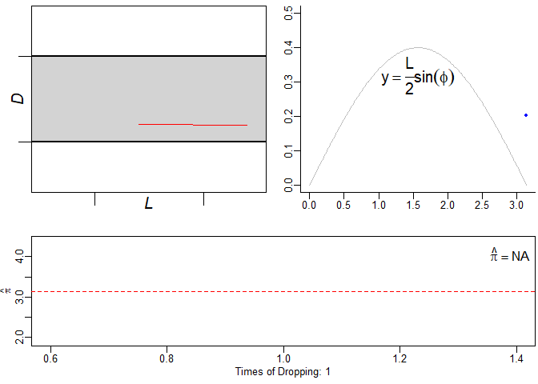

# 데이터 과학을 위한 R 알고리즘

## 1. 기계를 활용한 원주율 계산 [^r-monte-carlo] {#pi}

[^r-monte-carlo]: [Estimating Pi with R via MCS-Dart: A very simple example of numerical integration, illustrated and computed in R.](http://giventhedata.blogspot.kr/2012/09/estimating-pi-with-r-via-mcs-dart-very.html)

컴퓨터를 활용하여 원주율을 계산하기 위해서 사각형 면적과 원면적 비율을 활용하여 원주율($\pi$)를 도출한다.

즉, 가로세로가 2인 사각형내부에 반지름이 1인 원을 내접하여 표현하면 다음과 같이 그려본다.

~~~{.r}
# library(purrr)
# library(shape)
# library(tidyverse)
# library(hrbrthemes)
# library(extrafont)
# loadfonts()

## 1.1. 반지름 1인 원 ------------------------------
r <- 1
par(pty="s")
emptyplot(c(0, 0),frame.plot=r)
plotcircle(r=r, mid=c(0,0), lwd=1, lcol="blue")
lines(x=c(0,1),y=c(0,0), lty=1, col="red")
lines(x=c(-1,1),y=c(0,0), lty=2)
lines(y=c(-1,1),x=c(0,0), lty=2)
axis(1)
axis(2)
text(x=0.5,y=0.2, labels=expression("r=1"), col="red")
~~~

피타고라스 정리를 이용하여 원 내부에 위치하면 원 내부면적에 위치하는지를 파악한다.

- $\text{원면적} = \pi \times r^2$
- $\text{정사각형면적} = {(2 \times r)}^2 = 4 \times r^2$

상기 두 면적의 비를 통하여 원주율($\pi$)를 다음과 같이 수식을 정리하여 도출한다.

$$\frac{\text{원 면적}}{\text{정사각형 면적}} = \frac{\pi \times r^2}{4 \times r^2}$$
$\pi$에 관해 수식을 정리하면 다음과 같다.

$$\pi = 4 \times \frac{\text{원 면적}}{\text{정사각형 면적}}$$

~~~{.r}
## 1.2. 피타고라스 정리 ------------------------------
### 원
emptyplot(frame.plot=r)
plotcircle(r=r, mid=c(0,0), lwd=1,lcol="blue")
lines(x=c(0,1),y=c(0,0), lty=1, col="red")
lines(x=c(-1,1),y=c(0,0), lty=2)
lines(y=c(-1,1),x=c(0,0), lty=2)
axis(1)
axis(2)

### 피타고라스 정리
points(x=0.8,y=0.58,col="red", lwd=2)
lines(x=c(0,0.8), y=c(0,0), col="red", lwd=2)
lines(x=c(0.8,0.8), y=c(0,0.58), col="red", lwd=2)
lines(x=c(0,0.8), y=c(0,0.58), col="red", lty=2,lwd=2)
text(x=0.4,y=0.4,"c",col="red")
title(expression(c == sqrt(a^2 + b^2)))
~~~

## 2. 몬테카를로 모의실험  {#r-monte-carlo-sim}

`simulate_pi` 함수를 만들어서 정사각형 길이가 2가 되기 때문에 -1에서 1사이 일양분포(uniform)에서 x, y 좌표 점을 
무작위로 뽑아내서 피타고라스 정리를 활용하여 원 내부에 위치하는지 원 외부에 위치하는지 파악한다.
이를 부울을 R 내부적으로 데이터를 표현하는 특성을 활용하여 더하면 원내부 위치하는 점의 갯수가 되고 이를 
전체 모의실험 횟수로 나누게 되면 원주율을 계산할 수 있다.

~~~{.r}
# 2. 몬테카를로 모의실험 -----------------------

simulate_pi <- function(iter = 1000) {
  
  x_pos <- runif(iter, min=-1, max=1)
  y_pos <- runif(iter, min=-1, max=1)

  xy_pos <- ifelse(x_pos^2 + y_pos^2 <= 1, TRUE, FALSE)
  
  pi_val <- 4*(sum(xy_pos)/iter)
  return(pi_val)
}

simulate_pi(1000000)
~~~

~~~{.output}
[1] 3.139988

~~~

~~~{.r}
# 3. 원주율 값 수렴 시각화  -----------------------
## 3.1. 데이터 준비 -------------------------------
sim_iter_lst <- list()

for(i in 1:10^5) {
  if(i %% 100 == 0) {
    sim_iter_lst[[length(sim_iter_lst)+1]] <- i
  }
}

iter_v <- sim_iter_lst %>% unlist
pi_v <- map(sim_iter_lst, simulate_pi) %>% unlist

pi_df <- data.frame("반복횟수"=iter_v, "원주율"=pi_v)

DT::datatable(pi_df) %>% 
  DT::formatCurrency("원주율", currency ="", interval = 3, mark = ",", digits = 5)
~~~

<!--html_preserve-->

<!--/html_preserve-->

모의실험횟수가 증가함에 따라 위키백과사전 [원주율](https://ko.wikipedia.org/wiki/%EC%9B%90%EC%A3%BC%EC%9C%A8) 값에 수렴되는지를 
시각적으로 확인한다. 

> 원주율: "3.1415926535897932384626433832795028841971"

~~~{.r}
## 3.2. 시각화 -------------------------------

ggplot(pi_df, aes(x=반복횟수, y=원주율)) +
  geom_line() +
  theme_ipsum(base_family="NanumGothic") +
  labs(x="모의실험횟수", y="원주율값") +
  scale_x_continuous(labels = scales::comma) +
  geom_hline(yintercept = 3.1415926535897932384626433832795028841971, color="red")
~~~

## 3. 몬테카를로 모의실험 시각화 {#r-monte-carlo-sim-viz}

원주율을 계산하는 몬테카를로 모의실험 결과를 시각화해보자.
1,000회 난수를 추출하여 이를 앞서 계산한 로직에 맞춰 결과값이 원내부에 위치하면 검은색 점으로,
원외부에 위치하면 붉은색 점으로 표현하여 보자.

~~~{.r}
# 4. 모의실험 1000회 시각화 ------------------------------
r <- 1
par(pty="s")
emptyplot(c(0, 0),frame.plot=r)
plotcircle(r=r, mid=c(0,0), lwd=1, lcol="blue")
lines(x=c(0,1),y=c(0,0), lty=1, col="red")
lines(x=c(-1,1),y=c(0,0), lty=2)
lines(y=c(-1,1),x=c(0,0), lty=2)
axis(1)
axis(2)
text(x=0.5,y=0.2, labels=expression("r=1"), col="red")

draw_point <- function(iter = 10) {
  
  x_pos <- runif(iter, min=-1, max=1)
  y_pos <- runif(iter, min=-1, max=1)
  
  for(i in seq_along(x_pos)) {
    if( x_pos[i]^2+y_pos[i]^2 <=1 ) {
      points(x_pos[i], y_pos[i], col="black")
    } else {
      points(x_pos[i], y_pos[i], col="red")
    }
  } 
}

draw_point(1000)
~~~

## 4. 함수 적분 {#monte-carlo-integration}

수학 함수의 적분 문제를 푸는데 몬테카를로 모의실험을 동원해서 보자. 
정의역이 $x \in [0,1]$으로 $x$가 0에서 1 사이이며, 함수 $f(x)$를 다음과 같이 정의해 보자.

$$f(x) = /sqrt{1 - x^2 }$$

정의역 구간 $x \in [0,1]$에서 함수 $f(x)$를 적분해 보자. 즉,

$$\int_0^1 \sqrt{1 - x^2 } dx = \frac{\pi} {4}$$

자세한 수학적 증명은 [Integral of $\sqrt{1 - x^2}$ using integration by parts](https://math.stackexchange.com/questions/533082/integral-of-sqrt1-x2-using-integration-by-parts)를 참조한다.

- 부정적분: $\int \sqrt{1-x^2} = \frac{1}{2}x\sqrt{1-x^2} + \frac{1}{2} sin^{-1}x +C$
- $sin^{-1}x$: $sin^{-1}x = arcsin(1) = \frac{\pi}{2}$ 

### 4.1. 적분함수 {#integration-function}

`integrte` 함수를 활용해서 함수를 정의(`pi_fn`) 한 후 정적분 값을 통해 $\pi$ 값을 계산한다.

~~~{.r}
## 1. 수식에 대한 수치해석 -----------------
pi_fn <- function(x) sqrt(1-x^2)

integration_val <- integrate(pi_fn, 0, 1) 

integration_val$value * 4
~~~

~~~{.output}
[1] 3.141593

~~~

### 4.2. 모의 실험 {#integration-function}

함수가 정의되었다면 모의실험을 통한 결과를 시각화해보자.
$pi_fn$ 함수가 정의되어 있으니 일양분포 난수를 넣어 `pi_fn` 함수값을 계산하여 평균을 낸다.

~~~{.r}
## 2. 모의실험 -----------------

pi_sim_lst <- pi_fn(runif(n=1000000)) * 4
mean(pi_sim_lst)
~~~

~~~{.output}
[1] 3.140017

~~~

~~~{.r}
## 3. 모의실험 시각화 -----------------
par(pty="s")
curve(pi_fn, 0,1)

draw_point(1000)
~~~

## 5. 뷔퐁 바늘(Buffon Needle) {#buffon-need}

[뷔퐁의 바늘](https://ko.wikipedia.org/wiki/%EB%B7%94%ED%90%81%EC%9D%98_%EB%B0%94%EB%8A%98)은 18세기에 뷔퐁 백작이 처음 제기한 문제로,
너비가 모두 같은 평행한 목재 널빤을 깔아 만든 마루가 있을 때, 그 마루 위에 바늘을 떨어뜨린다. 바늘이 널빤과 널빤 사이의 선을 가로지어 걸칠 확률은 얼마인가?
기하학 지식과 적분 지식을 가지고 수학적으로 풀 수도 있고, 컴퓨터를 활용하여 몬테카를로 모의 실험을 통해 **원주율($\pi$)**을 구할수 있다.

- 바늘 가운데에서 가장 가까운 평행선까지의 거리를 $d$로 정의: $d = \left[ 0, { t \over 2} \right]$
- 바늘과 평행선 사이 각도를 $\theta$로 정의: $\theta = \left[ 0, { \pi \over 2} \right]$
- 바늘이 선을 가로질러 걸칠 조건: $d \le \frac{l}{2}\sin\theta$

$d, \theta$가 독립이기 때문에 결합확률분포함수를 적분하면 답을 구할 수 있다.

$$P(\frac{sin\theta}{2}>d) = \int_{0}^{\pi} \frac{sin \theta}{2} d \theta = \frac{-cos\theta}{2} \Big|^{\pi}_{0} = 1$$

확률을 구하게 되면 $\frac{\text{내부 면적}}{\text{사각형 면적}} = \frac{\frac{2}{2}}{\frac{\pi}{2}}=\frac{2}{\pi}$ 가 된다.

<iframe width="300" height="180" src="https://www.youtube.com/embed/sJVivjuMfWA" frameborder="0" allowfullscreen></iframe>

### 5.1. 뷔퐁 바늘 모의실험 애니메이션 {#buffon-need-animation}

`animation` 팩키지 내부에 뷔퐁 바늘 모의실험 함수가 있어 이를 실행해서 뷔퐁 바늘 모의실험을 통해 $\pi$가 계산되는 과정을 확인할 수 있다. 자세한 사항 [Simulation of Buffons Needle](https://yihui.name/animation/example/buffon-needle/) 참조한다.
`ani.options(nmax = 1, 1)` 명령어 `nmax=100` 인자를 조정하면 애니메이션을 확인할 수 있다.

~~~{.r}
#library(animation)
ani.options(nmax = 1, 1)
par(mar = c(3, 2.5, 0.5, 0.2), pch = 20, mgp = c(1.5, 0.5, 0))
buffon.needle()
~~~

### 5.2. 뷔퐁 바늘 모의실험 [^buffon-needle-sim-rcode] {#buffon-need-simulation}

[^buffon-needle-sim-rcode]: [Calculating Pi using Buffon's Needle](http://www.exegetic.biz/blog/2016/07/calculating-pi-using-buffons-needle/)

~~~{.r}
buffon_needle_sim <- function(needle_len=1, line_spacing=2) {
  distance <- runif(1, min = 0, max = line_spacing / 2)
  theta <- runif(1, 0, pi / 2)
  is_crossed <- distance <= needle_len / 2 * sin(theta)
  return(is_crossed)
}

is_crossed <- replicate(10^7, buffon_needle_sim(1, 2))

10^7 / sum(is_crossed)
~~~

~~~{.output}
[1] 3.139509

~~~

