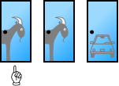

```{r, include=FALSE}
source("tools/chunk-options.R") 

knitr::opts_chunk$set(echo = TRUE, warning=FALSE, message=FALSE)

library(tidyverse)
library(hrbrthemes)
library(extrafont)
loadfonts()


options(scipen = 999)
options(family="NanumGothic")
```


## 1. 문제 정의 [^wiki-monty-hall] [^namuwiki-monty-hall] {#monty-hall-problem}

[^wiki-monty-hall]: [위키사전 - 몬티 홀 문제](https://ko.wikipedia.org/wiki/%EB%AA%AC%ED%8B%B0_%ED%99%80_%EB%AC%B8%EC%A0%9C)

[^namuwiki-monty-hall]: [나무위키 - 몬티 홀 문제](https://namu.wiki/w/%EB%AA%AC%ED%8B%B0%20%ED%99%80%20%EB%AC%B8%EC%A0%9C)

몬티 홀 문제(Monty Hall problem)는 미국의 TV 게임 쇼 《Lets Make a Deal》에서 유래한 퍼즐이다. 
퍼즐의 이름은 이 게임 쇼의 진행자 몬티 홀의 이름에서 따온 것이다. 



> ### 몬티홀 문제 
> 
> 세 개의 문 중에 하나를 선택하여 문 뒤에 있는 선물을 가질 수 있는 게임쇼에 참가했다. 
> 한 문 뒤에는 자동차가 있고, 나머지 두 문 뒤에는 염소가 있다. 
> 이때 어떤 사람이 예를 들어 1번 문을 선택했을 때, 게임쇼 진행자는 3번 문을 열어 문뒤에 염소가 있음을 보여주면서 1번 대신 2번을 선택하겠냐고 물었다. 
> 참가자가 자동차를 가지려할 때 원래 선택했던 번호를 바꾸는 것이 유리할까?
> 이때 진행자는 자동차와 염소가 어떤 문에 있는지 알고 있기 때문에, 진행자가 자동차가 있는 문을 여는 일은 절대 발생하지 않는다.

|          짧은 버젼(5분)       |         긴 버젼(10분)         | 
|:-----------------------------:|:-----------------------------:|
| <iframe width="300" height="160" src="https://www.youtube.com/embed/4Lb-6rxZxx0" frameborder="0" allowfullscreen></iframe> | <iframe width="300" height="160" src="https://www.youtube.com/embed/ugbWqWCcxrg" frameborder="0" allowfullscreen></iframe> |

## 2. 수학 - 베이즈 정리 {#monty-hall-math}

몬티홀 문제에 대해서 처음 선택을 유지할지, 아니면 몬티가 문을 열어 염소가 나온 것을 보고 바꿀지 결정을 해야 한다.
이를 베이즈 정리를 이용하여 처음 선택을 유지할 확률과 선택을 바꿀 때 확률을 계산하면 다음과 같다.

$$P(X	\cap Y) = P(X|Y) * P(Y)$$
$$P(Y \cap X) = P(Y|X) * P(X)$$

$P(Y \cap X) = P(X	\cap Y)$ 같다는 성질을 이용하여 동치로 놓고 수식을 정리한다.

$$P(X|Y) * P(Y) = P(Y|X) * P(X)$$

양변을 $P(Y)$로 나누어서 정리하면 다음과 같다.

$$\frac{P(X|Y)P(Y)}{P(Y)} = P(X|Y) = P(Y|X) \frac{P(X)}{P(Y)}$$

이제, $X=\text{자동차}$로 대입하고, $Y=\text{몬티}$로 설정하고 나서, 각각의 확률을 계산한다.

몬티는 게임 진행자로 모든 정보를 가지고 있기 때문에 $P(\text{몬티}|\text{자동차})=\frac{1}{2}$ 확률을 알고 있다.
또한, $P(\text{자동차}) = \frac{1}{3}$, $P(\text{몬티}) = \frac{1}{2}$로 확률을 계산할 수 있다.
즉, 몬티가 선택했을 때 그대로 처음 선택을 유지했을 때 자동차를 받을 확률은 다음과 같다.


- $P(\text{몬티}|\text{자동차})=\frac{1}{2}$
- $P(\text{자동차}) = \frac{1}{3}$
- $P(\text{몬티}) = \frac{1}{2}$

$$P(\text{자동차}|\text{몬티}) = P(\text{몬티}|\text{자동차}) \frac{P(\text{자동차})}{P(\text{몬티})} =
\frac{1}{2} \times \frac{\frac{1}{3}}{\frac{1}{2}} = \frac{1}{3}$$

따라서, 몬티가 선택한 후 계속 처음 선택을 유지할 경우 자동차를 선택할 확률이 $\frac{1}{3}$이라서,
몬티가 선택을 하면 처음 선택을 번복하고 다른 문을 선택해야 자동차를 선택할 확률이 2배 올라가서, $\frac{2}{3}$가 된다.


## 3. 몬테카를로 실험 {#monte-carlo}

[몬티홀 퀴즈 모의실험](http://www.grand-illusions.com/simulator/montysim.htm)을 직접 웹사이트에서 경험할 수 있다.
매번 수작업으로 클릭해서 확률값을 경험적으로 계산하는 것보다 몬테카를로 모의실험을 통해서 수행하면 앞선 수식으로 
계산한 것을 검증할 수도 있다.

### 3.1. 한번 모의실험 {#single-run}

문 세가지 중 하나에 자동차가 있고, 3가지 문을 선택할 수 있다.
만약 동일한 난수가 발생되었다면 자동차를 갖게 되고, 그렇지 않다면 꽝이 된다.
한번 모의실험을 하게 되면 자동차를 갖거나 꽝이된다.

``` {r monty-single-run}
# 1. 몬테카를로 모의실험 -----------------------
## 1.1. 한번실험 -------------------------------

car <- sample(3,1,replace=TRUE)
door <- sample(3,1,replace=TRUE)

stay_win <- car == door
switch_win <- car != door

c(stay_win, switch_win)
```

### 3.2. 열번 모의실험 {#ten-run}

퀴즈쇼에 열번 나왔다고 가정하고 몬테카를로 모의실험을 수행하면 다소 오차가 있지만 $\frac{2}{3}$에 근사한다.

``` {r monty-ten-run}
## 1.2. 열번 실험 -------------------------------

car <- sample(3,10,replace=TRUE)
door <- sample(3,10,replace=TRUE)

stay_win <- car == door
switch_win <- car != door

c(sum(stay_win), sum(switch_win))
```

### 3.3. 정말 많은 모의실험 {#many-run}

퀴즈쇼를 무한히 진행할 수는 없지만, 일주일에 한번 진행한다고 하면 56회가 될 것이고 이를 100년 진행한다고 가정하고 모의실험을 
수행하면, 앞서 계산한 이론값에 근사하는 것을 알 수 있다.

``` {r monty-many-run}

## 1.3. 몬테카를로 모의시험 -------------------------------

simulate_monty <- function(n_times){
  
  car  <- sample(3, n_times, replace=TRUE)
  door <- sample(3, n_times, replace=TRUE)
  
  stay_win <- car == door
  switch_win <- car != door
  
  switch_win_prob <- sum(switch_win)/n_times
  return(switch_win_prob)
}

simulate_monty(560)

## 1.4. 몬테카를로 모의시험 Viz. -------------------------------

monty_MC_df <- data.frame()

for(i in 1:560) {
  n_trials <- i
  prob <- simulate_monty(i)
  monty_MC_df <- rbind(monty_MC_df, data.frame(n_trials, prob))
}

ggplot(monty_MC_df, aes(n_trials, prob)) + 
  geom_line(size=1.0, color="lightblue", alpha=0.5) +
  theme_ipsum(base_family = "NanumGothic") +
  labs(x="모의시험횟수", title="자동차를 차지할 확률", y="확률", subtitle="몬티홀 퀴즈쇼 처음 선택을 바꿨을 경우") +
  scale_y_continuous(labels = scales::percent) +
  scale_x_continuous(labels = scales::comma) +
  geom_hline(yintercept=2/3, color="red")
```

