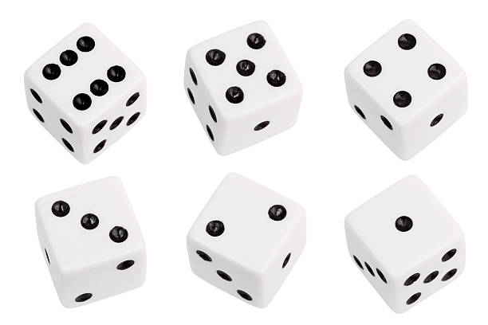
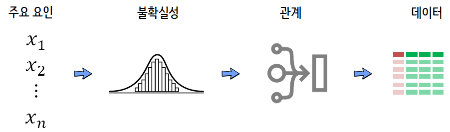
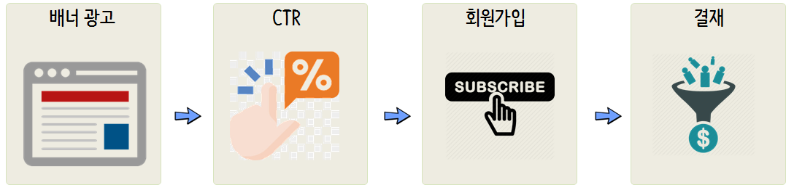

```{r, include=FALSE}
source("tools/chunk-options.R") 

knitr::opts_chunk$set(echo = TRUE, warning=FALSE, message=FALSE, fig.width = 12, fig.height = 10)


options(scipen = 999)
options(family="NanumGothic")
```

# 모의실험 프레임워크(framework) {#simulation-framework}

컴퓨터를 이용한 모의실험을 통해서 다양한 문제를 해결할 수 있고, 정확성은 모의실험횟수를 늘려서 정도를 높일 수 있다.
실생활에서 발생되는 다양한 사건을 모의실험 프레임워크를 통해 해결하는 방식은 다음과 같다.

1. 데이터 생성 정의 단계
    1. 확률변수로 표현되는 가능한 모든 결과를 정의
    1. 각 결과값에 대한 확률 배정
    1. 확률변수간 관계를 정의
1. 데이터 생성 및 분석 단계
    1. 반복 표본 추출로 결과를 생성
    1. 결과값에 대한 데이터 분석


## 현실을 모사 {#simulation-step01}

## 카드 생성기 [^card-generator] {#card-generator}

[^card-generator]: [Creating A Deck Of Cards In R Without Using While And Double For Loop](https://stackoverflow.com/questions/24685024/creating-a-deck-of-cards-in-r-without-using-while-and-double-for-loop)

카드게임을 위한 카드를 생성해 보자.

다이아몬드, 클럽, 하트, 스페이드 대분류에 13개 카드가 에이스부터 킹(왕)까지 각 한장씩 구성된다.


`suits`와 `cards`로 정의를 하고 나서 `expand.grid()`함수로 카드를 구성한다.
카드 덱은 `total_num_of_decks` 변수로 1을 지정한다. 
`sample()` 함수로 카드를 섞어 두고 나서 `dplyr` 팩키지 `sample_n()` 함수 혹은 `slice()` 함수로 
카드 5장을 추출한다.


``` {r simulation-cards}
library(tidyverse) 

suits <- c("Diamonds", "Clubs", "Hearts", "Spades")
cards <- c("Ace", "Deuce", "Three", "Four","Five", "Six", "Seven", "Eight", "Nine", "Ten", "Jack", "Queen", "King")
values <- c(0, 2:9, rep(10, 4))
total_num_of_decks <- 1

deck_unit <- expand.grid(cards=cards, suits=suits)
deck_unit$value <- values

deck <- deck_unit[rep(seq(nrow(deck_unit)), total_num_of_decks),]

# 2. 카드 섞기 -----
smpl_idx <- sample(1:52, 52, replace = FALSE)

shuffled_deck <- deck[smpl_idx,]

# 3. 카드 5 장 추출 -----
## 3.1. dplyr 함수 
deck %>% 
    sample_n(5)

## 3.2. 
shuffled_deck %>% 
    slice(1:5)
```


## 주사위 모사 {#simulatin-dice}

주사위 던지는 게임을 모사해보자. 이를 위해서 먼저 주사위를 정의하고 
주사위 눈이 나올 확률도 정의한다. 

주사위를 던졌을 때 나올 수 있는 모든 경우의 수를 주사위 눈과 주사위 눈이 나올 확률을 정의한다.
그리고 나서 `sample()` 함수로 주사위 던지기를 모사한다. 



주사위 눈이 나올 확률은 수학적으로 다음과 같이 계산된다.

$$1 \times \frac{1}{6} + 2 \times \frac{1}{6} + 3 \times \frac{1}{6} + 4 \times \frac{1}{6} + 5 \times \frac{1}{6} + 6 \times \frac{1}{6} = 3.5$$

이를 주사위 던기를 반복해서 계산할 수 있다. `for` 루프를 사용해도 되고 벡터화 기능을 사용해도 된다.

``` {r simulation-dice}
# 1. 주사위 구성 -----

die <- c(1,2,3,4,5,6)
prob <- c(1/6, 1/6, 1/6, 1/6, 1/6, 1/6)

# 2. 주사위 던지기 -----
## 2.1. 1번 던지기
sample(die, 1, prob=prob)

## 2.2. 100번 던지기
die_draw <- vector(mode="integer", length = 100)

for(i in 1:1000) {
    die_draw[i] <- sample(die, 1, prob=prob)
}

mean(die_draw)

## 2.3. 강력한 R 기능
die_draw_v <- sample(die, 1000, prob=prob, replace=TRUE)
mean(die_draw_v)
```


## 주사위 던지기 게임 {#simulatin-dice-game}

이번에는 주사위 던지기 게임을 수행하는데 규칙은 다음과 같다.

주사위 두개를 던졌을 때 두 주사위 눈이 모두 같을 경우 "승리", 그렇지 않을 경우 "패배"가 되는 게임이다.
과연 승률은 얼마나 될까?

먼저 주사위를 구성하고 두 주사위를 한번씩 던져본다. 그리고 나서 
두 주사위 눈이 같은 경우 "승리", 그렇지 않은 경우 "패배"가 되는 게임을 한판 겨룬다.

``` {r simulation-dice-game-runs}
# 1. 주사위 구성 -----

die <- c(1,2,3,4,5,6)
prob <- c(1/6, 1/6, 1/6, 1/6, 1/6, 1/6)

# 2. 주사위 던지기 게임 -----
## 2.1. A 주사위 1번 던지기
draw_A <- sample(die, 1, prob=prob)

## 2.2. B 주사위 1번 던지기
draw_B <- sample(die, 1, prob=prob)

ifelse(draw_A == draw_B, "승리", "패배")
```

주사위 게임 한판 겨뤘으니 이제 컴퓨터의 힘을 빌어 모의실험을 100 회 수행한다.

``` {r simulation-dice-game}
# 3. 주사위 던지기 게임 반복 -----

dice_game_v <- vector(mode="integer", length=100)

dice_game <- function(sims=100) {
    for(i in 1:sims) {
        draw_A <- sample(die, 1, prob=prob)
        draw_B <- sample(die, 1, prob=prob)
        
        dice_game_v[i] <- ifelse(draw_A == draw_B, 1, 0)
    }
    return(dice_game_v)
}

dice_game(100) %>% mean
```


## 로또 가격 {#lotto-price}

기대값을 고려하여 기대값보다 높게 손해를 보지 않고 구입가능한 로또 가격을 계산해보자.

우선 로또 구입가격은 10원이고 로또 티켓은 1,000 시중에 나와있고 로또에 당첨되었을 때 백만원을 받는다고 설정한다.
이런 경우 로또 당첨확률은 $\frac{1}{1,000}$이 된다.

로또 구입에 따른 득실을 `lotto_profit` 벡터로 지정하고, 로또 당첨확률도 `lotto_prob` 벡터에 저장한다.
그리고 나서 `sample(lotto_profit, 1, prob = lotto_prob)` 함수로 로또 한장을 뽑아본다.
로또 1000장 뽑았을 때 평균적으로 얼마가 되는지 살펴보자.

``` {r lotto-price}
# 1. 로또 구성 -----

lotto_cost <- 10
num_tickets <- 1000
lotto_prize <- 1000000

chance_of_winning <- 1/num_tickets

# 1. 로또 한장 뽑기 -----

lotto_profit <- c(lotto_prize - lotto_cost, -lotto_cost)
lotto_prob   <- c(chance_of_winning, 1-chance_of_winning)

sample(lotto_profit, 1, prob = lotto_prob)

# 2. 로또 1000 장 뽑기 -----

sample(lotto_profit, 1000, prob = lotto_prob, replace = TRUE) %>% 
    mean
```

이번에는 로또 가격을 0 원부터 시작하여 천천히 올려 얼마까지 로또가격이 비싸야 더이상 로또 구입이 손해가 나는지 살펴보자. 

``` {r lotto-price-set}
# 3. 로또 가격 정하기 -----

lotto_cost <- 0

while(TRUE) {
    
    lotto_outcome <- sample(c(lotto_prize - lotto_cost, -lotto_cost), 100000, prob = lotto_prob, replace = TRUE)
    
    lotto_cost <- if(mean(lotto_outcome) < 0) {
        break  
    } else {
        lotto_cost <- lotto_cost +1 
    } 
}

cat("기대값을 고려하여 손해보지 않고 구입 가능한 로또가격: ", lotto_cost-1)
```


# 데이터 생성 과정(DGP) {#simulation-DGP}

모의실험을 위해서 주요 요인을 특정하고 나서, 불확실성과 관계를 설정하면 데이터생성에 대한 모든 준비가 끝났다.




## 카드 매칭 [^card-matching] {#simulation-card-matching}

[^card-matching]: [피에르 레몽 드 몽모르 조우](https://statkclee.github.io/r-algorithm/r-history-of-probability.html#montmort-1708)

$1,2,3, \cdots, n$ 숫자가 세겨진 공을 $n$개 담겨있는 항아리가 있다. 
항아리 안에서 공은 잘 섞어서 한번에 하나씩 뽑아낸다. 적어도 공하나 뽑히는 순서가 공에 표식된 순서대로 뽑힐 확률은 얼마인가? (예를 들어, 숫자 2가 찍힌 공이 두번째로 뽑힌다.)
이 문제 대한 변형으로 공을 카드로 바꿔서 카드를 13장 뽑는데 순서대로 뽑을 때 한번 이상 매칭될 확률은 얼마나 될까?


``` {r simulation-card-matching}
# 1. 카드 구성 -----

card_thirteen_deck <- seq(from=1, to=13, by=1)

# 2. 카드 게임 1번 -----

shuffled_deck <- sample(card_thirteen_deck, 13, replace=FALSE)

outcome_v <- vector(mode="integer", length=13)

for(i in 1:13) {
    outcome_v[i] <- ifelse(shuffled_deck[i] == i, 1, 0)
    outcome <- ifelse(sum(outcome_v) == 0, "승리", "패배")
}

cat("게임 결과: ", outcome)
```

13장으로 구성된 카드패를 구성하고 나서 13장 뽑는 카드게임을 한판 돌려본다.
이번에는 이를 함수로 만들어서 10,000회 반복했을 때 순서에 맞춰 카드가 한번이상 나올 확률을 계산한다.

``` {r simulation-card-matching-many}
# 3. 카드 게임 10,000번 도전 -----
## 3.1. 게임 1번 함수
single_game_of_thirteen <- function() {
    shuffled_deck <- sample(card_thirteen_deck, 13, replace=FALSE)
    
    outcome_v <- vector(mode="integer", length=13)
    
    for(i in 1:13) {
        outcome_v[i] <- ifelse(shuffled_deck[i] == i, 1, 0)
        outcome <- ifelse(sum(outcome_v) == 0, "승리", "패배")
    }
    return(outcome)
}

## 3.2. 게임 10,000번 반복 함수
game_of_thirteen_v <- vector(mode="character", length=10000)

for(i in 1:10000) {
    game_of_thirteen_v[i] <- single_game_of_thirteen()
}

## 3.3. 게임 10,000번 결과 정리
table(game_of_thirteen_v) %>% tbl_df() %>% 
    mutate(prob = scales::percent(n/sum(n)))
```


## 구슬 뽑기 {#simulation-draw-balls}

항아리에 흰구슬 7개와 검은 구슬 6개가 담겨있다. 
항아리에서 구슬을 4개 뽑았을 때, 순서대로 흰구슬, 검은 구슬, 흰구슬, 검은 구슬이 나왔을 때를 조건이 만족되어 
승리가 되고 그렇지 않았을 때 패배로 정의하면 구슬뽑기 게임에서 승리할 확률은 얼마나 될까? 

먼저, 항아리 구슬을 정의하고 나서 구술을 한개 뽑아본다.

``` {r simulation-draw-balls}
# 1. 구슬 항아리 구성 -----

urn <- c(rep("흰구슬",7), rep("검은구슬",6))

# 2. 구슬 4개 비복원 추출 -----
random_draw <- sample(urn, 4, replace=FALSE)

# 3. 1,3 구슬 흰구슬, 2,4 검은구슬 -----
url_game <- ifelse(random_draw[1] == "흰구슬"   & random_draw[3] == "흰구슬" & 
   random_draw[2] == "검은구슬" & random_draw[4] == "흰구슬", "승리", "패배")

cat("구슬 뽑기 게임 결과: ", url_game)
```

구슬 4개를 뽑는 게임을 100,000번 반복하여 구슬뽑기 게임에서 승리할 확률을 산출해본다.


``` {r simulation-draw-balls-many}
# 4. 100,000번 구슬 뽑기 -----
## 4.1. 구슬뽑기 게임 함수
draw_ball <- function() {
    random_draw <- sample(urn, 4, replace=FALSE)
    
    urn_game <- ifelse(random_draw[1] == "흰구슬"   & random_draw[3] == "흰구슬" & 
                           random_draw[2] == "검은구슬" & random_draw[4] == "흰구슬", "승리", "패배")
    return(urn_game)
}

## 4.3. 구슬뽑기 게임 모의실험: 100,000

draw_ball_v <- vector(mode="character", length=100000)

for(i in 1:100000) {
    draw_ball_v[i] <- draw_ball()
}

draw_ball_v %>% tbl_df %>% 
    count(value) %>% 
    mutate(pcnt = scales::percent(n/sum(n)))
```


## 선거 예측 {#simulation-elecitn}

50개 선거구를 갖는 두 정당이 있다. 하나는 좌파정당, 또 다른 한 정당은 우파정당이다.
가장 많은 선거구에서 승리하는 정당이 선거에서 승리하는 것으로 가정한다.
`stat_prob` 벡터는 50개 선거구에 대한 득표율 데이터를 담고 있다. 
선거 승리가 45% 이하일 확률을 계산하시오.

선거구가 50개별로 선거를 한번 치뤘을 때 승리/패배에 대한 결과를 `election` 벡터에 담게 되고 
이에 대한 평균을 계산하면 종합선거결과를 얻게 된다.


``` {r simulation-election}
# 1. 선거 -----
state_prob <- c(0.52076814, 0.67846401, 0.82731745, 0.64722761, 0.03665174,
                0.17835411, 0.75296372, 0.22206157, 0.72778372, 0.28461556,
                0.72545221, 0.106571  , 0.09291364, 0.77535718, 0.51440142,
                0.89604586, 0.39376099, 0.24910244, 0.92518253, 0.08165597,
                0.4212476 , 0.74123879, 0.2479099 , 0.46125805, 0.19584491,
                0.24440482, 0.349916  , 0.80224624, 0.80186664, 0.82968251,
                0.91178779, 0.51739059, 0.67338858, 0.15675863, 0.37772308,
                0.77134621, 0.71727114, 0.92700912, 0.28386132, 0.25502498,
                0.30081506, 0.19724585, 0.29129564, 0.56623386, 0.97681039,
                0.96263926, 0.0548948 , 0.14092758, 0.54739446, 0.54555576)

# 2. 선거 한번 -----

election <- rbinom(1:50, 1, prob = state_prob)

mean(election)
```

앞선 모의시험 선거를 함수로 만들어서 1,000 회 반복실험할 수 있도록 준비하고 
선거 모의시험 결과를 앞서 정의한 45% 기준에 맞춰 선거 승리 패배 확률을 산출해 본다.

``` {r simulation-election-many}
# 3. 선거 모의실험 반복: 100,000 -----
## 3.1. 선거 1 회 실시 함수
run_election <- function() {
    election <- rbinom(1:50, 1, prob = state_prob)
    election_outcome <- mean(election)
    return(election_outcome)
}

## 3.2. 선거 모의실험: 1,000

election_winning_v <- vector(mode="numeric", length=1000)

for(i in 1:1000) {
    election_winning_v[i] <- run_election()
}

ifelse(election_winning_v < 0.45, 1, 0)  %>% mean
```


# 피트니스 살빼기 {#simulation-fitness}


피트니스 클럽에 갈때는 15,000 걸음을 걷고, 가지 못하는 날은 5,000 걸음을 걷는다.
통상 40% 확률로 피트니스 클럽에 가는데 포아송 분포 모수 람다가 된다.
 
만보이상 걸을 때 80% 확률로 체중이 1KG 감량이 되고, 20%확률로 체중이 1KG 증량이 된다.
8,000 걸음보다 적게 걷게 되면 반대로 20% 확률로 체중이 1KG 감량이 되고, 80%확률로 체중이 1KG 증량된다.
8,000 걸음과 반보사이는 50% 확률로 체중이 1KG 감량이 되고, 50%확률로 체중이 1KG 증량되어 반반이 된다.

이와 같은 상황이 주어졌을 때 체중변화를 모의실험으로 풀어보자.

먼저 포아송분포를 따르는 걸음수를 설정한다.
그리고 나서 걸음수에 따른 체중의 변화를 `weight_prob`으로 지정한다.
체중 변화를 `sample(weight, 1, weight_prob, replace=FALSE)`으로 모사한다.

``` {r fitness-simulation}
# 1. 걸음걸이 설정 ----

gym_steps <- c(5000, 15000) 
gym_steps_prob <- c(0.6, 0.4)

poi_lambda <- sample(gym_steps, 1, prob = gym_steps_prob)

# 2. 하루 체중 증감 ----

sim_steps <- rpois(1, poi_lambda)

weight <- c(-1, 1)

weight_prob <- if(sim_steps > 10000) {
    prob <- c(0.2, 0.8)
} else if(sim_steps < 8000) {
    prob <- c(0.8, 0.2)
} else {
    prob <- c(0.5, 0.5)
}

sample(weight, 1, weight_prob, replace=FALSE)
```

앞서 하루 체중변화를 모사했다면 이번에는 날짜를 특정하여 예를 들어 30일간 체중 변화를 모의실험하도록 
설정한다.

``` {r fitness-simulation-days}
# 3. 기간별 체중 증감 함수 ----
## 3.1. 체중변화 1회 모의실험 함수
change_weight <- function(days) {
    
    daily_weight_v <- vector(mode="integer", days)
    
    for(i in 1:days) {
        # 걸음수 데이터 생성
        poi_lambda <- sample(gym_steps, 1, prob = gym_steps_prob)
        sim_steps <- rpois(1, poi_lambda)
        
        # 걸음수에 따른 체중변화 
        weight <- c(-1, 1)
        
        weight_prob <- if(sim_steps > 10000) {
            c(0.2, 0.8)
        } else if(sim_steps < 8000) {
            c(0.8, 0.2)
        } else {
            c(0.5, 0.5)
        }
        
        daily_weight_v[i] <- sample(weight, 1, weight_prob, replace=FALSE)
        
    }
    
    return(sum(daily_weight_v))
}

change_weight(30)
```

하루 체중변화를 한달(30일) 체중변화로 모사했고 이를 1,000회 반복해서 모의실험했을 때 
체중의 변화를 살펴보자.

``` {r fitness-simulation-many}
## 3.2. 걷기에 따른 체중변화 모의실험: 1,000
weight_change_v <- vector(mode="integer", length=1000)

for(i in 1:1000) {
    weight_change_v[i] <- change_weight(30)
}

ifelse(weight_change_v < 0, 1, 0) %>% mean
```

# **전자상거래 광고** {#simulation-ecommerce}

배너광고를 통해 **노출(impression)**이 되게 되면 광고를 클릭하게 되고 이는 CTR 증가로 이어진다.
CTR이 높아지면 회원가입이 증가하게 되고, 가입된 회원 중 일부는 결재를 하게 되는 과정을 쭉 이어진다.



배너광고를 통해 높아진 혹은 추가 기능이 들어가서 높아진 CTR이 최종매출에 어떤 영향을 미치는가를 모의실험을 통해 확인해보자.


## 가입고객 모의실험 {#simulation-ecommerce-signup}


먼저 노출은 포아송분포를 따르는데 포아송 분포의 모수 $\lambda$는 정규분포 평균 10,000 표준편차 2,000을 따른다고 가정한다.
그리고 CTR은 일양분포 1% 에서 광고효과로 20%정도 높아질 수 있다고 가정하고,
고객가입도 클릭한 사용자중 평균 20%가 가입하는데 마찬가지로 20%정도 높아질 수 있다고 가정한다.

이를 바탕으로 클릭수와 가입고객을 모의실험으로 모사할 수 있다.


``` {r ad-simulation-setup}
# 1. 광고 설정  ------
## impression --> ctr --> signup
impression_lambda <- rnorm(1, mean = 10000, sd = 2000)
impression <- rpois(1, lambda = impression_lambda)

ctr_rate     <- runif(1, min = 0.01, max = 0.01 * 1.2)
sign_up_rate <- runif(1, min = 0.2,  max = 0.2  * 1.2)

clicks   <- rbinom(impression, size = 1, prob = ctr_rate) %>% sum
sign_ups <- rbinom(clicks, size = 1, prob = sign_up_rate)

# 2. 한번 광고 캠페인 ------
## 2.1. impression --> click --> signup
get_signup <- function(ad_campaign=FALSE) {
    
    impression_lambda <- rnorm(1, mean = 100000, sd = 2000)
    impression   <- rpois(1, lambda = impression_lambda)
    
    if(ad_campaign == TRUE) {
        ctr_rate     <- runif(1, min = 0.01, max = 0.01 * 1.2)
        sign_up_rate <- runif(1, min = 0.2,  max = 0.2  * 1.2)
    } else {
        ctr_rate     <- 0.01
        sign_up_rate <- 0.2
    }
    
    clicks   <- rbinom(impression, size = 1, prob = ctr_rate) %>% sum
    sign_ups <- rbinom(clicks,     size = 1, prob = sign_up_rate)
    
    # cat("lambda: \t",      scales::comma(impression_lambda), "\n",
    #     "impression: \t",  scales::comma(impression), "\n",
    #     "CTR rate: \t",    scales::percent(ctr_rate), "\n",
    #     "Signup rate: \t", scales::percent(sign_up_rate), "\n",
    #     "Clicks: \t",      scales::comma(sum(clicks)), "\n",
    #     "Sign_ups: \t",    scales::comma(sum(sign_ups)), "\n")
    
    return(sum(sign_ups))
}

get_signup(TRUE)
```

한번 모의실험한 사항을 아무런 조치를 하지 않았을 때와 조치를 취했을 때를 비교하여 각 1,000회 모의시험한다.

``` {r ad-simulation-setup-many}
signup_low_v  <- vector(mode="integer", length=1000)
signup_high_v <- vector(mode="integer", length=1000)

for(i in 1:1000) {
    signup_low_v[i]  <- get_signup(FALSE)
    signup_high_v[i] <- get_signup(TRUE)
}

mean(signup_low_v)
mean(signup_high_v)
```

## 매출 모의실험 {#simulation-ecommerce-revenue}

두번째는 가입된 고객이 매출을 얼마나 올리느냐가 두번째 문제라... 이에 대해서는
지수분포를 도입하여 가입고객이 얼마 매출을 올릴지 모의실험한다.

``` {r simulation-ecommerce-revenue}
## 2.2. 매출 모의실험 -----
### 2.2.1. 함수
get_revenue <- function(ad_campaign=FALSE) {
    ## 회원가입자수
    sign_ups <- get_signup(ad_campaign)
    
    ## 가입회원 매출추정

    purchase <- rbinom(sign_ups, 1, prob=0.1)
    num_purchase <- sum(purchase)
    purchase_value <- rexp(num_purchase, rate = 1/1000)
    
    revenue <- sum(purchase_value)
    
    # cat("Sign Ups: ", sign_ups, "\n",
    #     "Num Purchases: ", num_purchase, "\n",
    #     "Purchase Value: ", sum(purchase_value), "\n")
        
    return(revenue)
}

### 2.2.2. 1회 실시
get_revenue(FALSE)

### 2.2.3. 1000회 실시

reveune_low_v  <- vector(mode="integer", length=1000)
reveune_high_v <- vector(mode="integer", length=1000)

for(i in 1:1000) {
    reveune_low_v[i]  <- get_revenue(FALSE)
    reveune_high_v[i] <- get_revenue(TRUE)
}

mean(reveune_low_v)
mean(reveune_high_v)
```

## 효과 대안 분석 {#simulation-ecommerce-revenue-comparison}

예를 들어 3,000이 광고 혹은 기능개선에 소요된다고 가정하면, 그냥 놔둘 때와 비교하여 
새롭게 프로젝트를 추진했을 때 효과가 있는지 확률적으로 분석을 하는 것도 가능하다.

``` {r simulation-ecommerce-revenue-diff}
## 2.3. 효과분석 -----

sum(get_revenue(get_signup(TRUE))) - sum(get_revenue(get_signup(FALSE)))

# 3. 광고 캠페인 모의실험: 1,000 ------

ad_cost <- 3000
ad_effect_revenue_v <- vector(mode="integer", length = 1000)


for(i in 1:1000) {
    ad_revenue    <- get_revenue(TRUE)
    no_ad_revenue <- get_revenue(FALSE)
    
    ad_effect_revenue_v[i] <- ad_revenue - no_ad_revenue
}
    
ifelse(ad_effect_revenue_v < ad_cost, 1, 0) %>% mean

